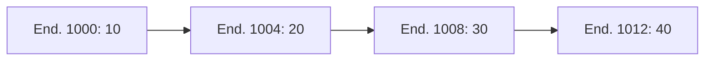
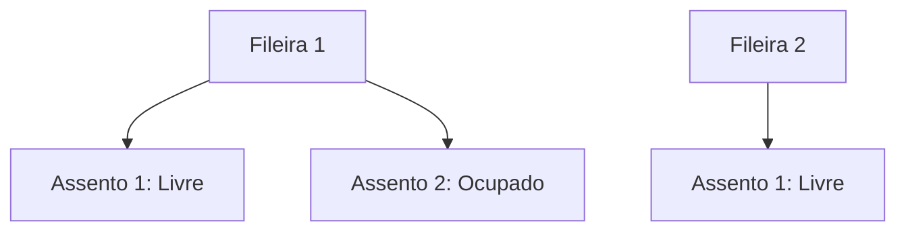
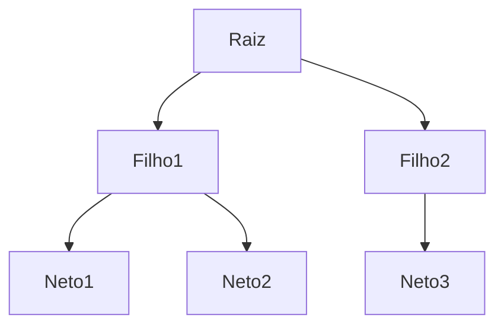
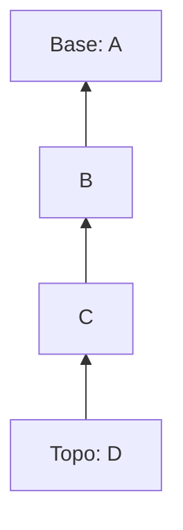
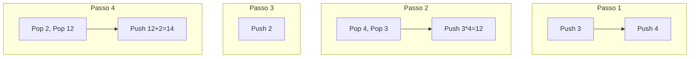

# Abstração de Dados e Estruturas Fundamentais  

## Introdução à Abstração de Dados  
**Abstração de dados** é o princípio que permite trabalhar com informações sem precisar entender detalhes técnicos de armazenamento físico na memória. É como usar um carro sem precisar conhecer mecânica interna:  

- **Ocultação de complexidade**: Detalhes de implementação são encapsulados  
- **Interface simplificada**: Operações lógicas (inserir, remover, buscar) substituem manipulação direta de memória  
- **Benefícios**: Reutilização de código, manutenção facilitada e redução de erros  

> 💡 **Analogia**: Assim como um menu de restaurante abstrai a complexidade da cozinha, estruturas de dados abstraem o armazenamento na memória.  

---

## 1. Estruturas de Dados Básicas  

### 1.1 Vetores (Arrays)  
**Coleção contígua** de elementos do mesmo tipo na memória:  



**Características**:  
- ✅ **Acesso direto** por índice (O(1))  
- ❌ **Custo alto** em inserções/remoções no meio (O(n))  
- **Operação crítica**:  
  ```python
  # Inserir elemento na posição 2 (0-based)
  for i in range(len(vetor)-1, 1, -1):
      vetor[i] = vetor[i-1]  # Desloca elementos
  vetor[2] = novo_valor
  ```  

**Aplicações**: Processamento de imagens (pixels), cálculos matriciais.  

---

### 1.2 Matrizes (Arrays Bidimensionais)  
**Grade retangular** para dados tabulares:  



**Exemplo prático** (controle de assentos):  
```c
int teatro[5][10];  // 5 fileiras, 10 assentos
teatro[3][6] = 1;   // Ocupa 4ª fileira, 7º assento
```  

**Vantagem**: Cálculo direto de posições `endereço = base + (i * cols + j) * size`.  

---

### 1.3 Listas Ligadas (Linked Lists)  
**Elementos não contíguos** conectados por ponteiros:  


**Operações eficientes**:  
- ✅ Inserção/remoção no início: O(1)  
- ❌ Acesso por posição: O(n)  

**Código de exclusão**:  
```c
// Remover nó B
nóA->next = nóB->next;  // Ponteiro "pula" nó B
free(nóB);              // Libera memória
```  

**Tipos**:  
- **Simples**: Só avança para frente  
- **Duplamente ligada**: Ponteiros anterior/próximo  
- **Circular**: Último aponta para primeiro  

---

### 1.4 Árvores  
**Estrutura hierárquica** com relação pai-filho:  



**Árvore Binária de Busca (BST)**:  
- Filhos esquerdos ≤ pai ≤ filhos direitos  
- **Busca eficiente**: O(log n) em árvores balanceadas  

**Exemplo de busca**:  
```python
def buscar(raiz, valor):
    if raiz is None or raiz.valor == valor:
        return raiz
    if valor < raiz.valor:
        return buscar(raiz.esquerda, valor)
    return buscar(raiz.direita, valor)
```  

---

## 2. Estruturas Operacionais Restritas  

### 2.1 Pilhas (LIFO: Last-In, First-Out)  
**Operações fundamentais**:  
- `push()`: Adiciona ao topo  
- `pop()`: Remove do topo  
- `peek()`: Inspeciona topo  



**Aplicações típicas**:  
- Chamadas de função (call stack)  
- Undo/Redo em editores  
- Avaliação de expressões (ex: `(2+3)*4`)  

**Implementação mínima**:  
```python
class Pilha:
    def __init__(self):
        self.itens = []
    
    def push(self, item):
        self.itens.append(item)
        
    def pop(self):
        return self.itens.pop() if self.itens else None
```  

---

### 2.2 Filas (FIFO: First-In, First-Out)  
**Operações essenciais**:  
- `enqueue()`: Adiciona ao final  
- `dequeue()`: Remove do início  
- `front()`: Consulta primeiro  


**Variantes importantes**:  
- **Filas circulares**: Reutilizam espaços liberados  
- **Filas de prioridade**: Elementos com "urgência"  

**Implementação com lista ligada**:  
```java
class Fila {
    class Nó {
        int dado;
        Nó próximo;
    }
    
    Nó frente, trás;
    
    void enqueue(int item) {
        Nó novo = new Nó();
        novo.dado = item;
        if (trás != null) trás.próximo = novo;
        trás = novo;
        if (frente == null) frente = trás;
    }
}
```  

---

## 3. Aplicação Prática: Máquina de Pilha  
**Avaliação de expressão pós-fixa** `3 4 * 2 +`:  



**Regras de execução**:  
1. Valores são empilhados  
2. Operadores consomem operandos do topo  
3. Resultado é reinserido na pilha  

---

## Resumo Comparativo de Estruturas  

| Estrutura       | Força Principal            | Fraqueza Principal         | Complexidade Acesso |
|-----------------|----------------------------|----------------------------|---------------------|
| **Vetor**       | Acesso direto por índice   | Inserção/remoção no meio   | O(1)               |
| **Lista Ligada**| Inserções/remoções rápidas | Acesso sequencial          | O(n)               |
| **Pilha**       | Gerenciamento LIFO         | Acesso restrito ao topo    | O(1)               |
| **Fila**        | Gerenciamento FIFO         | Acesso restrito às pontas  | O(1)               |
| **Árvore BST**  | Busca ordenada eficiente   | Desbalanceamento degrada desempenho | O(log n) |

> ⚠️ **Nota sobre desempenho**: Complexidades assumem implementações ideais. Desempenho real varia com alocação de memória e padrões de acesso.

---

## Referências Bibliográficas  
1. BROOKSHEAR, J.G. *Ciência da Computação: uma visão abrangente*. Porto Alegre: Bookman, 2013.  
2. CORMEN, T.H. *Algoritmos: Teoria e Prática*. Elsevier, 2012.  
3. SEDGEWICK, R. *Algorithms in C*. Addison-Wesley, 1998.  

> 🔍 **Sugestão de estudo complementar**: Implemente cada estrutura em sua linguagem preferida e compare desempenhos com diferentes tamanhos de dados.