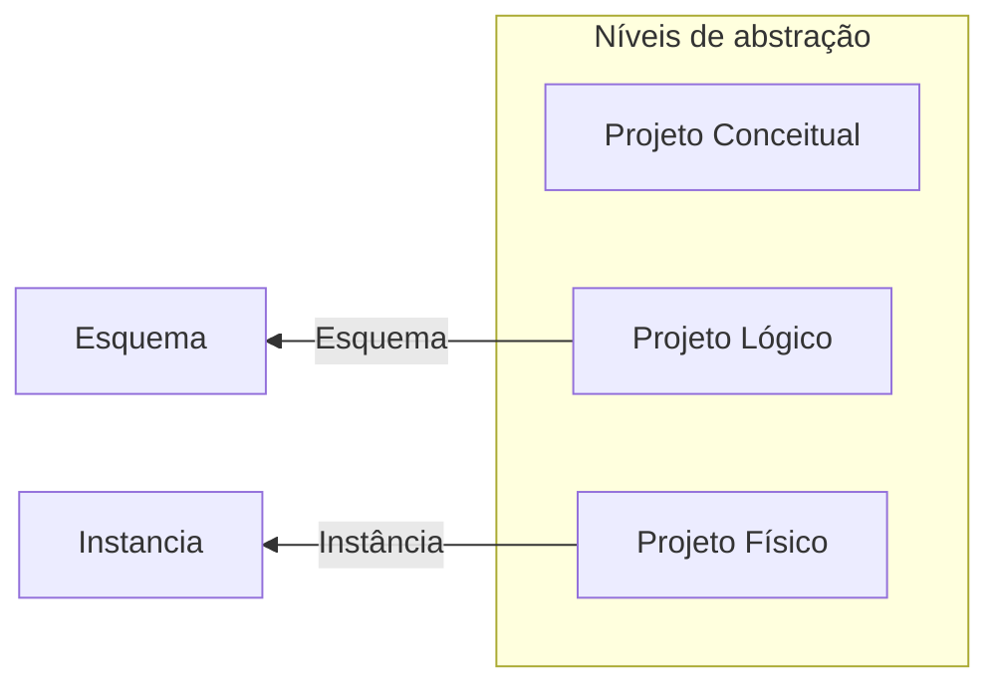
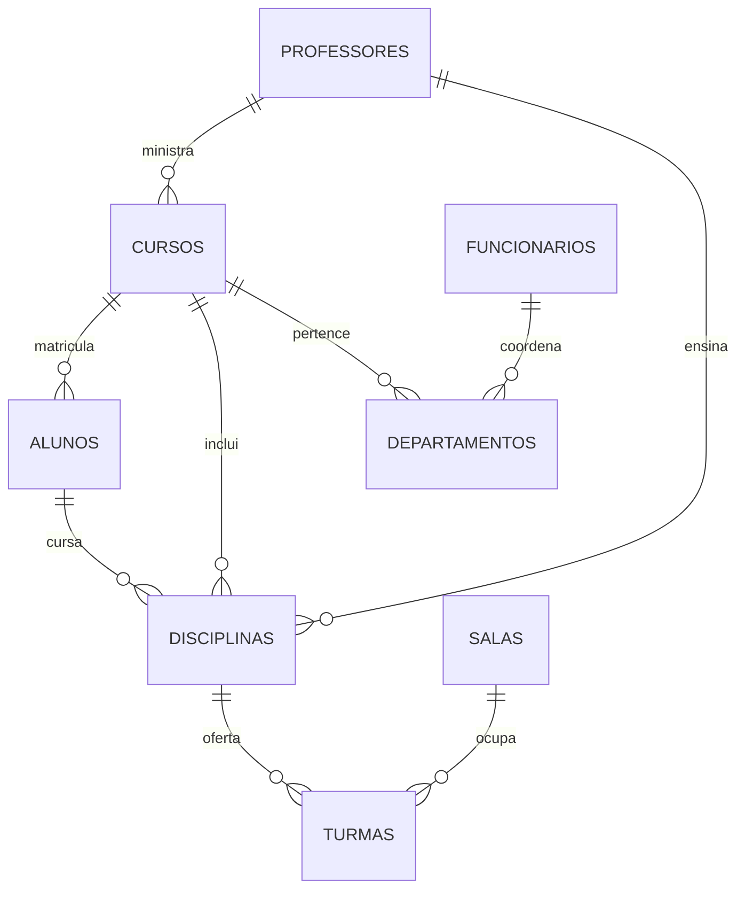

# Fundamentos de Bancos de Dados

*Um guia para estudantes de Ciência da Computação*

---

## Sumário
1. [Introdução e Conceitos Básicos](#introdução-e-conceitos-básicos)
2. [Dados vs. Informação](#dados-vs-informação)
3. [Sistemas de Arquivos vs. SGBD](#sistemas-de-arquivos-vs-sgbd)
4. [Componentes de um Banco de Dados](#componentes-de-um-banco-de-dados)
5. [Modelos de Dados](#modelos-de-dados)
6. [O Modelo Relacional](#o-modelo-relacional)
7. [O Modelo Orientado a Objetos](#o-modelo-orientado-a-objetos)
8. [Diagrama Entidade-Relacionamento (DER)](#diagrama-entidade-relacionamento-der)
9. [SGBD: Funcionalidades e Operações](#sgbd-funcionalidades-e-operações)
10. [SQL vs NoSQL](#sql-vs-nosql)
11. [ACID vs BASE](#acid-vs-base)

---

## Introdução e Conceitos Básicos

Bancos de dados (BD) são coleções organizadas de dados, essenciais para operações do cotidiano, como transações bancárias, reservas online, cadastros e muito mais. Eles permitem que empresas e organizações armazenem, gerenciem e analisem grandes volumes de dados para tomada de decisões.

### O que é um Banco de Dados?
- **Banco de dados**: Instância de dados + metadados.
  - **Instância de dados**: Os dados reais armazenados.
  - **Metadados**: Dados sobre os dados (estrutura, regras, restrições).
- **SGBD (Sistema Gerenciador de Banco de Dados)**: Software que gerencia o banco de dados (ex: MySQL, PostgreSQL, Oracle).

> 💡 **No princípio**: Antes dos SGBDs, os dados eram armazenados em arquivos simples, o que causava redundância, inconsistência e dificuldade de acesso.

---

## Dados vs. Informação

- **Dados**: Fatos brutos, representados por medidas, símbolos ou valores (ex: números, textos).
- **Informação**: Dados processados e contextualizados, que possuem significado e utilidade.

**Exemplo**: Um agricultor coleta *dados* sobre a produção de safras. Quando ele analisa esses dados para identificar que "em épocas de cheia, a plantação perde X%", ele transforma dados em *informação* útil para decisões futuras.

---

## Sistemas de Arquivos vs. SGBD

| Sistema de Arquivos                          | SGBD                                      |
|---------------------------------------------|-------------------------------------------|
| Dados armazenados em pastas separadas       | Dados integrados e organizados            |
| Dificuldade de acesso e manipulação         | Acesso rápido e seguro                    |
| Dados redundantes e inconsistentes          | Controle de integridade e consistência    |
| Baixa segurança                             | Controle de acesso e permissões           |

---

## Componentes de um Banco de Dados

### Instância e Esquema
- **Instância**: Conjunto de dados em um momento específico (mudam frequentemente).
- **Esquema**: Estrutura do BD (tabelas, colunas, relacionamentos) – muda raramente.

### Independência de Dados
- **Independência física**: Alterar a estrutura física sem afetar o esquema lógico.
- **Independência lógica**: Alterar o esquema lógico sem afetar as aplicações.

### Linguagens de um SGBD
1. **DDL (Linguagem de Definição de Dados)**: Define a estrutura do BD (ex: `CREATE`, `ALTER`, `DROP`).
2. **DML (Linguagem de Manipulação de Dados)**: Manipula os dados (ex: `SELECT`, `INSERT`, `UPDATE`, `DELETE`).
3. **QL (Linguagem de Consulta)**: Permite consultas complexas (ex: SQL).

---

## Modelos de Dados

### Modelos Conceituais
- **Entidade-Relacionamento (ER)**: Representa entidades, atributos e relacionamentos de forma visual.

### Modelos Lógicos
1. **Relacional**: Dados organizados em tabelas com linhas e colunas.
2. **Orientado a Objetos**: Dados representados como objetos (com atributos e métodos).
3. **Redes**: Baseado em grafos (nós e arestas).
4. **Hierárquico**: Estrutura em árvore (registros pai e filho).

---

## O Modelo Relacional

Representa o banco de dados como uma coleção de **tabelas** (relações). Cada tabela possui:
- **Linhas (tuplas)**: Registros individuais.
- **Colunas (atributos)**: Características dos registros.

### Componentes do Modelo Relacional
- **Atributo**: Coluna de uma tabela.
- **Tupla**: Linha única em uma tabela.
- **Esquema de relação**: Nome da relação + seus atributos.
- **Grau**: Número total de atributos.
- **Cardinalidade**: Número total de linhas.
- **Chave primária**: Atributo que identifica unicamente uma tupla.
- **Chave estrangeira**: Atributo que referencia uma chave primária em outra tabela.

### Restrições de Integridade
1. **Restrições de domínio**: Valores devem estar dentro de um domínio pré-definido.
2. **Restrições de chave**: Chave primária deve ser única e não nula.
3. **Integridade referencial**: Chaves estrangeiras devem referenciar chaves primárias válidas.

### Operações Básicas
- `INSERT`: Adicionar novos registros.
- `UPDATE`: Modificar registros existentes.
- `DELETE`: Remover registros.
- `SELECT`: Consultar dados.

### Vantagens e Desvantagens
| Vantagens                          | Desvantagens                          |
|-----------------------------------|---------------------------------------|
| Simplicidade e facilidade de uso  | Limitações em campos de texto longo   |
| Independência de dados            | Complexidade em relacionamentos muitos-para-muitos |
| Escalabilidade                    | Dificuldade em consultas recursivas   |
| Capacidade de consulta (SQL)      |                                       |

---

## O Modelo Orientado a Objetos

Combina princípios de programação orientada a objetos com armazenamento de dados. Os dados são representados como **objetos**, com atributos e métodos.

### Por que usar?
- **Limitações do modelo relacional**: Não representa adequadamente entidades complexas do mundo real.
- **Aplicações avançadas**: Necessidade de armazenar objetos diretamente (ex: multimídia).
- **Popularidade da OO**: Integração com linguagens como Java e C++.

### Exemplos de SGBDOO
- Gemstone/OPAL, Ontos, ObjectStore, Cache.

---

## Diagrama Entidade-Relacionamento (DER)

Representação gráfica do modelo de dados, mostrando:
- **Entidades**: Objetos do mundo real (ex: Pessoa, Produto).
- **Atributos**: Características das entidades (ex: nome, preço).
- **Relacionamentos**: Como as entidades se conectam.

### Tipos de Relacionamentos
- **1:1 (Um para um)**: Cada entidade A se relaciona com no máximo uma entidade B.
- **1:N (Um para muitos)**: Uma entidade A pode se relacionar com várias entidades B.
- **N:M (Muitos para muitos)**: Múltiplas entidades A e B podem se relacionar.

### Classificação de Entidades
- **Físicas**: Objetos tangíveis (ex: Pessoa, Produto).
- **Lógicas**: Decorrentes de interações (ex: Venda, Cadastro).
- **Fortes**: Existem independentemente.
- **Fracas**: Dependem de outras entidades.

### Exemplo de DER

---

## SGBD: Funcionalidades e Operações

Principais conceitos e funções de um SGBD:
- **Tabelas**: Armazenam dados em linhas e colunas.
- **Índices**: Aceleram consultas.
- **Transações**: Operações atômicas (ou todas são executadas ou nenhuma).
- **Backup e recuperação**: Protegem contra perda de dados.
- **Segurança**: Controlam acesso e permissões.
- **Desempenho**: Otimizam consultas e operações.

---

## SQL vs NoSQL

| SQL (Relacional)               | NoSQL (Não relacional)               |
|-------------------------------|--------------------------------------|
| Dados organizados em tabelas  | Dados flexíveis (documentos, grafos) |
| Esquema fixo                  | Esquema dinâmico                     |
| Escalabilidade vertical       | Escalabilidade horizontal            |
| Ex: MySQL, PostgreSQL         | Ex: MongoDB, Cassandra               |

---

## ACID vs BASE

### ACID (Bancos Relacionais)
- **Atomicidade**: Transações são all-or-nothing.
- **Consistência**: O BD sempre está em um estado válido.
- **Isolamento**: Transações não interferem umas nas outras.
- **Durabilidade**: Dados persistem após falhas.

### BASE (Bancos NoSQL)
- **Basicamente Disponível**: Sempre respondendo, mesmo com falhas parciais.
- **Estado Soft**: Pode haver inconsistências temporárias.
- **Eventualmente Consistente**: Dados tornam-se consistentes ao longo do tempo.

---

### Referência Bibliográfica
ELMASRI, Ramez. Sistemas de banco de dados. São Paulo: Pearson Addison Wesley, 2015.

---
**Nota**: Este documento integra e organiza os conceitos fundamentais de bancos de dados, com linguagem acessível para estudantes do primeiro semestre, sem omitir detalhes importantes.