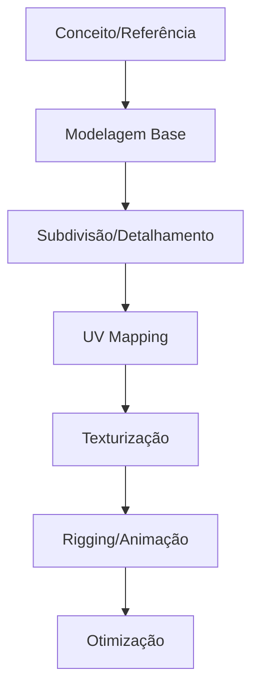
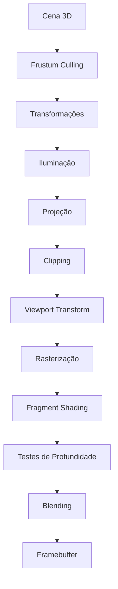
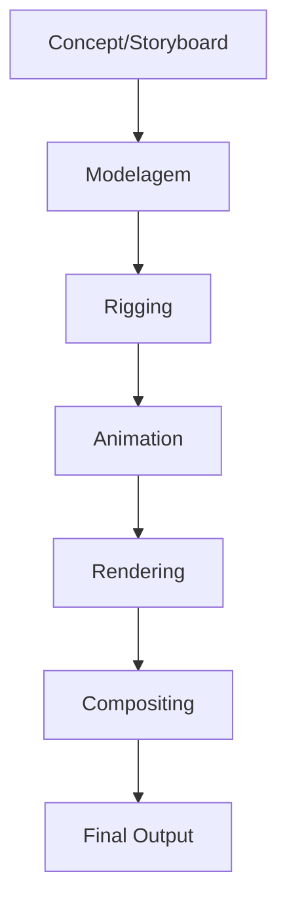

# Computação Gráfica - Guia Completo

## 📚 Índice
1. [Introdução](#introdução)
2. [Processamento de Imagens](#processamento-de-imagens)
3. [Modelagem 3D](#modelagem-3d)
4. [Renderização](#renderização)
5. [Animação e Efeitos](#animação-e-efeitos)
6. [Ferramentas e Software](#ferramentas-e-software)
7. [Aplicações Práticas](#aplicações-práticas)
8. [Referências](#referências)

---

## 🎯 Introdução

A **Computação Gráfica** é uma área multidisciplinar da ciência da computação que combina matemática, física e arte para criar, manipular e visualizar imagens digitais. Esta disciplina revolucionou diversas indústrias, desde o entretenimento até a medicina, proporcionando ferramentas poderosas para representação visual da informação.

### 🌟 Áreas de Aplicação
- **🎬 Entretenimento**: Cinema, jogos, animações
- **🏥 Medicina**: Diagnóstico por imagem, simulações cirúrgicas
- **🏗️ Engenharia**: CAD, simulações, prototipagem
- **🔬 Ciência**: Visualização de dados, modelagem científica
- **🎨 Arte Digital**: Design, ilustração, arte interativa

### 🔄 Principais Processos
1. **Aquisição**: Captura de imagens por sensores
2. **Processamento**: Manipulação e melhoria de imagens
3. **Modelagem**: Criação de objetos 2D e 3D
4. **Renderização**: Geração de imagens finais
5. **Animação**: Criação de sequências em movimento
---

## 📷 Processamento de Imagens

O processamento de imagens é a base da computação gráfica moderna, envolvendo a manipulação de imagens digitais através de algoritmos computacionais para melhorar qualidade, extrair informações ou preparar dados para análises posteriores.

### 🔍 Definição e Conceitos

Uma **imagem digital** é uma matriz de pixels (picture elements), onde cada pixel representa uma intensidade de cor ou brilho em uma posição específica. O processamento manipula esses pixels para atingir objetivos específicos.

### 🎯 Tipos de Processamento

#### 📊 **Processamento de Imagens**
- **Entrada**: Imagem digital
- **Saída**: Imagem digital melhorada
- **Objetivo**: Melhorar qualidade visual

| Técnica | Aplicação | Exemplo |
|---------|-----------|---------|
| **Ajuste de Brilho** | Corrigir exposição | Fotografias escuras |
| **Contraste** | Realçar detalhes | Imagens médicas |
| **Filtragem de Ruído** | Remover interferências | Fotos com granulação |
| **Nitidez** | Melhorar foco | Imagens desfocadas |
| **Correção de Cor** | Balanceamento cromático | Fotos com dominantes |

#### 🤖 **Análise de Imagens**
- **Entrada**: Imagem digital
- **Saída**: Dados, informações ou medições
- **Objetivo**: Extrair conhecimento

| Técnica | Aplicação | Exemplo |
|---------|-----------|---------|
| **Detecção de Bordas** | Identificar contornos | Reconhecimento de objetos |
| **Segmentação** | Separar regiões | Diagnóstico médico |
| **Classificação** | Categorizar imagens | Controle de qualidade |
| **Reconhecimento de Padrões** | Identificar formas | Leitura de códigos |
| **Visão Computacional** | Interpretação automática | Veículos autônomos |

### 🏥 Aplicações Práticas

#### **Medicina**
- **Tomografia Computadorizada**: Reconstrução 3D de órgãos
- **Ressonância Magnética**: Análise de tecidos moles
- **Raio-X Digital**: Detecção de fraturas e patologias

#### **Indústria**
- **Controle de Qualidade**: Inspeção automática de produtos
- **Robótica**: Navegação e manipulação de objetos
- **Vigilância**: Detecção de movimento e reconhecimento facial

#### **Entretenimento**
- **Edição Fotográfica**: Adobe Photoshop, GIMP
- **Cinema**: Efeitos especiais e pós-produção
- **Jogos**: Processamento em tempo real

### 📋 Fluxo de Trabalho


1. **Aquisição**: Captura por câmeras, scanners, sensores
2. **Pré-processamento**: Correção de ruídos e distorções
3. **Processamento**: Aplicação de filtros e transformações
4. **Pós-processamento**: Refinamento e otimização
5. **Análise/Saída**: Extração de informações ou visualização
---

## 🎲 Modelagem 3D

A modelagem 3D é o processo de criação de representações tridimensionais de objetos usando coordenadas matemáticas e técnicas computacionais. É fundamental para jogos, filmes, arquitetura e simulações científicas.

### 🔺 Geometria e Forma dos Objetos

A base da modelagem 3D são os **polígonos**, especialmente triângulos, que formam a **mesh** (malha) dos objetos.

#### **Princípios Fundamentais**
- **Triângulos**: Menor unidade geométrica para representar superfícies planas
- **Vértices**: Pontos no espaço 3D que definem os cantos dos polígonos
- **Arestas**: Linhas que conectam os vértices
- **Faces**: Superfícies definidas por três ou mais vértices

#### 📊 **Relação Qualidade vs Performance**

| Quantidade de Polígonos | Qualidade Visual | Performance | Uso Típico |
|-------------------------|------------------|-------------|------------|
| **Low Poly** (< 1.000) | Baixa | Alta | Jogos mobile, VR |
| **Mid Poly** (1.000 - 10.000) | Média | Moderada | Jogos PC/Console |
| **High Poly** (10.000 - 100.000) | Alta | Baixa | Cinema, renderização |
| **Ultra High** (> 100.000) | Máxima | Muito baixa | Modelagem detalhada |

### 🧮 Métodos de Modelagem

#### **1. Modelagem Matemática**
Baseada em equações e fórmulas geométricas precisas.

**Exemplo - Esfera**:
```
R² = x² + y² + z²
```
Onde:
- **R**: Raio da esfera
- **x, y, z**: Coordenadas cartesianas

| Forma Geométrica | Equação | Aplicação |
|------------------|---------|-----------|
| **Esfera** | `x² + y² + z² = r²` | Planetas, bolas |
| **Cilindro** | `x² + y² = r²` | Colunas, tubos |
| **Cone** | `x²/a² + y²/b² = z²/c²` | Montanhas, chapéus |
| **Plano** | `ax + by + cz = d` | Superfícies planas |

#### **2. Modelagem Física (Digitalização)**
Captura de objetos reais através de tecnologia.

| Tecnologia | Precisão | Custo | Aplicação |
|------------|----------|-------|-----------|
| **Scanner 3D** | Alta | Alto | Objetos pequenos/médios |
| **Fotogrametria** | Média | Baixo | Arquitetura, paisagens |
| **LiDAR** | Muito Alta | Muito Alto | Topografia, carros autônomos |
| **Kinect/Câmeras** | Baixa | Baixo | Protótipo rápido |

#### **3. Modelagem por Fractais**
Criação de formas complexas através de padrões repetitivos.

| Tipo de Fractal | Aplicação | Características |
|-----------------|-----------|-----------------|
| **Mandelbrot** | Texturas abstratas | Padrões infinitos |
| **Perlin Noise** | Terrenos naturais | Variação suave |
| **L-Systems** | Vegetação | Crescimento orgânico |
| **Julia Sets** | Efeitos especiais | Formas complexas |

### 🎨 Superfícies e Materiais

#### **Texturas**
Imagens aplicadas sobre a geometria para adicionar detalhes visuais sem aumentar a complexidade geométrica.

| Tipo de Textura | Finalidade | Formato Comum |
|------------------|-----------|---------------|
| **Diffuse/Albedo** | Cor base do material | JPG, PNG |
| **Normal Map** | Simular irregularidades | PNG, EXR |
| **Roughness** | Controlar reflexões | Grayscale |
| **Metallic** | Definir propriedades metálicas | Grayscale |
| **Emission** | Materiais luminosos | HDR |

#### **Mapeamento UV**
Processo de "desembalar" a geometria 3D em uma superfície 2D para aplicar texturas.

```
Coordenadas 3D (x,y,z) → Coordenadas UV (u,v)
```

### 🔧 Pipeline de Modelagem



### 📐 Técnicas Avançadas

#### **Subdivision Surfaces**
- Suavização automática de geometrias low-poly
- Algoritmos: Catmull-Clark, Loop, Doo-Sabin
- Permite trabalhar com geometria simples que se torna complexa na renderização

#### **Sculpting Digital**
- Modelagem similar à escultura tradicional
- Software: ZBrush, Mudbox, Blender
- Ideal para personagens orgânicos e detalhes complexos

#### **Procedural Modeling**
- Geração automática baseada em regras
- Uso de nós e algoritmos
- Eficiente para ambientes grandes e elementos repetitivos
---

## 🎬 Renderização

A renderização é o processo computacional que transforma modelos 3D em imagens 2D finais, simulando como a luz interage com objetos virtuais para criar representações visuais realistas ou estilizadas.

### 🎭 Componentes de uma Cena

#### **Elementos Fundamentais**

| Elemento | Função | Parâmetros Principais |
|----------|--------|----------------------|
| **🎥 Câmera** | Define ponto de vista | Posição, rotação, FOV, foco |
| **💡 Luzes** | Iluminam a cena | Tipo, intensidade, cor, sombras |
| **🎲 Objetos** | Geometria da cena | Mesh, materiais, transformações |
| **🌍 Ambiente** | Contexto da cena | Skybox, fog, partículas |

#### **Relação Complexidade vs Performance**

```
Tempo de Renderização ∝ (Objetos × Polígonos × Luzes × Resolução)
```

| Fator | Impacto no Tempo | Otimização |
|-------|------------------|-----------|
| **Número de objetos** | Linear | LOD, Culling |
| **Contagem de polígonos** | Quadrático | Decimation, Instancing |
| **Quantidade de luzes** | Exponencial | Light baking, Clustering |
| **Resolução final** | Quadrático | Upscaling, DLSS |

### ☀️ Física da Luz

#### **Reflexão**
Interação da luz com superfícies opacas.

**Lei da Reflexão**: `θᵢ = θᵣ`
- **θᵢ**: Ângulo de incidência
- **θᵣ**: Ângulo de reflexão

| Tipo de Reflexão | Característica | Aplicação |
|------------------|----------------|-----------|
| **Especular** | Reflexão perfeita | Espelhos, metal polido |
| **Difusa** | Dispersão uniforme | Papel, tecido |
| **Glossy** | Reflexão imperfeita | Metal escovado, plástico |

#### **Refração**
Mudança de direção da luz ao passar entre materiais.

**Lei de Snell**: `n₁ sin(θ₁) = n₂ sin(θ₂)`

| Material | Índice de Refração | Aplicação |
|----------|-------------------|-----------|
| **Ar** | 1.00 | Referência |
| **Água** | 1.33 | Lagos, oceanos |
| **Vidro** | 1.50 | Janelas, lentes |
| **Diamante** | 2.42 | Joias, cristais |

### 🎨 Sombreamento (Shading)

O sombreamento determina como a luz interage com as superfícies, definindo cor, brilho e textura de cada pixel.

#### **Modelos de Iluminação**

| Modelo | Componentes | Equação | Aplicação |
|--------|-------------|---------|-----------|
| **Lambert** | Difusa apenas | `I = I₀ × cos(θ)` | Materiais foscos |
| **Phong** | Difusa + Especular | `I = Iₐ + Iᵈ + Iₛ` | Superfícies brilhantes |
| **Blinn-Phong** | Otimização do Phong | Half-vector | Tempo real |
| **PBR** | Fisicamente correto | BRDF complexa | Realismo |

#### **Técnicas Avançadas de Sombreamento**

| Técnica | Finalidade | Quando Usar | Custo Computacional |
|---------|-----------|-------------|-------------------|
| **Bump Mapping** | Simular rugosidade | Detalhes de superfície | Baixo |
| **Normal Mapping** | Detalhes de iluminação | Substituir geometria | Médio |
| **Displacement Mapping** | Alterar geometria real | Máximo realismo | Alto |
| **Parallax Mapping** | Pseudo-profundidade | Efeito 3D em texturas | Médio |
| **Cel Shading** | Visual cartoon | Animações estilizadas | Baixo |
| **Subsurface Scattering** | Luz através do material | Pele, cera, mármore | Muito Alto |

### 🔧 Técnicas de Renderização

#### **🚀 Rasterização**
- **Princípio**: Converte triângulos em pixels
- **Performance**: Muito rápida (tempo real)
- **Limitações**: Reflexões e sombras limitadas


#### **✨ Ray Tracing**
- **Princípio**: Simula trajetória da luz
- **Performance**: Lenta (offline rendering)
- **Vantagens**: Reflexões e refrações perfeitas

```
Para cada pixel:
  1. Disparar raio da câmera
  2. Encontrar interseção mais próxima
  3. Calcular cor baseada no material
  4. Disparar raios secundários (reflexão/refração)
  5. Combinar resultados
```

| Aspecto | Rasterização | Ray Tracing |
|---------|--------------|-------------|
| **Velocidade** | Tempo real (>60 FPS) | Offline (minutos/horas) |
| **Reflexões** | Aproximadas | Perfeitas |
| **Sombras** | Limitadas | Naturais |
| **Transparência** | Problemática | Automática |
| **Hardware** | GPU padrão | RTX, cores RT |

#### **🌈 Radiosity**
Simula iluminação global através da distribuição de energia luminosa entre superfícies.

**Aplicações**:
- Arquitetura (iluminação natural)
- Ambientes internos realistas
- Pré-computação de iluminação

### 📊 Pipeline de Renderização



### ⚡ Otimizações de Performance

#### **Técnicas de Aceleração**

| Técnica | Descrição | Ganho Típico |
|---------|-----------|--------------|
| **Frustum Culling** | Remove objetos fora da câmera | 20-50% |
| **Occlusion Culling** | Remove objetos ocultos | 10-30% |
| **LOD (Level of Detail)** | Reduz detalhes com distância | 30-70% |
| **Batching** | Agrupa objetos similares | 15-40% |
| **Instancing** | Reutiliza geometria | 50-90% |

#### **Técnicas Modernas**

| Tecnologia | Função | Benefício |
|------------|--------|-----------|
| **DLSS/FSR** | Upscaling AI | +50-100% FPS |
| **Variable Rate Shading** | Shading adaptativo | +10-20% FPS |
| **Mesh Shaders** | Pipeline flexível | Melhor geometria |
| **RTX/RDNA** | Ray tracing hardware | RT em tempo real |

---

## 🎞️ Animação e Efeitos

A animação 3D dá vida aos objetos virtuais, criando a ilusão de movimento através da manipulação de propriedades ao longo do tempo.

### 🏃 Princípios da Animação 3D

#### **Keyframes e Interpolação**
- **Keyframes**: Poses principais definidas pelo animador
- **Interpolação**: Cálculo automático dos quadros intermediários
- **Curves**: Controle da velocidade e aceleração

| Tipo de Interpolação | Característica | Uso |
|---------------------|----------------|-----|
| **Linear** | Velocidade constante | Movimentos mecânicos |
| **Ease In** | Aceleração gradual | Início de movimentos |
| **Ease Out** | Desaceleração gradual | Final de movimentos |
| **Bezier** | Controle total da curva | Animações complexas |

#### **Sistemas de Animação**

| Sistema | Descrição | Aplicação |
|---------|-----------|-----------|
| **Forward Kinematics** | Controle direto de joints | Animação de máquinas |
| **Inverse Kinematics** | Controle por objetivos | Caminhada, alcançar objetos |
| **Motion Capture** | Captura de movimentos reais | Personagens realistas |
| **Procedural** | Geração automática | Multidões, partículas |

### 🔄 Morphing e Transformações

#### **Morphing (Metamorfose)**
Técnica que permite a transformação suave entre duas formas ou imagens diferentes.

**Processo**:
1. **Correspondência de pontos**: Mapear pontos entre formas
2. **Interpolação**: Calcular posições intermediárias
3. **Blending**: Misturar texturas e cores
4. **Renderização**: Gerar quadros da transição

| Tipo de Morphing | Complexidade | Aplicação |
|------------------|--------------|-----------|
| **2D Image** | Baixa | Efeitos fotográficos |
| **3D Mesh** | Média | Animação facial |
| **Volumétrico** | Alta | Efeitos especiais |

#### **Aplicações Práticas**

| Área | Uso do Morphing | Exemplo |
|------|----------------|---------|
| **Cinema** | Transformações de personagens | Lobisomem, envelhecimento |
| **Medicina** | Simulação de cirurgias | Antes/depois de procedimentos |
| **Forense** | Progressão etária | Busca de pessoas desaparecidas |
| **Arte** | Criação artística | Instalações interativas |

### 🎨 Efeitos Especiais

#### **Sistemas de Partículas**

Simulação de fenômenos naturais através de muitas pequenas entidades.

| Efeito | Partículas | Propriedades |
|--------|------------|--------------|
| **Fogo** | 1.000-10.000 | Temperatura, combustível |
| **Fumaça** | 5.000-50.000 | Densidade, turbulência |
| **Água** | 10.000-1M | Viscosidade, tensão superficial |
| **Explosão** | 100.000+ | Pressão, fragmentação |

#### **Simulações Físicas**

| Tipo | Complexidade | Tempo de Cálculo |
|------|--------------|-----------------|
| **Rigid Body** | Baixa | Tempo real |
| **Soft Body** | Média | Near real-time |
| **Fluid** | Alta | Offline |
| **Cloth** | Média-Alta | Variável |

### 🎯 Pipeline de Animação



#### **Fases Detalhadas**

1. **Pré-produção**
   - Concept art e storyboard
   - Definição de personagens
   - Pipeline técnico

2. **Rigging**
   - Criação de esqueleto (armature)
   - Controles de animação
   - Skin weighting

3. **Animação**
   - Layout e timing
   - Keyframe animation
   - Polishing e refinamento

4. **Pós-produção**
   - Renderização
   - Compositing
   - Edição final

---

## 🛠️ Ferramentas e Software

### 🏭 Software Profissional

#### **Modelagem e Animação Completa**

| Software | Licença | Especialidade | Custo Anual | Curva de Aprendizado |
|----------|---------|---------------|-------------|---------------------|
| **🎨 Blender** | Open Source | Generalista | Gratuito | Média |
| **🎭 Maya** | Comercial | Cinema/VFX | $1.785 | Alta |
| **🎬 3ds Max** | Comercial | Arquitetura/Jogos | $1.785 | Média-Alta |
| **🎪 Cinema 4D** | Comercial | Motion Graphics | $3.495 | Média |
| **🎨 Houdini** | Comercial | Efeitos Procedurais | $1.995-6.995 | Muito Alta |

#### **Especialização por Área**

| Área | Software Recomendado | Por quê |
|------|---------------------|--------|
| **🎮 Jogos** | Blender, Maya, 3ds Max | Pipeline de jogos |
| **🎬 Cinema** | Maya, Houdini, Nuke | VFX profissional |
| **🏗️ Arquitetura** | 3ds Max, SketchUp, Rhino | Visualização arq. |
| **📱 Motion Graphics** | Cinema 4D, After Effects | Integração |
| **🔬 Científica** | Blender, ParaView | Visualização dados |

### 📐 Software CAD e Técnico

#### **Design Industrial e Engenharia**

| Software | Aplicação | Forte em | Custo |
|----------|-----------|----------|--------|
| **AutoCAD** | Desenho técnico 2D/3D | Precisão, padrões | Alto |
| **SolidWorks** | Engenharia mecânica | Simulação, manufatura | Alto |
| **Fusion 360** | Design industrial | Cloud, colaboração | Médio |
| **Rhino** | Design complexo | Superfícies NURBS | Médio |
| **SketchUp** | Arquitetura rápida | Facilidade de uso | Baixo |

### 💻 Hardware Recomendado

#### **Configurações por Uso**

| Nível | CPU | RAM | GPU | Armazenamento | Orçamento |
|-------|-----|-----|-----|---------------|-----------|
| **🎓 Estudante** | Ryzen 5/i5 | 16GB | GTX 1660/RTX 3060 | SSD 500GB | $800-1.200 |
| **🏢 Profissional** | Ryzen 7/i7 | 32GB | RTX 4070/4080 | SSD 1TB | $1.500-3.000 |
| **🎬 Estúdio** | Threadripper/Xeon | 64GB+ | RTX 4090/A6000 | NVMe 2TB+ | $5.000+ |

#### **Especializações de Hardware**

| Workload | Prioridade | Componente Crítico |
|----------|------------|-------------------|
| **Modelagem** | CPU/RAM | Multi-core, memória |
| **Rendering** | GPU/CPU | Cores CUDA/RT |
| **Animação** | RAM/Storage | Memória, I/O rápido |
| **Simulação** | CPU/RAM | Cores, bandwidth |

---

## 🚀 Aplicações Práticas

### 🎯 Indústrias e Setores

#### **🎬 Entretenimento**

| Subárea | Aplicação | Exemplos |
|---------|-----------|----------|
| **Cinema** | VFX, personagens CGI | Marvel, Pixar |
| **Jogos** | Assets, ambientes | Unreal, Unity |
| **Streaming** | Virtual sets, avatares | Netflix, Twitch |
| **Publicidade** | Product viz, comerciais | Nike, Apple |

#### **🏥 Medicina e Ciência**

| Aplicação | Benefício | Tecnologia |
|-----------|-----------|------------|
| **Diagnóstico** | Visualização 3D de órgãos | Volume rendering |
| **Cirurgia** | Planejamento pré-operatório | Realidade aumentada |
| **Educação** | Anatomia interativa | VR/AR |
| **Pesquisa** | Modelagem molecular | Simulação científica |

#### **🏗️ Arquitetura e Engenharia**

| Fase do Projeto | Uso da CG | Ferramenta |
|-----------------|-----------|------------|
| **Conceitual** | Esboços 3D | SketchUp |
| **Desenvolvimento** | BIM, precisão | Revit, ArchiCAD |
| **Apresentação** | Renders realistas | V-Ray, Corona |
| **Construção** | AR no canteiro | HoloLens, iPad |

### 🔮 Tendências Emergentes

#### **🥽 Realidade Estendida (XR)**

| Tecnologia | Maturidade | Aplicação | Desafios |
|------------|------------|-----------|----------|
| **VR** | Madura | Jogos, treinamento | Comfort, resolução |
| **AR** | Crescendo | Mobile, industrial | Tracking, bateria |
| **MR** | Emergente | Colaboração | Custo, usabilidade |

#### **🤖 IA na Computação Gráfica**

| Área | Aplicação da IA | Impacto |
|------|----------------|---------|
| **Upscaling** | DLSS, FSR | Performance |
| **Geração** | DALL-E, Midjourney | Criação de conteúdo |
| **Animação** | Motion synthesis | Automação |
| **Rendering** | Denoising | Qualidade/velocidade |

---

## 📚 Referências

### 📖 Bibliografia Principal

#### **Livros Fundamentais**
- **FOLEY, J. D.; VAN DAM, A.** *Computer Graphics: Principles and Practice*. 3rd ed. Addison-Wesley, 2013.
- **SHIRLEY, P.; MARSCHNER, S.** *Fundamentals of Computer Graphics*. 5th ed. CRC Press, 2021.
- **AKENINE-MÖLLER, T.; HAINES, E.** *Real-Time Rendering*. 4th ed. A K Peters/CRC Press, 2018.

#### **Bibliografia Complementar**
- **BROOKSHEAR, J. G.** *Ciência da Computação: uma visão abrangente*. Bookman, 2013.
- **SOMMERVILLE, I.** *Engenharia de Software*. Pearson, 2018.
- **DUTRE, P.; BALA, K.; BEKAERT, P.** *Advanced Global Illumination*. 2nd ed. A K Peters, 2006.

### 🌐 Recursos Online

#### **Documentação Técnica**
- **[OpenGL Documentation](https://www.opengl.org/documentation/)** - API gráfica padrão
- **[DirectX Developer Center](https://docs.microsoft.com/en-us/windows/win32/directx)** - Plataforma Microsoft
- **[Vulkan Specification](https://www.khronos.org/vulkan/)** - API moderna de baixo nível

#### **Tutoriais e Cursos**
- **[Blender Guru](https://www.blenderguru.com/)** - Tutoriais Blender
- **[Digital Tutors/Pluralsight](https://www.pluralsight.com/)** - Cursos profissionais
- **[Coursera - Computer Graphics](https://www.coursera.org/)** - Cursos universitários

#### **Comunidades**
- **[CGSociety](https://cgsociety.org/)** - Comunidade profissional
- **[BlenderArtists](https://blenderartists.org/)** - Fórum Blender
- **[Polycount](https://polycount.com/)** - Comunidade de jogos

### 🔗 Links Úteis

#### **Software Gratuito**
- **[Blender](https://www.blender.org/)** - Suite completa 3D
- **[GIMP](https://www.gimp.org/)** - Editor de imagem
- **[Krita](https://krita.org/)** - Pintura digital
- **[Godot](https://godotengine.org/)** - Game engine

#### **Recursos Gratuitos**
- **[Sketchfab](https://sketchfab.com/)** - Modelos 3D
- **[Poly Haven](https://polyhaven.com/)** - HDRIs e texturas
- **[Mixamo](https://www.mixamo.com/)** - Animações de personagens
- **[Freesound](https://freesound.org/)** - Áudio para projetos

### 📊 Métricas de Aprendizado

#### **Roadmap Sugerido**

| Nível | Duração | Tópicos | Projetos |
|-------|---------|---------|----------|
| **Iniciante** | 3 meses | Modelagem básica, materiais | Objeto simples |
| **Intermediário** | 6 meses | Animação, iluminação | Cena completa |
| **Avançado** | 12 meses | Simulações, scripting | Portfolio profissional |
| **Especialista** | 2+ anos | Pesquisa, desenvolvimento | Contribuições open source |

---

> **💡 Dica Final**: A computação gráfica é um campo em constante evolução. Mantenha-se atualizado com as últimas tecnologias, pratique regularmente e não tenha medo de experimentar. O futuro da visualização digital está em suas mãos!