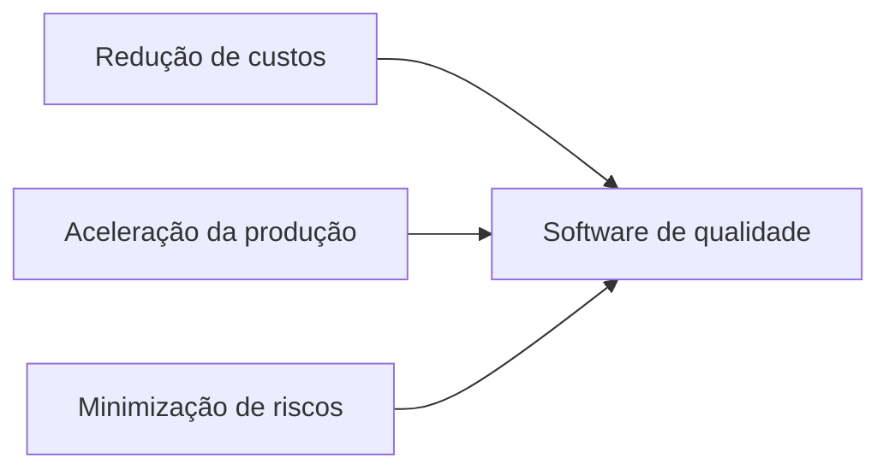
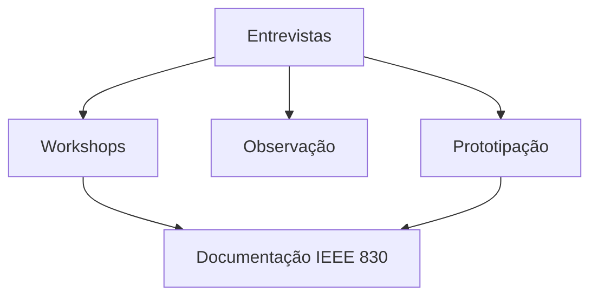
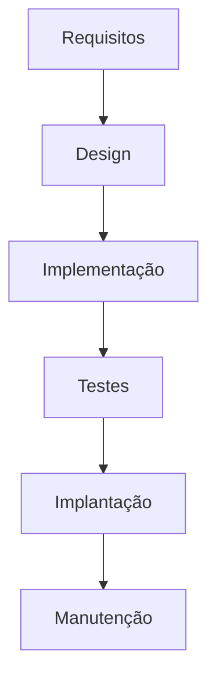
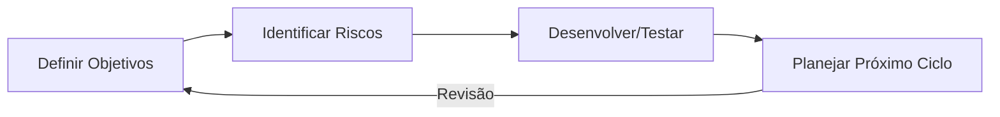
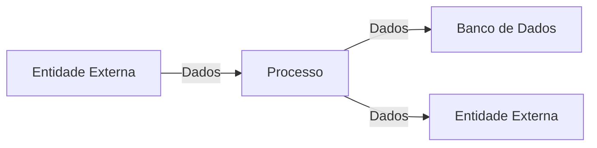
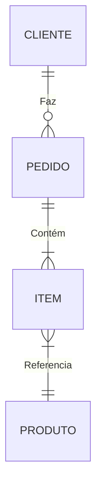
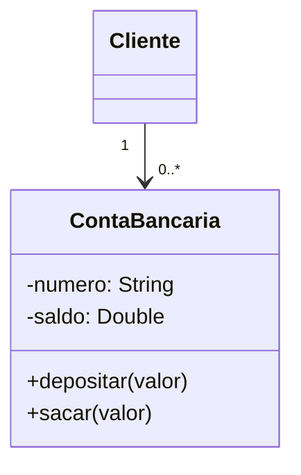
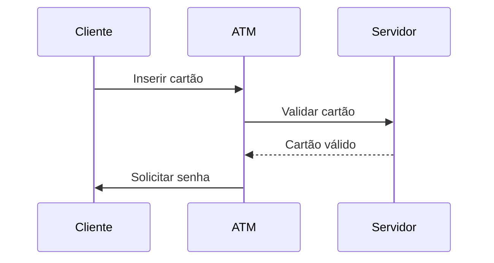

# Engenharia de Software: Fundamentos e Práticas  

## 1. Introdução à Engenharia de Software  
**Definição**: Disciplina que aplica abordagens sistemáticas ao desenvolvimento, operação e manutenção de software, combinando:  
- **Metodologias** (ágil, cascata, etc.)  
- **Recursos** (humanos, tecnológicos, financeiros)  
- **Ferramentas** (IDEs, sistemas de versionamento)  

**Objetivos principais**:  


**Desafios comuns**:  
- Gerenciamento de mudanças de requisitos  
- Coordenação de equipes multidisciplinares  
- Balanceamento entre tempo, custo e qualidade  

> 💡 *"A engenharia de software é a ponte entre problemas reais e soluções digitais eficientes."*

---

## 2. Engenharia de Requisitos  
### 2.1 Conceitos Fundamentais  
| Tipo de Requisito | Descrição | Exemplos |  
|-------------------|-----------|----------|  
| **Funcionais** | Comportamentos do sistema | Login, relatórios, processamento de pagamentos |  
| **Não-funcionais** | Restrições e qualidades | Performance, segurança, usabilidade |  

### 2.2 Técnicas de Elicitação  


**Boas práticas em entrevistas**:  
1. Preparar roteiro prévio com perguntas abertas  
2. Manter neutralidade (evitar indução de respostas)  
3. Registrar em múltiplas sessões  
4. Validar entendimento com protótipos visuais  

**Documento IEEE 830**:  
- Especificação clara de funcionalidades  
- Critérios de aceitação mensuráveis  
- Rastreabilidade de mudanças  

---

## 3. Modelos de Ciclo de Vida  
### 3.1 Comparativo entre Modelos  
| Modelo | Vantagens | Desvantagens | Casos de Uso |  
|--------|-----------|-------------|-------------|  
| **Cascata** | Previsibilidade, documentação robusta | Pouca flexibilidade, feedback tardio | Projetos com requisitos estáveis |  
| **Evolutivo** | Entrega rápida, adaptação a mudanças | Riscos de arquitetura frágil | MVP, sistemas inovadores |  
| **Espiral** | Gerenciamento proativo de riscos, iterações controladas | Complexidade gerencial | Projetos críticos de grande porte |  

### 3.2 Detalhamento dos Modelos Tradicionais  

#### Modelo Cascata (Clássico)  

**Características**:  
- Fluxo linear sequencial  
- Documentação rigorosa em cada fase  
- Ideal para requisitos estáveis  
**Caso típico**: Sistemas médicos regulamentados  

#### Modelo Evolutivo (Incremental)  

**Características**:  
- Entregas parciais frequentes  
- Adaptação contínua a mudanças  
- Risco de arquitetura fragmentada  
**Caso típico**: Aplicativos móveis com atualizações constantes  

#### Modelo Espiral (Boehm, 1988)  

**Características**:  
- Foco em gestão proativa de riscos  
- Combina prototipagem com planejamento  
- Ciclos iterativos com avaliação contínua  
**Caso típico**: Sistemas de defesa ou aeroespaciais  

### 3.3 Comparativo Estratégico  
| Critério               | Cascata         | Evolutivo       | Espiral         |  
|------------------------|-----------------|-----------------|-----------------|  
| **Flexibilidade**      | Baixa           | Alta            | Moderada        |  
| **Gestão de Riscos**   | Reativa         | Incremental     | Proativa        |  
| **Documentação**       | Extensa         | Mínima          | Focada em Riscos|  
| **Tempo p/Mercado**    | Longo (6-12m+)  | Curto (semanas) | Moderado        |  

> ⚠️ **Fator decisivo**: Escolha baseada em clareza de requisitos, criticidade do sistema e nível de incerteza tecnológica

### 3.4 Fases Universais  
1. `Análise` → Entendimento do problema  
2. `Projeto` → Arquitetura da solução  
3. `Codificação` → Implementação  
4. `Testes` → Validação técnica  
5. `Implantaçāo` → Entrega ao usuário  
6. `Manutenção` → Ajustes pós-entrega  

---

## 4. Garantia de Qualidade  
### 4.1 Pilares da Qualidade  
| Conceito | Objetivo | Técnicas |  
|----------|----------|----------|  
| **Verificação** | "Construímos o sistema corretamente?" | Revisões de código, análise estática |  
| **Validação** | "Construímos o sistema correto?" | Testes de usuário, UAT |  

### 4.2 Tipos de Testes  
**Teste de Caixa Branca**:  
- Foco em caminhos de execução  
- Exemplo: Coverage analysis (C1, C2, MC/DC)  
```c
if (x > 0 && y == 10) { 
    // Teste caminho verdadeiro
} else { 
    // Teste caminho falso
}
```

**Teste de Caixa Preta**:  
- Baseado em especificação funcional  
- Técnicas:  
  - 🎯 Partição de equivalência  
  - 📏 Análise de valores limite  
  - 🧩 Matriz de decisão  

### 4.3 Gestão de Projetos  
**Ferramentas essenciais**:  
- 📅 Gráfico de Gantt (cronograma)  
- 👥 Matriz RACI (responsabilidades)  
- 📉 Burndown chart (progresso)  

---
Aqui está a seção 5 ampliada com metodologias, técnicas e ferramentas de modelagem, incorporando insights dos resultados de pesquisa:

---
### 5. Ferramentas de Modelagem  
#### 5.1 Diagramas Essenciais  

##### **DFD (Diagrama de Fluxo de Dados)**  
**Definição**:  
Representa o fluxo de informações em um sistema, mostrando como dados são processados, armazenados e movidos entre entidades.  

**Componentes-chave**:  


| Símbolo          | Função                                                                 | Exemplo                     |
|------------------|------------------------------------------------------------------------|----------------------------|
| **Processo**     | Transformação de dados (verbo)                                         | "Calcular Imposto"          |
| **Fluxo de Dados** | Movimento de informações (seta)                                        | Pedido → Validação         |
| **Entidade**     | Fonte/destino externo (retângulo)                                      | Cliente, Fornecedor        |
| **Armazenamento**| Repositório de dados (retângulo aberto)                                | DB_Clientes, Arquivo XML   |

**Quando usar**:  
- Mapear sistemas transacionais (ex: comércio eletrônico)  
- Identificar gargalos em processos  
- Documentar sistemas legados  

**Ferramentas**:  
- **Microsoft Visio**: Templates pré-definidos, integração com Office  
- **Lucidchart**: Colaboração em tempo real, histórico de versões  

---

##### **MER (Modelo Entidade-Relacionamento)**  
**Definição**:  
Modela a estrutura de dados de um sistema, focando em entidades, atributos e relacionamentos.  

**Elementos fundamentais**:  


| Conceito        | Descrição                                  | Exemplo                |
|-----------------|--------------------------------------------|------------------------|
| **Entidade**    | Objeto do mundo real (substantivo)         | Cliente, Produto       |
| **Atributo**    | Característica da entidade                 | CPF, Preço             |
| **Relacionamento** | Associação entre entidades (verbo)       | Compra, Pertence       |
| **Cardinalidade** | Quantidade de relações (1:1, 1:N, N:M)  | Um cliente → Muitos pedidos |

**Quando usar**:  
- Projetar bancos de dados relacionais  
- Migrar sistemas entre SGBDs (ex: Oracle → PostgreSQL)  
- Documentar regras de negócio complexas  

**Ferramentas**:  
- **MySQL Workbench**: Geração automática de scripts SQL, engenharia reversa  
- **DbSchema**: Comparação de modelos, documentação HTML/PDF  

---

##### **UML (Unified Modeling Language)**  
**Definição**:  
Linguagem padronizada para visualização de sistemas através de 14 tipos de diagramas, divididos em duas categorias:  

| Categoria        | Diagramas Chave                         | Foco                     |
|------------------|----------------------------------------|--------------------------|
| **Estruturais**  | Classes, Componentes, Objetos          | Arquitetura estática     |
| **Comportamentais** | Casos de Uso, Estados, Sequência     | Dinâmica do sistema      |

**Diagramas mais usados**:  
1. **Diagrama de Classes**:  


2. **Diagrama de Casos de Uso**:  
```mermaid
useCaseDiagram
    ator Cliente
    Cliente --> (Sacar Dinheiro)
    Cliente --> (Consultar Saldo)
    (Sacar Dinheiro) .> (Autenticar Usuário) : include
```

3. **Diagrama de Sequência**:  


**Quando usar**:  
- Documentar sistemas orientados a objetos  
- Planejar integrações entre subsistemas  
- Comunicar arquitetura para equipes multidisciplinares  

**Ferramentas**:  
- **Enterprise Architect**: Suporte a código (Java/C#), simulação de execução  
- **StarUML**: Extensível via plugins, exportação para JSON/XML  

---

### Quadro Resumo Comparativo  
| Critério          | DFD                      | MER                     | UML                     |
|-------------------|--------------------------|-------------------------|-------------------------|
| **Foco Principal**| Fluxo de informações     | Estrutura de dados      | Visão sistêmica         |
| **Melhor Caso**   | Sistemas transacionais   | Bancos de dados         | Sistemas OO complexos   |
| **Nível de Abstração** | Processos           | Dados                   | Arquitetura + Comportamento |
| **Entregável Típico** | Mapeamento de processos | Scripts SQL             | Documentação técnica    |
| **Curva de Aprendizado** | Baixa               | Moderada                | Alta                    |

> 💡 **Dica prática**: Combine as técnicas:  
> 1. Use **MER** para modelar o banco de dados  
> 2. Aplique **DFD** para fluxos de processamento  
> 3. Utilize **UML** para integração entre módulos
### Resumo Comparativo de Ferramentas  
| **Ferramenta**         | **Tipo**          | **Forças**                           | **Melhor Para**              |  
|------------------------|-------------------|--------------------------------------|------------------------------|  
| Astah                  | Software/UML      | Sincronização de diagramas           | Equipes ágeis com budget limitado |  
| Astera                 | Dados             | Automação de Data Vault              | Data warehouses corporativos |  
| ER/Studio              | Dados             | Governança de metadados              | Conformidade regulatória     |  
| Eclipse Sirius         | Software          | Editores gráficos customizáveis      | Projetos com DSLs            |  
| GitLab CI/CD           | DevOps            | DevSecOps integrado                  | Pipelines com segurança embutida |  

> 💡 **Dica estratégica**: Para projetos ágeis, combine Astah (UML) com DBDesigner (dados) e GitLab CI/CD (pipelines). Em ambientes enterprise, priorize ER/Studio + Rational RequisitePro para governança .

---

## 6. Tendências Modernas  
- **DevOps**: CI/CD (Integração/Entrega Contínua)  
- **Ia Generativa**: Co-pilotos para codificação  
- **Low-Code**: Desenvolvimento visual acelerado  
- **Shift-Left Testing**: Testes desde fases iniciais  

> ⚠️ **Atenção**: Escolha metodológica deve considerar:  
> - Maturidade da equipe  
> - Complexidade do projeto  
> - Restrições regulatórias  

---

## Referências Bibliográficas  
1. PRESSMAN, R.S. *Engenharia de Software*. AMGH, 2016.  
2. SOMMERVILLE, I. *Engenharia de Software*. Pearson, 2018.  
3. BOEHM, B. *A Spiral Model of Software Development*. IEEE, 1988.  
4. IEEE. *Standard 830-1998*.  


---

## Checklist de Revisão  
- [ ] Diferencio requisitos funcionais/não-funcionais  
- [ ] Selecione modelo de ciclo de vida adequado  
- [ ] Diferencio verificação e validação  
- [ ] Aplico testes de caixa branca/preta  
- [ ] Utilizo ferramentas de modelagem adequadas  
- [ ] Compreendo vantagens/limitações de cada modelo de ciclo de vida  

> 🔍 **Próximo passo**: Explorar metodologias ágeis (Scrum, Kanban) e práticas de DevOps em detalhes.
