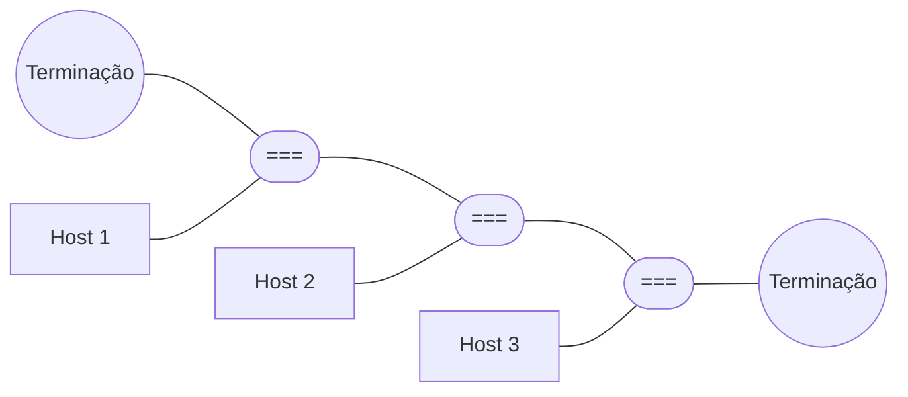
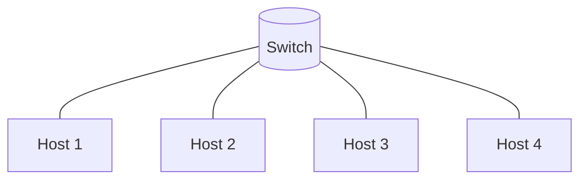
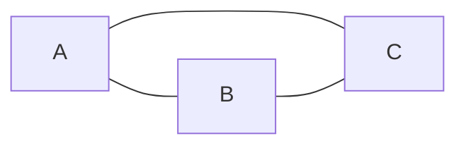
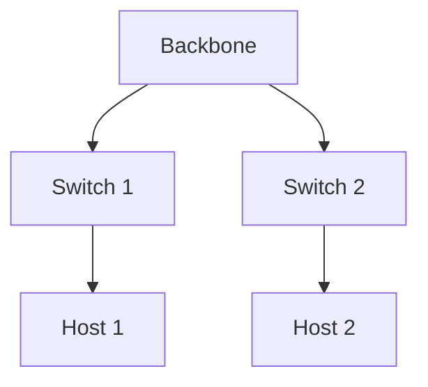

# Conceitos Básicos de Redes de Computadores

## O que é uma rede?

Uma **rede de computadores** é um conjunto de dispositivos (hardware) e softwares interconectados que permitem o **compartilhamento de recursos** (como impressoras, arquivos e internet) e a **comunicação** entre diferentes equipamentos, como computadores, celulares e servidores.

Exemplos de uso:

* Compartilhar arquivos entre computadores;
* Jogar online com outros usuários;
* Utilizar impressoras de forma centralizada em uma empresa;
* Acessar a internet a partir de dispositivos móveis.

---

## Tipos de Rede

As redes podem ser classificadas de acordo com sua **abrangência geográfica** e **finalidade**:

* **PAN (Personal Area Network)**: conecta dispositivos em curta distância, geralmente via Bluetooth (ex.: smartphone ↔ fone de ouvido);
* **LAN (Local Area Network)**: rede local em casas, escritórios ou laboratórios. Tem baixo custo e alta velocidade;
* **MAN (Metropolitan Area Network)**: conecta LANs em regiões maiores, como cidades. Exemplo: redes de provedores de internet;
* **WAN (Wide Area Network)**: interliga LANs e MANs em grandes distâncias, até globais (ex.: a internet);
* **Redes sem fio (WLAN)**: utilizam tecnologias como Wi-Fi para conectar dispositivos sem cabos.

---

## Topologias de Rede

A **topologia** descreve como os dispositivos estão organizados em uma rede. Pode ser física (cabeamento) ou lógica (como os dados circulam).

### Barramento

Todos os dispositivos são conectados a um único cabo. Simples, mas sujeito a falhas conforme o cabo aumenta.

### Anel

Os dispositivos são conectados em círculo, passando dados de um para o outro.

### Estrela

Cada dispositivo se conecta a um ponto central (hub ou switch). É a mais utilizada atualmente.

### Malha

Todos os dispositivos estão conectados entre si, garantindo redundância.

### Árvore

Combina características da topologia em estrela e hierárquica.

---

## Meios de Transmissão

* **Guiados (cabeados):**

  * Cabo coaxial;
  * Par trançado (UTP/STP);
  * Fibra óptica.
* **Não guiados (sem fio):**

  * Rádio (Wi-Fi);
  * Satélite;
  * Micro-ondas.

Cada meio tem características distintas quanto à velocidade, custo, alcance e imunidade a interferências.

---

## Padrões de Rede de Computadores

* **Ethernet:** padrão base de LANs, usa cabos de cobre ou fibra óptica;
* **Fast Ethernet:** até 100 Mbps (100BASE-TX);
* **Gigabit Ethernet:** até 1 Gbps, usada em empresas;
* **10 Gigabit Ethernet:** até 10 Gbps, geralmente em backbones;
* **Terabit Ethernet:** próxima geração, alcançando até 1,6 Tbps.

---

## Padrões de Rede

Os **padrões de rede** asseguram a interoperabilidade entre dispositivos de fabricantes diferentes. São definidos por:

* **ITU** (International Telecommunication Union);
* **ANSI** (American National Standards Institute);
* **IEEE** (Institute of Electrical and Electronics Engineers).

O **IEEE 802** é uma família de padrões que inclui **Ethernet (802.3)** e **Wi-Fi (802.11)**.

---

## Infraestrutura de Rede

Principais dispositivos:

* **Repetidor:** regenera o sinal em longas distâncias;
* **Hub:** conecta vários dispositivos, mas envia dados para todos (baixo desempenho);
* **Ponte (Bridge):** divide a rede em segmentos, encaminhando dados pelo endereço MAC;
* **Comutador (Switch):** conecta dispositivos de forma inteligente, enviando dados somente ao destino;
* **Roteador:** conecta redes diferentes, usando endereços IP e tabelas de roteamento.

---

## Protocolos de Comunicação

Um **protocolo de rede** é um conjunto de regras que define como os dispositivos trocam informações. Os principais protocolos se dividem em categorias:

### 1. Protocolos de Comunicação de Rede

* **TCP (Transmission Control Protocol):** Garante entrega confiável de dados, corrigindo erros e retransmitindo pacotes perdidos.
* **IP (Internet Protocol):** Define endereçamento e encaminhamento dos pacotes. Pode ser IPv4 ou IPv6.
* **UDP (User Datagram Protocol):** Não garante entrega, mas é mais rápido e usado em voz, vídeo e jogos online.

### 2. Protocolos de Comunicação de Aplicação

* **HTTP (Hypertext Transfer Protocol):** Base da web, permite navegação e troca de páginas.
* **FTP (File Transfer Protocol):** Transfere arquivos entre dispositivos.
* **POP3 (Post Office Protocol 3):** Recebe e baixa e-mails para o cliente.
* **SMTP (Simple Mail Transfer Protocol):** Envia e-mails de clientes para servidores.
* **IMAP (Internet Message Access Protocol):** Gerencia e-mails diretamente no servidor sem baixá-los.

### 3. Protocolos de Segurança

* **SSL (Secure Sockets Layer):** Criptografa dados entre cliente e servidor.
* **TLS (Transport Layer Security):** Sucessor do SSL, mais seguro.
* **HTTPS (HTTP Secure):** Versão segura do HTTP, utilizando SSL/TLS.
* **SSH (Secure Shell):** Conexão segura para acesso remoto a servidores.
* **Kerberos:** Protocolo de autenticação que usa chaves criptográficas.

### 4. Protocolos de Gerenciamento

* **SNMP (Simple Network Management Protocol):** Permite monitoramento e gerenciamento de dispositivos de rede.
* **ICMP (Internet Control Message Protocol):** Usado para mensagens de erro e diagnóstico (exemplo: comando *ping*).

---

## Modelo TCP/IP

* **Camada de Aplicação:** Define os protocolos para os aplicativos (HTTP, SMTP, FTP, etc.).
* **Camada de Transporte:** Garante a entrega correta (TCP/UDP).
* **Camada de Internet:** Faz o endereçamento e roteamento (IP, ICMP).
* **Camada de Acesso à Rede:** Define como os dados são transmitidos fisicamente (Ethernet, Wi-Fi, DSL).

---

# Redes Sem Fio (Wi-Fi)

## O que é Wi-Fi?

Wi-Fi significa **Wireless Fidelity**, padrão de comunicação definido pelo **IEEE 802.11** para redes sem fio locais (WLANs).

Permite conexão de dispositivos (notebooks, smartphones, IoT) sem cabos, utilizando frequências de **2,4 GHz, 5 GHz e 6 GHz (Wi-Fi 6E)**.

---

## Modos de Rede Sem Fio

* **Ad hoc (IBSS)**: Dispositivos conectam-se diretamente.
* **Infraestrutura (BSS)**: Comunicação mediada por um **Access Point (AP)**.
* **ESS (Extended Service Set)**: Vários APs interligados, permitindo mobilidade.

---

## Estrutura Wi-Fi

O Wi-Fi opera em duas camadas principais do modelo OSI:

* **Camada Física (PHY)**: Define frequência, modulação (DSSS, OFDM, MIMO).
* **Camada MAC**: Controla o acesso ao meio (CSMA/CA) e organiza quadros de dados.

Quadros Wi-Fi possuem **cabeçalho, carga útil e verificação de integridade**.

---

### Evolução do Wi-Fi

| Padrão             | Frequência  | Velocidade Máx. | Ano  | Características                         |
| ------------------ | ----------- | --------------- | ---- | --------------------------------------- |
| 802.11b            | 2,4 GHz     | 11 Mbps         | 1999 | Baixo custo, sujeito a interferência    |
| 802.11a            | 5 GHz       | 54 Mbps         | 1999 | Menos interferência, equipamentos caros |
| 802.11g            | 2,4 GHz     | 54 Mbps         | 2003 | Compatível com 802.11b                  |
| 802.11n (Wi-Fi 4)  | 2,4/5 GHz   | 450 Mbps        | 2009 | Uso de MIMO, maior alcance              |
| 802.11ac (Wi-Fi 5) | 5 GHz       | 7 Gbps          | 2014 | Beamforming, MU-MIMO                    |
| 802.11ax (Wi-Fi 6) | 2,4/5/6 GHz | 9,6 Gbps        | 2019 | Alta eficiência, muitos dispositivos    |

### Tipos de Redes Wi-Fi

* **Ad hoc (IBSS):** comunicação direta entre dispositivos, sem AP;
* **Infraestrutura (BSS):** dispositivos conectados a um Access Point (AP);
* **ESS (Extended Service Set):** múltiplos APs conectados, com roaming.

---

## Gerenciamento de Redes

O **gerenciamento de redes** é o conjunto de práticas, ferramentas e processos usados para monitorar, controlar, configurar e proteger os recursos de uma rede de computadores. Ele garante que os serviços de comunicação estejam disponíveis, estáveis e seguros.

### Funções Principais (Modelo FCAPS da ISO)

1. **Gerência de Falhas (Fault):**

   * Detecta falhas e problemas na rede.
   * Isola os componentes defeituosos.
   * Reconfigura a rede para reduzir impactos.
   * Repara ou substitui equipamentos.

2. **Gerência de Configuração (Configuration):**

   * Define e mantém a configuração dos dispositivos.
   * Controla mudanças (adição, remoção ou atualização de equipamentos).
   * Garante que todos os dispositivos estejam funcionando corretamente.

3. **Gerência de Contabilização (Accounting):**

   * Registra o uso da rede por usuários ou grupos.
   * Evita abusos de recursos (como monopolizar a banda).
   * Auxilia no planejamento de expansão da rede.

4. **Gerência de Desempenho (Performance):**

   * Monitora métricas como latência, largura de banda, perdas de pacotes, jitter e throughput.
   * Detecta gargalos de tráfego.
   * Ajusta parâmetros para melhorar a qualidade de serviço (QoS).

5. **Gerência de Segurança (Security):**

   * Controla acesso à rede e autenticação de usuários.
   * Garante a confidencialidade e integridade dos dados.
   * Monitora e previne ataques e acessos não autorizados.

### Ferramentas de Gerenciamento

* **SNMP (Simple Network Management Protocol):** Base para coleta de dados de dispositivos.
* **NetFlow:** Coleta informações de tráfego.
* **Wireshark:** Analisa pacotes e ajuda no diagnóstico de problemas.
* **Nagios / Zabbix / PRTG:** Plataformas de monitoramento.
* **Syslog:** Centraliza logs de equipamentos de rede.

### Modelos de Gerência

* **Centralizada:** Uma estação (servidor) controla toda a rede.
* **Distribuída:** Várias estações compartilham a gerência.
* **Híbrida:** Combinação de centralização e distribuição.

---

## Bibliografia

* KUROSE, J. F.; ROSS, K. *Redes de Computadores e a Internet*. 8ª Ed. Pearson, 2015.
* TANENBAUM, A. S. *Redes de Computadores*. 5ª Ed. Pearson, 2011.
