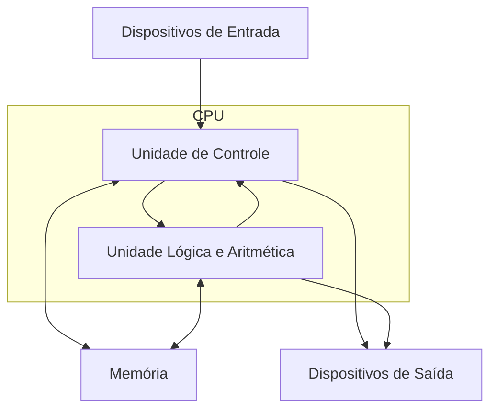
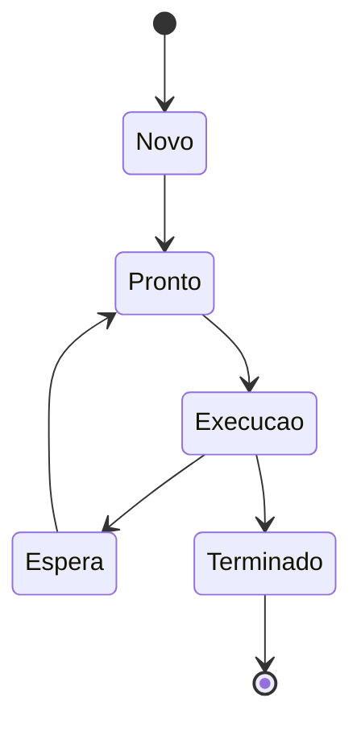

# Sistemas Operacionais

## Modelo de von Neumann

O **modelo de von Neumann**, proposto na década de 1940, descreve a arquitetura fundamental dos computadores modernos. Seus principais componentes são:

* **Unidade de Controle (UC)**: busca instruções da memória, interpreta e coordena sua execução;
* **Unidade Lógica e Aritmética (ULA)**: executa operações aritméticas (somas, subtrações, deslocamentos) e lógicas (AND, OR, NOT);
* **Memória**: armazena dados e instruções em posições endereçáveis;
* **Dispositivos de Entrada e Saída (E/S)**: permitem a interação com o usuário e outros sistemas (não fazem parte dos componentes centrais, mas interagem com eles).

## CPU: A Unidade Central de Processamento

A **CPU** é o “cérebro” do computador. Muitas vezes confundida com o gabinete, na verdade ela é o **processador**, responsável por buscar, decodificar e executar instruções armazenadas na memória.

### Unidade de Controle (UC)

A UC busca cada instrução, interpreta e coordena sua execução, determinando a sequência de operações.

### Unidade Lógica e Aritmética (ULA)

A ULA realiza operações simples, como:

* Soma e subtração;
* AND (E lógico) e OR (OU lógico);
* Negação e inversão de bits;
* Deslocamentos e rotações de bits.

Funções mais complexas são obtidas pela combinação de operações básicas.

## Memória, Instruções e Drivers

### Memória

* **RAM**: memória volátil, armazena dados temporários;
* **ROM**: memória não volátil, guarda informações permanentes como o firmware.

Um **registrador** é uma pequena unidade de memória extremamente rápida, localizada dentro da CPU.

Exemplo: se a memória possui 4096 posições, os endereços vão de 0 a 4095.

### Instruções

Programas e dados ficam armazenados na memória. As instruções são executadas em sequência e controladas pela CPU.

### Drivers

Drivers são softwares que permitem a comunicação entre hardware e sistema operacional. Exemplo: drivers de impressora, placa de vídeo e scanner.

## Barramento

O **barramento** é um conjunto de linhas elétricas que interliga CPU, memória e dispositivos de E/S, permitindo a transmissão de dados, endereços e sinais de controle.

## Programas e Processos

Um **programa** é uma sequência de instruções. Quando carregado na memória e executado, torna-se um **processo**.

Os processos podem existir em diferentes **estados**:

* **Novo**: processo criado, aguardando recursos;
* **Pronto**: apto para execução;
* **Execução**: em processamento pela CPU;
* **Espera**: aguardando E/S ou outro recurso;
* **Terminado**: finalizado.

## Rotina Bootstrap

O **bootstrap** é o processo de inicialização do computador. Ele:

* Reside na memória **ROM**;
* Inicializa o hardware;
* Carrega o **sistema operacional** do disco para a RAM.

## Tipos de Sistemas Operacionais

* **Desktop**: voltado a usuários domésticos e corporativos (Windows, macOS, Linux);
* **Servidor**: gerencia grandes volumes de recursos, múltiplos usuários e rede (Windows Server, Linux Server);
* **Distribuído**: recursos espalhados em várias máquinas, de forma transparente ao usuário;
* **Multiusuário**: permite que vários usuários utilizem recursos ao mesmo tempo, com controle de acesso;
* **De Rede**: possibilita o compartilhamento de arquivos, impressoras e recursos entre computadores conectados;
* **Embutido (Embedded)**: projetado para dispositivos com hardware limitado, como automóveis, eletrodomésticos e equipamentos industriais.

## Evolução dos Sistemas Operacionais

* **1984**: Apple introduz a interface gráfica no Macintosh;
* **1997**: MacOS inclui suporte à internet, relógio na tela e janelas minimizáveis;
* **1999**: Atualização online, sistema de senhas e busca integrada;
* **2000–2013**: Integração em rede, maior segurança e interfaces gráficas avançadas.

## Ciclo de Execução da CPU

O ciclo de execução ocorre em três etapas principais:

1. **Busca**: a CPU lê a instrução da memória;
2. **Decodificação**: a UC interpreta a instrução;
3. **Execução**: a ULA ou outros componentes realizam a operação.

Esse ciclo se repete continuamente enquanto o computador está em funcionamento.

## Ferramentas de Estudo

* **DrMips**: simulador gráfico da CPU;
* **Johnny Simulator**: ferramenta didática para compreender arquitetura de computadores.

## Referências Bibliográficas

* BROOKSHEAR, J.G. *Ciência da Computação: uma visão abrangente*. Porto Alegre: Bookman, 2013.
* TANENBAUM, A. S. *Sistemas Operacionais Modernos*. 3.ed. São Paulo: Pearson Prentice Hall, 2010.
* SILBERSCHATZ, Abraham; GALVIN, Peter Baer; GAGNE, Greg. *Fundamentos de Sistemas Operacionais*. Grupo Gen-LTC, 2000.
