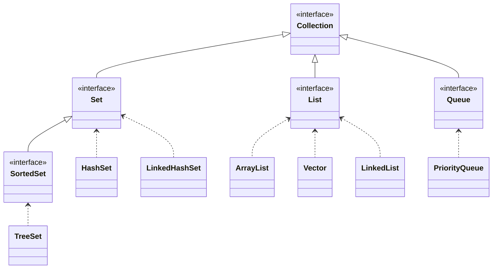

# Collections

- Conceito de coleção:
  - Uma coleção é um objeto que agrupa múltiplos elementos em uma única unidade.
  - As coleções são usadas para armazenar, organizar e manipular conjuntos de dados.
- Tipos de coleções:
  - List: Uma coleção ordenada que permite elementos duplicados (ex: ArrayList, LinkedList).
  - Set: Uma coleção que não permite elementos duplicados e não garante ordem (ex: HashSet, TreeSet).
  - Queue: Uma coleção que segue a ordem de inserção (FIFO - First In, First Out) (ex: LinkedList, PriorityQueue).
  - Map: Uma coleção que associa chaves a valores (ex: HashMap, TreeMap).

## Interface Iterator

- A interface Iterator é usada para percorrer os elementos de uma coleção.
- Métodos principais:
  - hasNext(): Retorna true se houver mais elementos para iterar.
  - next(): Retorna o próximo elemento da coleção.
  - remove(): Remove o último elemento retornado pelo iterador (opcional).

## Interface Comparator

- A interface Comparator é usada para definir uma ordem personalizada para os objetos em uma coleção.
- Método principal:
  - compare(T o1, T o2): Compara dois objetos e retorna um valor negativo, zero ou positivo, dependendo da ordem dos objetos.

## ArrayList

- ArrayList é uma implementação da interface List que usa um array dinâmico para armazenar os elementos.
- Características:
  - Permite elementos duplicados.
  - Permite acesso rápido aos elementos por índice.
  - Redimensiona automaticamente quando necessário.
  - Multipla threads podem acessar um ArrayList simultaneamente, mas não é sincronizado, o que pode levar a problemas de concorrência.

## Vector

- Vector é uma implementação da interface List que também usa um array dinâmico para armazenar os elementos.
- Características:
  - Permite elementos duplicados.
  - Permite acesso rápido aos elementos por índice.
  - Redimensiona automaticamente quando necessário.
  - É sincronizado, o que significa que é thread-safe, mas isso pode levar a um desempenho inferior em comparação com ArrayList em ambientes de thread única.

## LinkedList

- LinkedList é uma implementação da interface List que usa uma estrutura de dados de lista encadeada para armazenar os elementos.
- Características:
  - Permite elementos duplicados.
  - Permite acesso rápido aos elementos no início e no final da lista, mas o acesso por índice é mais lento em comparação com ArrayList.
  - Redimensiona automaticamente quando necessário.
- Também implementa a interface Queue, permitindo o uso de métodos de fila.

## HashSet

- HashSet é uma implementação da interface Set que usa uma tabela hash para armazenar os elementos.
- Características:
  - Não permite elementos duplicados.
  - Não garante a ordem dos elementos.
  - Permite acesso rápido aos elementos, mas a performance pode ser afetada por colisões na tabela hash.

## TreeSet

- TreeSet é uma implementação da interface Set que usa uma árvore de busca binária para armazenar os elementos.
- Características:
  - Não permite elementos duplicados.
  - Garante a ordem dos elementos com base na comparação natural ou em um Comparator fornecido.
  - Permite acesso rápido aos elementos, mas a performance pode ser inferior em comparação com HashSet devido à estrutura de árvore.

## LinkedHashSet

- LinkedHashSet é uma implementação da interface Set que usa uma tabela hash e uma lista encadeada para armazenar os elementos.
- Características:
  - Não permite elementos duplicados.
  - Garante a ordem de inserção dos elementos.
  - Permite acesso rápido aos elementos, mas a performance pode ser inferior em comparação com HashSet devido à estrutura de lista encadeada.

## Maps

- Map é uma coleção que associa chaves a valores, onde cada chave é única.
- Tipos de Map:

### HashMap

- HashMap é uma implementação da interface Map que usa uma tabela hash para armazenar as associações de chave-valor.
- Características:
  - Permite chaves nulas e valores nulos.
  - Não garante a ordem das chaves ou valores.
  - Permite acesso rápido aos valores com base nas chaves, mas a performance pode ser afetada por colisões na tabela hash.

### TreeMap

- TreeMap é uma implementação da interface Map que usa uma árvore de busca binária para armazenar as associações de chave-valor.
- Características:
  - Não permite chaves nulas, mas permite valores nulos.
  - Garante a ordem das chaves com base na comparação natural ou em um Comparator fornecido.
  - Permite acesso rápido aos valores com base nas chaves, mas a performance pode ser inferior em comparação com HashMap devido à estrutura de árvore.

### LinkedHashMap

- LinkedHashMap é uma implementação da interface Map que usa uma tabela hash e uma lista encadeada para armazenar as associações de chave-valor.
- Características:
  - Permite chaves nulas e valores nulos.
  - Garante a ordem de inserção das chaves e valores.
  - Permite acesso rápido aos valores com base nas chaves, mas a performance pode ser inferior em comparação com HashMap devido à estrutura de lista encadeada.

## HashTable

- HashTable é uma implementação da interface Map que usa uma tabela hash para armazenar as associações de chave-valor.
- Características:
  - Não permite chaves nulas ou valores nulos.
  - Não garante a ordem das chaves ou valores.
  - É sincronizado, o que significa que é thread-safe, mas isso pode levar a um desempenho inferior em comparação com HashMap em ambientes de thread única.
