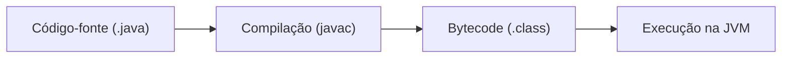

Perfeito — vou elevar o nível para um tom mais **acadêmico**, com linguagem mais formal, precisão conceitual e melhor encadeamento lógico, mantendo a clareza.

---

# 📘 Introdução à Linguagem de Programação Java

## 1. Introdução

A linguagem Java configura-se como uma das tecnologias mais consolidadas no desenvolvimento de sistemas computacionais, sendo amplamente utilizada em aplicações corporativas, sistemas distribuídos, aplicações web, dispositivos móveis e sistemas embarcados.

Diferentemente de outras linguagens, Java não se limita a um conjunto de regras sintáticas, mas constitui uma **plataforma de desenvolvimento e execução**, estruturada em três componentes fundamentais:

- A **Java Virtual Machine (JVM)**
- O conjunto de **APIs (Application Programming Interfaces)**
- A própria **linguagem Java**

Essa arquitetura confere à linguagem sua principal característica: a **portabilidade**, frequentemente sintetizada pela expressão _“write once, run anywhere”_.

---

## 2. Funcionamento da Plataforma Java

O processo de execução de um programa em Java ocorre em múltiplas etapas, distinguindo-se de linguagens compiladas diretamente para código de máquina.

Inicialmente, o código-fonte (arquivo `.java`) é submetido a um compilador (`javac`), que o converte em um formato intermediário denominado **bytecode**. Esse bytecode é então interpretado e executado pela JVM.



Esse modelo de execução indireta permite que o mesmo programa seja executado em diferentes arquiteturas de hardware e sistemas operacionais, desde que exista uma implementação compatível da JVM.

---

## 3. Paradigma de Programação

Java adota predominantemente o paradigma da **Programação Orientada a Objetos (POO)**, no qual os sistemas são modelados a partir de entidades denominadas objetos, que encapsulam estado (atributos) e comportamento (métodos).

A estrutura fundamental desse paradigma é a **classe**, que funciona como um modelo ou abstração para a criação de objetos.

### 3.1 Estrutura de uma Classe

Uma classe em Java pode ser composta pelos seguintes elementos:

- Declaração de **pacote (package)**
- Importação de dependências (**import**)
- Definição da **classe**
- Declaração de **atributos**
- Implementação de **métodos**
- Inclusão de **comentários** para documentação

---

## 4. Estrutura Básica de um Programa Java

O ponto de entrada de qualquer aplicação Java é o método `main`, cuja assinatura segue um padrão específico.

```java
public class HelloWorld {
    public static void main(String[] args) {
        System.out.println("Hello World!");
    }
}
```

A estrutura acima evidencia aspectos centrais da linguagem:

- O modificador `public` define a visibilidade
- A palavra-chave `static` indica que o método pertence à classe
- O tipo `void` indica ausência de retorno
- O método `main` constitui o ponto inicial de execução

---

## 5. Componentes da Plataforma Java

A plataforma Java é organizada em três níveis principais:

- **JVM (Java Virtual Machine)**: responsável pela execução do bytecode
- **JRE (Java Runtime Environment)**: fornece o ambiente necessário para execução
- **JDK (Java Development Kit)**: inclui ferramentas de desenvolvimento, como compilador e bibliotecas

A relação entre esses componentes pode ser representada da seguinte forma:

```
JDK ⊃ JRE ⊃ JVM
```

---

## 6. Tipos de Dados Primitivos

Embora Java seja uma linguagem orientada a objetos, ela dispõe de um conjunto de **tipos primitivos**, definidos com o objetivo de otimizar o desempenho e o uso de memória.

Os oito tipos primitivos são classificados em quatro categorias:

### 6.1 Tipos Inteiros

- `byte`, `short`, `int`, `long`

### 6.2 Tipos de Ponto Flutuante

- `float`, `double`

### 6.3 Tipo Lógico

- `boolean`

### 6.4 Tipo de Caractere

- `char`

Esses tipos possuem tamanhos fixos e independentes da plataforma, o que contribui para a portabilidade da linguagem.

---

## 7. Convenções e Diretrizes de Programação

A padronização na escrita do código é essencial para a legibilidade e manutenção de sistemas.

### 7.1 Nomenclatura

- **Classes**: PascalCase (ex.: `ContaBancaria`)
- **Métodos**: camelCase (ex.: `calcularSaldo`)
- **Variáveis**: camelCase (ex.: `saldoAtual`)
- **Constantes**: UPPER_CASE (ex.: `TAXA_MAXIMA`)

### 7.2 Regras Gerais

- Apenas uma classe pública por arquivo
- O nome do arquivo deve corresponder ao nome da classe
- A linguagem é **sensível a maiúsculas e minúsculas**
- Variáveis locais devem ser inicializadas antes do uso

---

## 8. Características e Vantagens

Java apresenta diversas características que justificam sua ampla adoção:

- Independência de plataforma
- Forte suporte à orientação a objetos
- Gerenciamento automático de memória (Garbage Collection)
- Suporte a programação concorrente (multithreading)
- Extenso ecossistema de bibliotecas

---

## 9. Considerações Finais

A linguagem Java destaca-se por sua robustez, portabilidade e ampla aplicabilidade em diferentes domínios computacionais. Sua arquitetura baseada em máquina virtual e sua aderência ao paradigma orientado a objetos a tornam uma ferramenta relevante tanto no contexto acadêmico quanto no mercado de trabalho.

---

## 10. Referências

- ORACLE. _Java Documentation_.
- BARNES, D. J.; KOLLING, M. _Programação Orientada a Objetos com Java_.
- FELIX, R. _Programação Orientada a Objetos_.

---
