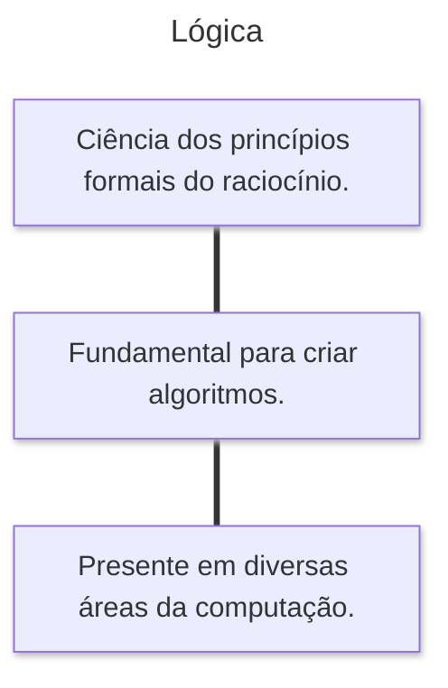
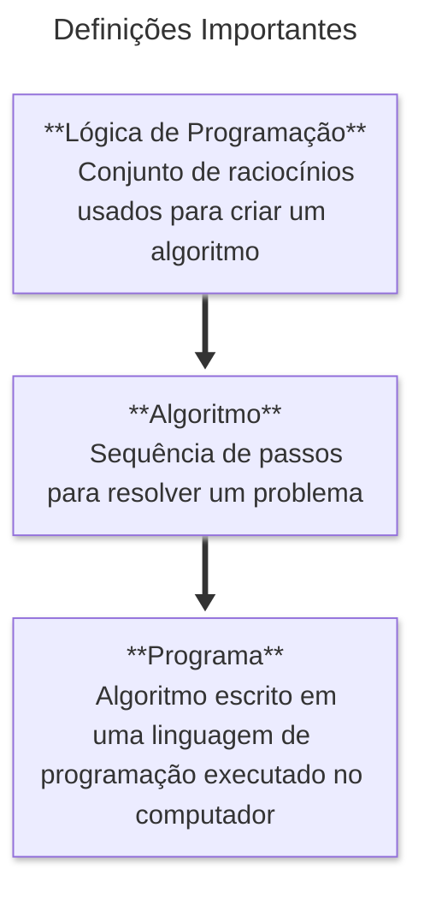

# Algoritmos

> **Definição:** Sequência de instruções que resolve determinado problema.  
> Um algoritmo consiste em uma série de passos lógicos que levam à solução de uma tarefa.  
> Para desenvolvê-lo, é essencial:  
> - Entender o problema  
> - Definir as regras  
> - Estabelecer a ordem dos passos  
> - Verificar se a solução realmente funciona  

⚡ Importante: raramente um problema terá uma única solução correta. Diferentes algoritmos podem resolver a mesma tarefa.

---

## Como Estudar Algoritmos

Antes de escrever um algoritmo, é necessário **pensar no problema** e depois **em como resolvê-lo**.  
Esse processo envolve transformar ideias em uma sequência clara de passos.

```mermaid
---
title: Como Estudar Algoritmo
---
flowchart LR
A((Como?)) --> B([Pensar no problema e como RESOLVÊ-LO])
B --> C([Transformar a solução em forma de algoritmo])
````

---

## Passos para Resolver um Problema

1. **Conhecer as regras** – o que pode e o que não pode ser feito.
2. **Entender o problema** – conhecer cada detalhe antes de propor uma solução.
3. **Indicar os passos** – o que deve ser feito e em que ordem.
4. **Executar e verificar** – testar se a sequência realmente resolve o problema.

```mermaid
---
title: Passos para Resolver um Problema
---
flowchart TD
    A([1.Conhecer regras])
    B([2.Entender o problema])
    C([3.Indicar ordem dos passos])
    D([4.Executar e verificar solução])
    A-->B-->C-->D
```

📌 *Exemplo:* atravessar a rua com segurança

* Olhar para a esquerda
* Olhar para a direita
* Se vier carro → esperar
* Se não vier → atravessar

---

## Conceitos Fundamentais

### Lógica

> “Ciência dos princípios formais do raciocínio.”

> A lógica é essencial no desenvolvimento de algoritmos, pois organiza o pensamento e evita ambiguidades.



---

### Definições Importantes



📌 *Analogia com receita de bolo:*

* **Ideia (Lógica de Programação):** quero fazer um bolo.
* **Algoritmo:** receita com os passos.
* **Programa:** execução da receita usando ferramentas (o computador).

---

## Formas de Representação de Algoritmos

1. **Descrição Narrativa** – texto em linguagem natural.

   * Simples, mas pode gerar interpretações diferentes.
2. **Fluxograma** – representação gráfica com símbolos geométricos.

   * Visual, fácil de entender.
3. **Diagrama de Chapin** – visão hierárquica da lógica.

   * Estruturado, mas menos usado atualmente.
4. **Pseudocódigo (Portugol)** – descrição próxima da programação real.

   * Base para implementar no computador.

---

## Ferramenta para Prática: Visualg

Para praticar algoritmos em **pseudocódigo (Portugol)**, utilizamos o **Visualg**.

* Gratuito e de domínio público
* Voltado apenas para ensino de lógica de programação
* Permite executar algoritmos simulando programas

🔗 Visualg: [Visualg na web](https://visualg.com.br/)

---

## Atividade Prática

**Título:** Primeiro Algoritmo
**Objetivo:** Praticar lógica de programação e desenvolvimento de algoritmos.
**Ferramenta:** Visualg

---

## Conteúdo Bônus

🎬 **Filme:** *O Jogo da Imitação*
História de **Alan Turing**, considerado o pai da computação, que criou a máquina precursora do computador e ajudou a decifrar os códigos da máquina Enigma na Segunda Guerra Mundial.

---

## Referências

* GUEDES, S. *Lógica de programação algorítmica*. Pearson, 2014.
* MANZANO, J. A. N. G.; OLIVEIRA, J. F. *Estudo Dirigido de Algoritmos*. 15ª ed. São Paulo: Érica, 2012.
* PUGA, S.; RISSETTI, G. *Lógica de programação e estruturas de dados, com aplicações em Java*. Pearson, 2016.
* RIBEIRO, J. A. *Introdução à programação e aos algoritmos*. 1ª ed. Rio de Janeiro: LTC, 2019.