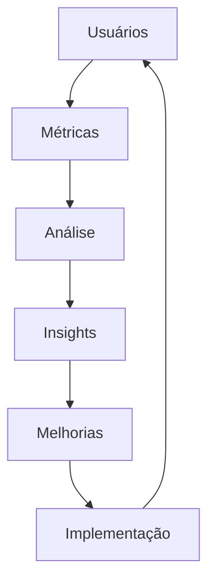
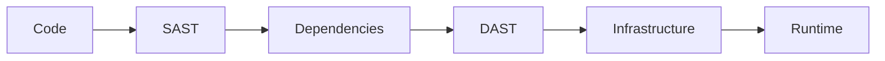
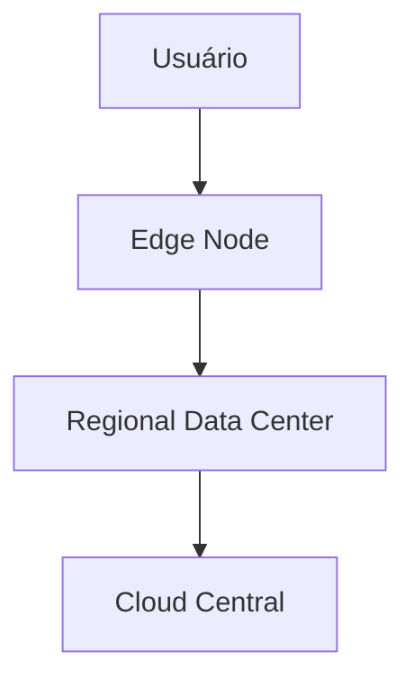
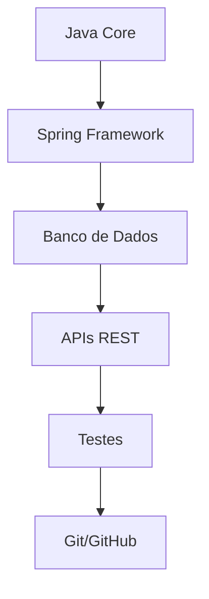

# 🛠️ Boas Práticas de Mercado - Guia Completo

## 📚 Índice
1. [Introdução](#introdução)
2. [Versionamento de Código](#versionamento-de-código)
3. [Boas Práticas Java](#boas-práticas-java)
4. [Entrega e Melhoria Contínua](#entrega-e-melhoria-contínua)
5. [Tendências de Desenvolvimento](#tendências-de-desenvolvimento)
6. [Portfólio Profissional](#portfólio-profissional)
7. [Próximos Passos](#próximos-passos)
8. [Atividade Prática](#atividade-prática)
9. [Recursos Complementares](#recursos-complementares)
10. [Referências](#referências)

---

## 🎯 Introdução

As **Boas Práticas de Mercado** são diretrizes fundamentais que garantem qualidade, eficiência e sustentabilidade no desenvolvimento de software. Este guia aborda as principais práticas adotadas pela indústria de tecnologia para criar aplicações robustas e competitivas.

### 🌟 Pilares das Boas Práticas
- **📊 Qualidade**: Código limpo, testável e manutenível
- **🚀 Eficiência**: Processos otimizados e automatizados
- **🔒 Segurança**: Proteção de dados e sistemas
- **👥 Colaboração**: Trabalho em equipe eficaz
- **📈 Evolução**: Melhoria contínua dos processos

---

## 📋 Versionamento de Código

O versionamento é a **espinha dorsal** do desenvolvimento moderno, permitindo controle total sobre as mudanças no código-fonte ao longo do tempo.

### 🎯 Importância Estratégica

| Benefício | Descrição | Impacto no Negócio |
|-----------|-----------|-------------------|
| **📚 Rastreabilidade** | Histórico completo de mudanças | Auditoria e compliance |
| **👥 Colaboração** | Trabalho simultâneo da equipe | Produtividade aumentada |
| **🔙 Recuperação** | Restauração de versões anteriores | Redução de riscos |
| **🔄 Integração** | CI/CD automatizado | Deploy mais rápido |
| **📖 Documentação** | Contexto das mudanças | Conhecimento preservado |

### 🛠️ Ferramentas e Plataformas

#### **Sistemas de Controle de Versão**

| Sistema | Tipo | Popularidade | Características |
|---------|------|-------------|----------------|
| **Git** | Distribuído | 95%+ | Flexível, rápido, robusto |
| **SVN** | Centralizado | 15% | Simples, linear |
| **Mercurial** | Distribuído | 5% | Alternativa ao Git |

#### **Plataformas de Hospedagem**

| Plataforma | Pontos Fortes | Melhor Para | Preço |
|------------|---------------|-------------|-------|
| **GitHub** | Comunidade, integração | Open source, colaboração | Freemium |
| **GitLab** | CI/CD integrado, DevOps | Empresas, pipelines | Freemium |
| **Bitbucket** | Integração Atlassian | Equipes Jira/Confluence | Freemium |
| **Azure DevOps** | Ecosystem Microsoft | Empresas .NET | Pago |

### 🌳 Estratégias de Branching

#### **GitFlow - Modelo Tradicional**
```
master
├── develop
    ├── feature/nova-funcionalidade
    ├── release/v1.2.0
    └── hotfix/correcao-critica
```

#### **GitHub Flow - Modelo Simplificado**
```
main
├── feature/implementacao-api
├── bugfix/correcao-login
└── hotfix/security-patch
```

#### **Comparação de Estratégias**

| Modelo | Complexidade | Melhor Para | Equipes |
|--------|--------------|-------------|---------|
| **GitFlow** | Alta | Releases programados | Grandes |
| **GitHub Flow** | Baixa | Deploy contínuo | Pequenas/Médias |
| **GitLab Flow** | Média | Ambiente híbrido | Médias |

### 📝 Commits Eficazes

#### **Estrutura de Mensagem Padrão**
```
tipo(escopo): descrição breve

Descrição detalhada do que foi alterado e por quê.

- Item específico alterado
- Outro item modificado

Closes #123
```

#### **Tipos de Commit**

| Tipo | Uso | Exemplo |
|------|-----|---------|
| **feat** | Nova funcionalidade | `feat(auth): adicionar login OAuth` |
| **fix** | Correção de bug | `fix(api): corrigir timeout de conexão` |
| **docs** | Documentação | `docs(readme): atualizar instruções` |
| **style** | Formatação | `style: aplicar prettier no código` |
| **refactor** | Refatoração | `refactor(utils): simplificar validação` |
| **test** | Testes | `test(auth): adicionar casos de erro` |
| **chore** | Manutenção | `chore: atualizar dependências` |

### 🏷️ Tags e Releases

#### **Versionamento Semântico (SemVer)**
```
MAJOR.MINOR.PATCH
  2.1.3

MAJOR: Mudanças incompatíveis
MINOR: Novas funcionalidades compatíveis  
PATCH: Correções compatíveis
```

#### **Estratégia de Release**

| Ambiente | Versão | Exemplo | Deploy |
|----------|--------|---------|--------|
| **Development** | Branch | `develop` | Automático |
| **Staging** | Pre-release | `v2.1.0-rc.1` | Manual |
| **Production** | Release | `v2.1.0` | Aprovação |
---

## ☕ Boas Práticas Java

O desenvolvimento Java eficiente requer a adoção de padrões e práticas que promovem código limpo, legível e sustentável ao longo do tempo.

### 📐 Convenções de Nomenclatura

#### **Padrões de Nomenclatura**

| Elemento | Convenção | Exemplo | Regra |
|----------|-----------|---------|-------|
| **Classes** | PascalCase | `UsuarioService` | Substantivo descritivo |
| **Métodos** | camelCase | `calcularDesconto()` | Verbo + ação |
| **Variáveis** | camelCase | `nomeCompleto` | Descritivo e claro |
| **Constantes** | UPPER_CASE | `MAX_TENTATIVAS` | Valor imutável |
| **Pacotes** | lowercase | `com.empresa.projeto` | Domínio reverso |
| **Interfaces** | PascalCase | `Processable` | Adjetivo com -able |

#### **Exemplos Práticos**

```java
// ✅ BOM
public class ContaBancaria {
    private static final int LIMITE_SAQUES_DIARIOS = 5;
    private BigDecimal saldoAtual;
    
    public void sacarDinheiro(BigDecimal valor) {
        validarSaque(valor);
        atualizarSaldo(valor);
    }
}

// ❌ RUIM
public class cb {
    private int lsd = 5;
    private double s;
    
    public void s(double v) {
        // código sem clareza
    }
}
```

### 🧹 Código Limpo e Legível

#### **Princípios Fundamentais**

| Princípio | Descrição | Benefício |
|-----------|-----------|-----------|
| **DRY** | Don't Repeat Yourself | Reduz duplicação |
| **KISS** | Keep It Simple, Stupid | Facilita manutenção |
| **YAGNI** | You Aren't Gonna Need It | Evita complexidade |
| **Single Level of Abstraction** | Uma abstração por método | Melhora legibilidade |

#### **Estrutura de Métodos**

```java
// ✅ Método limpo e focado
public boolean validarIdadeParaCompra(int idade) {
    return idade >= IDADE_MINIMA_COMPRA;
}

// ✅ Método com responsabilidade única
public void processarPedido(Pedido pedido) {
    validarPedido(pedido);
    calcularTotal(pedido);
    salvarPedido(pedido);
    enviarNotificacao(pedido);
}

// ❌ Método muito complexo
public void fazerTudo(Object data) {
    // 100+ linhas de código misturado
}
```

### 🎯 Princípios SOLID

#### **Detalhamento dos Princípios**

| Princípio | Sigla | Definição | Exemplo |
|-----------|-------|-----------|---------|
| **Responsabilidade Única** | SRP | Uma classe = uma responsabilidade | `EmailService` só envia emails |
| **Aberto/Fechado** | OCP | Aberto para extensão, fechado para modificação | Usar interfaces e herança |
| **Substituição de Liskov** | LSP | Subtipos devem ser substituíveis | Herança correta |
| **Segregação de Interface** | ISP | Interfaces específicas e pequenas | Evitar god interfaces |
| **Inversão de Dependência** | DIP | Depender de abstrações | Injeção de dependência |

#### **Exemplo Prático - SRP**

```java
// ❌ Violando SRP - múltiplas responsabilidades
public class Usuario {
    private String nome;
    private String email;
    
    public void salvarNoBanco() { /* ... */ }
    public void enviarEmail() { /* ... */ }
    public void validarDados() { /* ... */ }
    public void gerarRelatorio() { /* ... */ }
}

// ✅ Aplicando SRP - responsabilidades separadas
public class Usuario {
    private String nome;
    private String email;
    // apenas dados e comportamentos do usuário
}

public class UsuarioRepository {
    public void salvar(Usuario usuario) { /* ... */ }
}

public class EmailService {
    public void enviarBoasVindas(Usuario usuario) { /* ... */ }
}

public class UsuarioValidator {
    public boolean validar(Usuario usuario) { /* ... */ }
}
```

### 🔧 Gerenciamento de Recursos

#### **Try-with-Resources**

```java
// ✅ Gerenciamento automático de recursos
public void lerArquivo(String caminho) throws IOException {
    try (BufferedReader reader = Files.newBufferedReader(Paths.get(caminho))) {
        reader.lines()
              .forEach(System.out::println);
    } // Fechamento automático
}

// ❌ Gerenciamento manual (propenso a erros)
public void lerArquivoAntigo(String caminho) throws IOException {
    BufferedReader reader = null;
    try {
        reader = Files.newBufferedReader(Paths.get(caminho));
        // processamento
    } finally {
        if (reader != null) {
            reader.close(); // Pode ser esquecido
        }
    }
}
```

### 🛡️ Tratamento de Exceções

#### **Hierarquia de Exceções**

```java
// ✅ Exceções específicas e informativas
public class ContaInexistenteException extends Exception {
    public ContaInexistenteException(String numeroConta) {
        super("Conta não encontrada: " + numeroConta);
    }
}

public class SaldoInsuficienteException extends Exception {
    private final BigDecimal saldoAtual;
    private final BigDecimal valorSolicitado;
    
    public SaldoInsuficienteException(BigDecimal saldoAtual, BigDecimal valorSolicitado) {
        super("Saldo insuficiente. Atual: " + saldoAtual + ", Solicitado: " + valorSolicitado);
        this.saldoAtual = saldoAtual;
        this.valorSolicitado = valorSolicitado;
    }
}
```

#### **Práticas de Tratamento**

| Prática | Quando Usar | Exemplo |
|---------|-------------|---------|
| **Catch específico** | Tratamentos diferentes | `catch (SQLException e)` |
| **Log e re-throw** | Preservar stack trace | `log.error()` + `throw e` |
| **Wrapping** | Abstrair camadas | `throw new ServiceException(e)` |
| **Fail-fast** | Validações iniciais | `Objects.requireNonNull()` |

### 🧪 Estratégias de Teste

#### **Pirâmide de Testes**

```
    /\
   /  \  E2E (poucos)
  /____\
 /      \ Integration (alguns)
/_______\ Unit (muitos)
```

#### **Frameworks e Ferramentas**

| Tipo | Framework | Uso | Exemplo |
|------|-----------|-----|---------|
| **Unit** | JUnit 5 | Testes isolados | Métodos individuais |
| **Mock** | Mockito | Simulação de dependências | APIs externas |
| **Integration** | TestContainers | Testes com BD | Repositories |
| **Performance** | JMH | Benchmarks | Algoritmos críticos |

```java
// ✅ Teste unitário bem estruturado
@ExtendWith(MockitoExtension.class)
class ContaServiceTest {
    
    @Mock
    private ContaRepository repository;
    
    @InjectMocks
    private ContaService service;
    
    @Test
    @DisplayName("Deve sacar quando saldo suficiente")
    void deveSacarQuandoSaldoSuficiente() {
        // Given
        Conta conta = new Conta("123", new BigDecimal("1000"));
        when(repository.buscarPorNumero("123")).thenReturn(conta);
        
        // When
        service.sacar("123", new BigDecimal("500"));
        
        // Then
        assertThat(conta.getSaldo()).isEqualTo(new BigDecimal("500"));
        verify(repository).salvar(conta);
    }
}
---

## 🚀 Entrega e Melhoria Contínua

Os conceitos de entrega e melhoria contínua são pilares fundamentais do desenvolvimento moderno, garantindo que o software evolua de forma eficiente e atenda às necessidades dos usuários.

### 📦 Entrega Contínua (Continuous Delivery)

A entrega contínua automatiza o processo de levar código da desenvolvimento até a produção de forma segura, rápida e confiável.

#### **Pipeline de CI/CD**


#### **Componentes do Pipeline**

| Etapa | Ferramentas | Tempo Típico | Objetivo |
|-------|-------------|-------------|----------|
| **Build** | Maven, Gradle | 2-5 min | Compilar e empacotar |
| **Testes Unitários** | JUnit, TestNG | 5-15 min | Validar lógica |
| **Análise de Qualidade** | SonarQube | 3-10 min | Code smells, vulnerabilidades |
| **Testes Integração** | TestContainers | 10-30 min | Validar integrações |
| **Deploy Staging** | Docker, K8s | 2-5 min | Ambiente de testes |
| **Testes E2E** | Selenium, Cypress | 15-60 min | Fluxos completos |
| **Deploy Produção** | Blue/Green | 5-15 min | Rollout seguro |

#### **Práticas de Automação**

| Prática | Descrição | Benefício | Ferramentas |
|---------|-----------|-----------|-------------|
| **Integração Contínua** | Merge frequente no branch principal | Detecção precoce de conflitos | Jenkins, GitHub Actions |
| **Builds Automatizados** | Compilação automática a cada commit | Feedback imediato | Maven, Gradle |
| **Testes Automatizados** | Execução automática de testes | Qualidade garantida | JUnit, Mockito |
| **Deploy Automatizado** | Implantação sem intervenção manual | Redução de erros | Ansible, Terraform |

### 🔄 Estratégias de Deploy

#### **Blue-Green Deployment**
```
Produção Atual (Blue) ←→ Nova Versão (Green)
     ↓ Switch instantâneo ↓
Produção Nova (Green) ←→ Rollback (Blue)
```

#### **Canary Deployment**
```
90% usuários → Versão Atual
10% usuários → Nova Versão (teste)
```

#### **Rolling Deployment**
```
Servidor 1: v1.0 → v2.0 ✓
Servidor 2: v1.0 → v2.0 ✓
Servidor 3: v1.0 → v2.0 ✓
```

### 📈 Melhoria Contínua (Continuous Improvement)

A melhoria contínua visa aprimorar constantemente processos, qualidade e eficiência através de ciclos iterativos de avaliação e implementação.

#### **Ciclo PDCA**

| Fase | Ação | Duração | Responsável |
|------|------|---------|-------------|
| **Plan** | Identificar melhorias e planejar | 1-2 semanas | Product Owner |
| **Do** | Implementar mudanças | 2-4 semanas | Dev Team |
| **Check** | Medir resultados e impactos | 1 semana | QA/Analytics |
| **Act** | Padronizar ou corrigir | 1 semana | Tech Lead |

#### **Métricas de Acompanhamento**

| Categoria | Métrica | Meta | Frequência |
|-----------|---------|------|------------|
| **Performance** | Lead Time | < 2 dias | Semanal |
| **Qualidade** | Bug Rate | < 2% | Sprint |
| **Deploy** | Deployment Frequency | > 1x/dia | Diária |
| **Confiabilidade** | MTTR | < 2h | Incidentes |
| **Satisfação** | NPS | > 8.0 | Mensal |

#### **Feedback Contínuo**



### 🎯 Benefícios da Entrega e Melhoria Contínua

#### **Impacto nos Negócios**

| Área | Antes | Depois | Melhoria |
|------|-------|--------|----------|
| **Time to Market** | 6 meses | 2 semanas | 12x mais rápido |
| **Taxa de Defeitos** | 15% | 2% | 7.5x menos bugs |
| **Produtividade** | 40% capacidade | 85% capacidade | 2x mais produtivo |
| **Satisfação do Cliente** | 6.5/10 | 8.8/10 | 35% melhor |

#### **Metodologias Ágeis Integradas**

| Framework | Foco | Ciclo | Melhor Para |
|-----------|------|-------|-------------|
| **Scrum** | Sprints estruturados | 2-4 semanas | Equipes pequenas/médias |
| **Kanban** | Fluxo contínuo | Contínuo | Suporte e manutenção |
| **SAFe** | Escala empresarial | 10-12 semanas | Grandes organizações |
| **XP** | Práticas técnicas | 1-2 semanas | Projetos técnicos |

### 🛠️ Ferramentas do Ecossistema

#### **Stack DevOps Completo**

| Categoria | Ferramenta | Função | Maturidade |
|-----------|------------|--------|------------|
| **Versionamento** | Git + GitHub | Código fonte | Maduro |
| **CI/CD** | Jenkins, GitHub Actions | Automação | Maduro |
| **Containerização** | Docker + Kubernetes | Orquestração | Maduro |
| **Monitoramento** | Prometheus + Grafana | Observabilidade | Crescimento |
| **Logs** | ELK Stack | Análise de logs | Maduro |
| **Comunicação** | Slack + Teams | Colaboração | Maduro |
---

## 🚀 Tendências de Desenvolvimento

O mercado de desenvolvimento evolui rapidamente, impulsionado por novas tecnologias, metodologias e demandas dos usuários. Acompanhar essas tendências é crucial para manter-se competitivo.

### 📱 Desenvolvimento Mobile e Multiplataforma

#### **Frameworks Cross-Platform**

| Framework | Linguagem | Performance | Curva Aprendizado | Mercado |
|-----------|-----------|-------------|-------------------|---------|
| **Flutter** | Dart | Nativa | Média | Crescimento rápido |
| **React Native** | JavaScript | Próxima ao nativo | Baixa | Líder de mercado |
| **Xamarin** | C# | Nativa | Alta | Declínio |
| **Ionic** | HTML/CSS/JS | Web | Baixa | Nicho específico |
| **Kotlin Multiplatform** | Kotlin | Nativa | Média | Emergente |

#### **Comparativo de Vantagens**

| Aspecto | Nativo | Cross-Platform |
|---------|--------|----------------|
| **Performance** | Máxima | 85-95% do nativo |
| **Tempo desenvolvimento** | 2x (iOS + Android) | 1x para ambas |
| **Custo** | Alto | 40-60% menor |
| **Acesso APIs** | Completo | Limitado por bridges |
| **UX** | Perfeita | Muito boa |

### 🌐 Progressive Web Apps (PWAs)

PWAs combinam o melhor dos mundos web e mobile, oferecendo experiências app-like através de tecnologias web.

#### **Características Principais**

| Recurso | Descrição | Benefício | Suporte |
|---------|-----------|-----------|---------|
| **Service Workers** | Cache inteligente | Funciona offline | 95%+ browsers |
| **Web App Manifest** | Instalação na home | Acesso direto | Universal |
| **Responsive Design** | Adaptação a telas | UX consistente | Padrão web |
| **HTTPS** | Segurança obrigatória | Confiança | Requisito |
| **Push Notifications** | Engagement | Retenção de usuários | 85% browsers |

#### **Casos de Sucesso**

| Empresa | Métrica | Melhoria | Tecnologia |
|---------|---------|----------|------------|
| **Twitter Lite** | Bounce rate | -20% | React PWA |
| **Pinterest** | Time on site | +40% | Service Workers |
| **Starbucks** | Daily users | 2x | Offline-first |
| **Trivago** | Engagement | +150% | App Shell |

### 🎨 UX/UI e Design Centrado no Usuário

#### **Princípios de Design Moderno**

| Princípio | Descrição | Implementação | Ferramenta |
|-----------|-----------|---------------|------------|
| **Mobile First** | Design para mobile primeiro | CSS responsivo | Bootstrap, Tailwind |
| **Accessibility** | Inclusão para todos | WCAG 2.1 | Axe, Lighthouse |
| **Performance** | Carregamento rápido | Lazy loading, CDN | WebPageTest |
| **Microinterações** | Feedback visual | Animações sutis | Framer Motion |
| **Design System** | Consistência visual | Componentes | Storybook, Figma |

#### **Metodologias UX**

| Metodologia | Foco | Duração | Entrega |
|-------------|------|---------|---------|
| **Design Thinking** | Inovação centrada no usuário | 2-4 semanas | Protótipos |
| **Lean UX** | Validação rápida | 1-2 semanas | MVPs |
| **Atomic Design** | Sistema modular | Contínuo | Design System |
| **Jobs-to-be-Done** | Necessidades reais | 1-3 semanas | Insights |

### 🔒 Segurança e Privacidade (DevSecOps)

A segurança deixou de ser um "add-on" e tornou-se parte integral do desenvolvimento.

#### **Shift-Left Security**



#### **Práticas de Segurança Integrada**

| Prática | Ferramenta | Quando | O que Detecta |
|---------|------------|--------|---------------|
| **SAST** | SonarQube, Checkmarx | Build | Vulnerabilidades no código |
| **Dependency Check** | OWASP, Snyk | CI/CD | CVEs em bibliotecas |
| **DAST** | ZAP, Burp | Deploy | Vulnerabilidades runtime |
| **Container Scan** | Trivy, Twistlock | Build | Imagens vulneráveis |
| **Infrastructure** | Terraform Scan | Deploy | Misconfigurations |

#### **Compliance e Regulamentações**

| Regulamentação | Escopo | Multa Máxima | Impacto Dev |
|----------------|--------|-------------|-------------|
| **LGPD** | Dados pessoais (Brasil) | 2% faturamento | Consentimento, logs |
| **GDPR** | Dados pessoais (UE) | 4% faturamento | Privacy by design |
| **SOX** | Financeiras (US) | Criminal | Auditoria, controles |
| **HIPAA** | Saúde (US) | $1.5M | Criptografia, acesso |

### 🤖 Inteligência Artificial no Desenvolvimento

#### **IA no Ciclo de Desenvolvimento**

| Área | Aplicação | Ferramenta | Benefício |
|------|-----------|------------|-----------|
| **Código** | Autocompletar inteligente | GitHub Copilot | +35% produtividade |
| **Testes** | Geração automática | Diffblue, Testim | +60% cobertura |
| **Code Review** | Análise de qualidade | DeepCode, CodeGuru | +40% bugs detectados |
| **DevOps** | Previsão de falhas | DataDog AI | -25% downtime |

#### **Casos de Uso Emergentes**

| Tecnologia | Maturidade | Adoção | Exemplo de Uso |
|------------|------------|--------|---------------|
| **GPT/LLM** | Alta | 60%+ | Documentação automática |
| **Computer Vision** | Média | 25% | Testes de UI |
| **NLP** | Alta | 40% | Análise de feedback |
| **ML Ops** | Baixa | 15% | Deploy de modelos |

### ☁️ Cloud e Edge Computing

#### **Estratégias Cloud**

| Modelo | Controle | Custo | Escalabilidade | Melhor Para |
|--------|---------|-------|----------------|-------------|
| **IaaS** | Alto | Médio | Manual | Controle total |
| **PaaS** | Médio | Baixo | Automática | Desenvolvimento rápido |
| **SaaS** | Baixo | Muito baixo | Transparente | Soluções prontas |
| **Serverless** | Zero | Uso | Infinita | Event-driven |

#### **Edge Computing**



| Benefício | Edge | Cloud Central | Diferença |
|-----------|------|---------------|-----------|
| **Latência** | 1-5ms | 50-200ms | 10-40x melhor |
| **Bandwidth** | Reduzido | Alto | -80% tráfego |
| **Disponibilidade** | Local | Distribuída | +99.99% uptime |
| **Privacidade** | Local | Centralizada | Dados não saem |

### 🎯 Tendências por Setor

#### **Fintech**

| Tendência | Tecnologia | Regulamentação | Adoção |
|-----------|------------|----------------|--------|
| **Open Banking** | APIs REST | PSD2, LGPD | 2024+ |
| **Blockchain** | DeFi, Smart Contracts | Em discussão | 15% |
| **Biometria** | ML, CV | LGPD | 80% |
| **Real-time** | Event Streaming | Pix | 100% |

#### **Saúde (HealthTech)**

| Área | Inovação | Desafio | Oportunidade |
|------|----------|---------|-------------|
| **Telemedicina** | Video calls | Regulamentação | Acesso remoto |
| **IoT Médico** | Sensores | Privacidade | Monitoramento |
| **IA Diagnóstica** | Deep Learning | Aprovação | Precisão |
| **Prontuário Digital** | Blockchain | Interoperabilidade | Unificação |

---

## 💼 Portfólio Profissional

Um portfólio bem estruturado é sua vitrine profissional, demonstrando habilidades técnicas, evolução e capacidade de entrega de projetos reais.

### 🎯 Elementos Essenciais

#### **Estrutura do Portfólio**

| Seção | Conteúdo | Peso | Dicas |
|-------|----------|------|-------|
| **Apresentação** | Bio, foto, contato | 10% | Profissional e conciso |
| **Skills Técnicas** | Tecnologias dominadas | 20% | Nivele por experiência |
| **Projetos** | Casos práticos | 50% | Foque na qualidade |
| **Experiência** | Timeline profissional | 15% | Resultados alcançados |
| **Certificações** | Cursos, diplomas | 5% | Relevantes ao cargo |

#### **Projetos de Destaque**

| Tipo | Exemplos | Tecnologias | Diferencial |
|------|----------|-------------|------------|
| **Full Stack** | E-commerce, Blog | React + Spring Boot | Completo |
| **API REST** | Sistema bancário | Java + PostgreSQL | Robustez |
| **Mobile** | App delivery | Flutter/React Native | UX |
| **Data** | Dashboard analytics | Python + SQL | Insights |
| **DevOps** | Pipeline CI/CD | Docker + K8s | Automação |

### 📱 Plataformas de Hospedagem

#### **GitHub - Portfólio Técnico**

```
📂 Estrutura Recomendada
├── 📁 projeto-ecommerce/
│   ├── README.md (descrição detalhada)
│   ├── docs/ (documentação)
│   ├── src/ (código fonte)
│   └── demo/ (imagens/vídeos)
├── 📁 api-banking/
├── 📁 mobile-delivery/
└── README.md (perfil principal)
```

#### **Template de README.md para Projetos**

```markdown
# 🛒 E-commerce Platform

## 📋 Sobre o Projeto
Sistema completo de e-commerce com painel administrativo, 
carrinho de compras e integração com pagamentos.

## 🚀 Tecnologias
- **Frontend**: React 18, TypeScript, Tailwind CSS
- **Backend**: Spring Boot 3, Java 17, PostgreSQL
- **DevOps**: Docker, GitHub Actions

## ✨ Funcionalidades
- [x] Catálogo de produtos
- [x] Carrinho de compras
- [x] Pagamento integrado
- [x] Painel administrativo

## 🎯 Principais Desafios
1. **Performance**: Implementação de cache Redis
2. **Segurança**: Autenticação JWT + OAuth2
3. **Escalabilidade**: Arquitetura microserviços

## 📊 Resultados
- ⚡ 40% redução no tempo de carregamento
- 🛒 95% taxa de conversão nos testes
- 🔒 Zero vulnerabilidades de segurança

## 🔗 Links
- [Demo ao vivo](https://projeto-demo.com)
- [Documentação API](https://api-docs.com)
```

#### **Outras Plataformas**

| Plataforma | Foco | Vantagem | Desvantagem |
|------------|------|----------|-------------|
| **LinkedIn** | Network profissional | Visibilidade | Limitações técnicas |
| **Behance** | Design/Frontend | Visual | Não técnico |
| **CodePen** | Frontend/CSS | Interativo | Projetos pequenos |
| **Vercel/Netlify** | Deploy demos | Performance | Custo hosting |

### 🎨 Dicas de Apresentação

#### **Storytelling de Projetos**

| Elemento | Descrição | Exemplo |
|----------|-----------|---------|
| **Problema** | Desafio a resolver | "E-commerce com alta latência" |
| **Solução** | Abordagem técnica | "Cache distribuído com Redis" |
| **Resultado** | Impacto mensurável | "Redução de 60% no tempo" |
| **Aprendizado** | Evolução pessoal | "Dominei arquitetura de cache" |

#### **Código de Qualidade**

```java
// ✅ Código para portfólio - limpo e documentado
/**
 * Service responsável pela gestão de pedidos do e-commerce.
 * Implementa padrões de validação e cache distribuído.
 */
@Service
@Transactional
public class PedidoService {

    private final PedidoRepository repository;
    private final RedisTemplate<String, Object> cache;
    
    /**
     * Processa um novo pedido com validações de negócio.
     * 
     * @param request dados do pedido
     * @return pedido processado
     * @throws PedidoInvalidoException quando dados inválidos
     */
    public PedidoResponse processarPedido(PedidoRequest request) {
        validarPedido(request);
        
        Pedido pedido = mapearPedido(request);
        pedido = repository.save(pedido);
        
        atualizarCache(pedido);
        
        return mapearResponse(pedido);
    }
}
```

### 📈 Métricas de Sucesso

#### **KPIs do Portfólio**

| Métrica | Meta | Ferramenta | Frequência |
|---------|------|------------|------------|
| **Visualizações GitHub** | 100+/mês | GitHub Analytics | Mensal |
| **Stars nos repositórios** | 50+ total | GitHub | Trimestral |
| **Conexões LinkedIn** | 500+ | LinkedIn | Mensal |
| **Propostas recebidas** | 5+/mês | Tracking manual | Mensal |

---

## 🎯 Próximos Passos

### 🗓️ Roadmap de Desenvolvimento Java

#### **Curto Prazo (3-6 meses)**

| Mês | Foco | Entregáveis | Habilidades |
|-----|------|-------------|-------------|
| **1-2** | **Fundamentos** | API REST simples | Spring Boot, JPA |
| **3-4** | **Qualidade** | Testes + CI/CD | JUnit, Docker |
| **5-6** | **Escala** | Microserviços | Spring Cloud, K8s |

#### **Médio Prazo (6-12 meses)**

| Área | Tecnologia | Projeto Sugerido | Competência |
|------|------------|------------------|-------------|
| **Architecture** | Clean Architecture | Sistema bancário | Senior |
| **Performance** | Otimização JVM | Sistema high-throughput | Expert |
| **Leadership** | Mentoria técnica | Liderar equipe | Tech Lead |

#### **Longo Prazo (1-2 anos)**

| Carreira | Caminho | Especialização | Meta |
|----------|---------|----------------|------|
| **Tech Lead** | Liderança técnica | Arquitetura, people | Staff Engineer |
| **Specialist** | Especialização profunda | Performance, Security | Principal |
| **Product** | Visão de negócio | Domain expert | Engineering Manager |

### 📚 Plano de Estudos Estruturado

#### **Fundamentos (Iniciante → Intermediário)**



#### **Avançado (Intermediário → Senior)**

| Área | Conceitos | Prática | Validação |
|------|-----------|---------|-----------|
| **Architecture** | Clean, Hexagonal | Refactor projeto | Code review |
| **Performance** | JVM tuning, caching | Load testing | Métricas |
| **Security** | OWASP, OAuth2 | Pentest | Audit |
| **DevOps** | K8s, observability | Production deploy | Monitoring |

### 🎯 Configuração do Ambiente de Desenvolvimento

#### **Setup Essencial**

| Ferramenta | Versão | Configuração | Plugin Essencial |
|------------|--------|--------------|------------------|
| **Java** | 17+ LTS | OpenJDK | - |
| **IDE** | IntelliJ Ultimate | Formatter, inspections | SonarLint |
| **Build** | Maven 3.8+ | Wrapper | Dependency check |
| **VCS** | Git 2.30+ | SSH keys | Conventional commits |
| **Container** | Docker 20+ | Docker compose | - |

#### **Checklist de Projeto**

- [ ] **Estrutura**: Seguir convenções Maven/Gradle
- [ ] **Documentação**: README completo + Javadoc
- [ ] **Testes**: Cobertura > 80%
- [ ] **Qualidade**: SonarQube > 90%
- [ ] **Segurança**: Dependency check
- [ **CI/CD**: Pipeline automatizado
- [ ] **Monitoramento**: Logs estruturados
- [ ] **Performance**: Testes de carga

---

## 📝 Atividade Prática

### 🎯 **Objetivo**: Reconhecendo Boas Práticas de Mercado

Valide seu conhecimento sobre os principais conceitos abordados neste guia através de questões práticas e cenários reais do mercado de trabalho.

### 📋 **Questões Avaliativas**

#### **Questão 1** - Versionamento de Código
Por que o versionamento de código é uma prática importante no desenvolvimento de software?

**a)** Ele permite que o código seja permanentemente imutável, evitando revisões.
**b)** Ajuda a rastrear e gerenciar as modificações no código-fonte ao longo do tempo.
**c)** Facilita a eliminação de bugs sem a necessidade de revisão humana.
**d)** Reduz a necessidade de documentação detalhada do código.

---

#### **Questão 2** - Boas Práticas Java
Qual das opções a seguir é uma boa prática de desenvolvimento em Java?

**a)** Ignorar a nomenclatura padrão para tornar o código mais criativo.
**b)** Escrever o máximo de código possível em uma única linha para economizar espaço.
**c)** Documentar o código de forma clara e consistente.
**d)** Evitar a escrita de testes para não perder tempo.

---

#### **Questão 3** - Entrega Contínua
O que caracteriza a prática de Entrega Contínua no desenvolvimento de software?

**a)** Desenvolvimento de software sem testes para acelerar o processo.
**b)** Implementação de um sistema manual de deploy sem automação.
**c)** Automatização do processo de build, testes e implantação.
**d)** Desenvolvimento de módulos sem integração com outros sistemas.

---

#### **Questão 4** - Portfólio Profissional
Qual é um dos principais objetivos de criar um portfólio como pessoa desenvolvedora de aplicações e sistemas?

**a)** Reduzir o tempo de codificação em novos projetos.
**b)** Demonstrar habilidades técnicas e interpessoais, e a evolução do código para futuros empregadores ou clientes.
**c)** Evitar a utilização de boas práticas de desenvolvimento.
**d)** Tornar-se independente do uso de ferramentas de controle de versão.

---

#### **Questão 5** - Princípios SOLID (Bônus)
Qual princípio SOLID é violado no código abaixo?

```java
public class Usuario {
    private String nome;
    private String email;
    
    public void salvarNoBanco() { /* salva no banco */ }
    public void enviarEmail() { /* envia email */ }
    public void gerarRelatorio() { /* gera PDF */ }
}
```

**a)** Open/Closed Principle (OCP)
**b)** Single Responsibility Principle (SRP)
**c)** Liskov Substitution Principle (LSP)
**d)** Interface Segregation Principle (ISP)

### ✅ **Gabarito e Explicações**

#### **Resposta 1: B** - Ajuda a rastrear e gerenciar as modificações no código-fonte ao longo do tempo.
**Explicação**: O versionamento permite rastrear histórico, colaborar em equipe, fazer rollbacks e manter a integridade do código ao longo do desenvolvimento.

#### **Resposta 2: C** - Documentar o código de forma clara e consistente.
**Explicação**: Documentação clara facilita manutenção, onboarding de novos desenvolvedores e entendimento do código por diferentes membros da equipe.

#### **Resposta 3: C** - Automatização do processo de build, testes e implantação.
**Explicação**: Entrega Contínua visa automatizar todo o pipeline, desde build até deploy, garantindo entregas rápidas, seguras e de alta qualidade.

#### **Resposta 4: B** - Demonstrar habilidades técnicas e interpessoais, e a evolução do código para futuros empregadores ou clientes.
**Explicação**: Portfólio é a vitrine profissional que comprova competências através de projetos reais e evidencia evolução técnica.

#### **Resposta 5: B** - Single Responsibility Principle (SRP)
**Explicação**: A classe `Usuario` tem múltiplas responsabilidades: gerenciar dados do usuário, persistência, comunicação e relatórios. Cada responsabilidade deveria estar em classes separadas.

### 🎯 **Cenário Prático**

Você foi contratado para melhorar um sistema legado Java que apresenta os seguintes problemas:
- Deploy manual demorado (4 horas)
- Bugs frequentes em produção
- Código sem testes
- Sem versionamento adequado

**Desafio**: Elabore um plano de 90 dias para implementar boas práticas e resolver esses problemas.

**Seu plano deve incluir**:
1. Estratégia de versionamento
2. Pipeline CI/CD
3. Estratégia de testes
4. Processo de code review
5. Métricas de acompanhamento

---

## 🎁 Recursos Complementares

### 📺 **Conteúdo Bônus**

#### **Vídeos Recomendados**
- **[CODE] BOAS PRÁTICAS PARA DESENVOLVER UMA APLICAÇÃO** - CORTES JAVA (YouTube)
  - Dicas práticas da Paula Santana sobre desenvolvimento eficiente
  - Foco em organização, qualidade e eficiência do código
  - Exemplos reais de implementação

#### **Canais Técnicos Essenciais**
| Canal | Foco | Nível | Idioma |
|-------|------|-------|--------|
| **DevDojo** | Java/Spring | Intermediário/Avançado | PT-BR |
| **Código Fonte TV** | Tecnologia geral | Iniciante/Intermediário | PT-BR |
| **Akita** | Carreira/Tecnologia | Todos | PT-BR |
| **Spring Tips** | Spring Framework | Avançado | EN |

### 🛠️ **Ferramentas Gratuitas**

#### **Desenvolvimento**
| Ferramenta | Categoria | Uso | Licença |
|------------|-----------|-----|---------|
| **IntelliJ Community** | IDE | Java development | Gratuita |
| **Visual Studio Code** | Editor | Multi-linguagem | Gratuita |
| **Postman** | API Testing | Testes de API | Freemium |
| **DBeaver** | Database | Gerenciamento BD | Gratuita |

#### **DevOps**
| Ferramenta | Função | Alternativa Paga | Limite Gratuito |
|------------|---------|------------------|----------------|
| **GitHub Actions** | CI/CD | Jenkins Enterprise | 2.000 min/mês |
| **Docker Hub** | Registry | AWS ECR | 1 repo privado |
| **Heroku** | PaaS | AWS/GCP | 550h/mês |
| **MongoDB Atlas** | Database | Dedicated | 512MB |

### 📚 **Recursos de Aprendizado**

#### **Documentação Oficial**
- **[Spring Boot Reference](https://docs.spring.io/spring-boot/docs/current/reference/html/)** - Guia completo do framework
- **[Java Oracle Docs](https://docs.oracle.com/en/java/)** - Documentação oficial Java
- **[Git Documentation](https://git-scm.com/doc)** - Manual completo do Git
- **[Docker Docs](https://docs.docker.com/)** - Containerização e orquestração

#### **Cursos Online Gratuitos**
| Plataforma | Curso | Duração | Certificado |
|------------|-------|---------|-------------|
| **Coursera** | Java Programming | 40h | Sim (pago) |
| **edX** | Introduction to DevOps | 30h | Sim (pago) |
| **Codecademy** | Git & GitHub | 10h | Sim (pago) |
| **FreeCodeCamp** | APIs and Microservices | 300h | Gratuito |

### 🌐 **Comunidades**

#### **Fóruns e Redes**
| Plataforma | Foco | Brasileira | Atividade |
|------------|------|-----------|-----------|
| **Stack Overflow** | Q&A técnico | Não | Muito alta |
| **GitHub Discussions** | Projetos específicos | Não | Alta |
| **Dev.to** | Artigos técnicos | Não | Alta |
| **Tabnews** | Tech brasileiro | Sim | Média |

#### **Grupos Telegram/Discord**
- **Java Brasil** - Discussões sobre Java
- **Spring Framework Brasil** - Comunidade Spring
- **DevOps Brasil** - Práticas DevOps
- **Code Review Brasil** - Revisão de código

---

## 📚 Referências

### 📖 **Bibliografia Principal**

#### **Livros Fundamentais**
- **MARTIN, R. C.** *Clean Code: A Handbook of Agile Software Craftsmanship*. Prentice Hall, 2008.
- **FOWLER, M.** *Refactoring: Improving the Design of Existing Code*. 2nd ed. Addison-Wesley, 2019.
- **NEWMAN, S.** *Building Microservices: Designing Fine-Grained Systems*. 2nd ed. O'Reilly, 2021.
- **KIM, G.; HUMBLE, J.; DEBOIS, P.** *The DevOps Handbook*. IT Revolution Press, 2016.

#### **Bibliografia Complementar**
- **ASCENCIA, A. F. G.; CAMPOS, E. A. V. de.** *Fundamentos da programação: algoritmos, Pascal, C/C++ e Java*. 2. ed. Pearson, 2007.
- **DEITEL, H. M.; DEITEL, P. J.; CHOFFNES, D. R.** *Sistemas operacionais*. 3. ed. Pearson, 2005.
- **FORBELLONE, A. L. V.; EBERSPACHER, H. F.** *Lógica de programação: a construção de algoritmos e estruturas de dados*. 3. ed. Pearson, 2005.
- **GUEDES, S. (Org.).** *Lógica de programação algorítmica*. Pearson, 2014.
- **LEE, V.; SCHNEIDER, H.; SCHELL, R.** *Aplicações móveis: arquitetura, projetos e desenvolvimento*. Pearson, 2005.
- **MELO, A. C. V. de; SILVA, F. S. C. da.** *Princípios de linguagens de programação*. Blucher, 2014.
- **MENEZES, A. M. de.** *Os paradigmas de aprendizagem de algoritmo computacional*. Blucher, 2015.
- **PUGA, S.; RISSETTI, G.** *Lógica de programação e estruturas de dados, com aplicações em Java*. Pearson, 2016.

### 🌐 **Recursos Online**

#### **Documentação Técnica**
- **[Oracle Java Documentation](https://docs.oracle.com/en/java/)**
- **[Spring Framework Reference](https://spring.io/docs)**
- **[Git Documentation](https://git-scm.com/documentation)**
- **[Docker Official Documentation](https://docs.docker.com/)**

#### **Artigos e Blogs Técnicos**
- **[Martin Fowler's Blog](https://martinfowler.com/)** - Arquitetura e design
- **[Baeldung](https://www.baeldung.com/)** - Tutoriais Java/Spring
- **[DZone](https://dzone.com/)** - Artigos técnicos diversos
- **[InfoQ](https://www.infoq.com/)** - Trends e tecnologias emergentes

#### **Especificações e Padrões**
- **[OWASP](https://owasp.org/)** - Segurança em aplicações web
- **[12-Factor App](https://12factor.net/)** - Metodologia para SaaS
- **[Semantic Versioning](https://semver.org/)** - Versionamento semântico
- **[Conventional Commits](https://www.conventionalcommits.org/)** - Padrão de commits

### 📊 **Relatórios e Pesquisas**

#### **Estado do Mercado**
- **Stack Overflow Developer Survey 2024** - Tendências de desenvolvimento
- **JetBrains Developer Ecosystem 2024** - Ecossistema Java
- **GitHub State of the Octoverse** - Colaboração e open source
- **DevOps Report by GitLab** - Práticas DevOps

### 🏆 **Certificações Relevantes**

#### **Java/Spring**
| Certificação | Organização | Nível | Validade |
|---------------|-------------|--------|----------|
| **Oracle Certified Professional** | Oracle | Intermediate | Vitalício |
| **Spring Professional** | VMware | Advanced | 2 anos |
| **Red Hat Certified Developer** | Red Hat | Intermediate | 3 anos |

#### **DevOps/Cloud**
| Certificação | Provider | Foco | Custo |
|---------------|----------|------|-------|
| **AWS Developer Associate** | Amazon | Cloud development | $150 |
| **Docker Certified Associate** | Docker | Containerização | $195 |
| **Kubernetes Administrator** | CNCF | Orquestração | $300 |

---

> **💡 Dica Final**: As boas práticas de mercado evoluem constantemente. Mantenha-se atualizado através de comunidades, leitura técnica e experimentação prática. O investimento em qualidade de código e processos sempre retorna em produtividade e satisfação profissional!