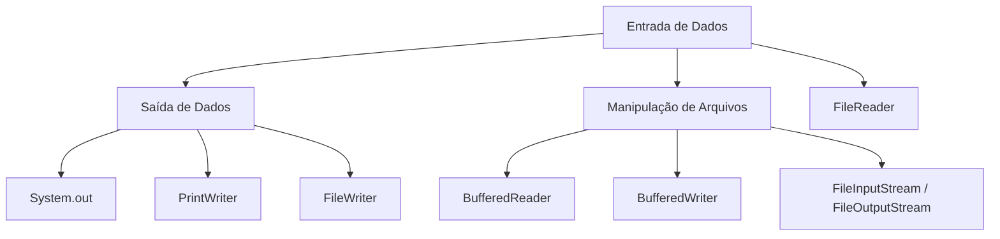

# Entrada e Saída de Dados em Java

A entrada e saída de dados (E/S) é um dos pilares fundamentais da programação em Java, pois permite que um programa **interaja com o usuário**, **manipule arquivos** e **exiba informações**.
Compreender essas operações é essencial para criar aplicações **interativas, funcionais e eficientes**.

---

## Fundamentos de Entrada e Saída

Em Java, as operações de E/S podem ser realizadas de diferentes maneiras, dependendo da necessidade:

* **Entrada de dados**: leitura de informações do console ou de arquivos.
* **Saída de dados**: exibição de informações no console ou gravação em arquivos.



---

## Entrada de Dados

### 1. Usando Scanner

A classe `Scanner` é simples e prática para ler dados do **console**, aceitando vários tipos (inteiros, strings, decimais).

```java
import java.util.Scanner;

public class ExemploScanner {
    public static void main(String[] args) {
        Scanner scanner = new Scanner(System.in);
        System.out.print("Digite seu nome: ");
        String nome = scanner.nextLine();
        System.out.print("Digite sua idade: ");
        int idade = scanner.nextInt();
        System.out.println("Olá, " + nome + "! Você tem " + idade + " anos.");
        scanner.close();
    }
}
```

---

### 2. Usando BufferedReader

Mais eficiente para **ler linhas inteiras**, geralmente usado com arquivos ou quando se deseja maior desempenho.

```java
import java.io.BufferedReader;
import java.io.IOException;
import java.io.InputStreamReader;

public class ExemploBufferedReader {
    public static void main(String[] args) throws IOException {
        BufferedReader reader = new BufferedReader(new InputStreamReader(System.in));
        System.out.print("Digite seu nome: ");
        String nome = reader.readLine();
        System.out.println("Olá, " + nome + "!");
    }
}
```

---

## Saída de Dados

### 1. System.out

A forma mais comum e direta de exibir informações no console.

```java
public class ExemploPrintln {
    public static void main(String[] args) {
        System.out.println("Hello, World!");
    }
}
```

---

### 2. PrintWriter

Permite maior controle e **formatação avançada** da saída, seja no console ou em arquivos.

```java
import java.io.PrintWriter;

public class ExemploPrintWriter {
    public static void main(String[] args) {
        PrintWriter writer = new PrintWriter(System.out, true);
        writer.println("Hello, World!");
        writer.printf("Nome: %s | Idade: %d%n", "João", 30);
    }
}
```

---

## Manipulação de Arquivos

Além da interação com o console, Java permite trabalhar com **arquivos** de forma simples e eficiente.

* **FileReader / FileWriter** → Leitura e escrita de arquivos de texto.
* **BufferedReader / BufferedWriter** → Melhor desempenho ao trabalhar com arquivos grandes.
* **FileInputStream / FileOutputStream** → Para arquivos binários.

### Exemplo: Escrevendo em arquivo com BufferedWriter

```java
import java.io.BufferedWriter;
import java.io.FileWriter;
import java.io.IOException;

public class FileWriteExample {
    public static void main(String[] args) {
        try (BufferedWriter writer = new BufferedWriter(new FileWriter("arquivo.txt"))) {
            writer.write("Olá, Mundo!");
            writer.newLine();
            writer.write("Segunda linha.");
        } catch (IOException e) {
            e.printStackTrace();
        }
    }
}
```

### Exemplo: Lendo arquivo com BufferedReader

```java
import java.io.BufferedReader;
import java.io.FileReader;
import java.io.IOException;

public class FileReadExample {
    public static void main(String[] args) {
        try (BufferedReader reader = new BufferedReader(new FileReader("arquivo.txt"))) {
            String linha;
            while ((linha = reader.readLine()) != null) {
                System.out.println(linha);
            }
        } catch (IOException e) {
            e.printStackTrace();
        }
    }
}
```

---

## Atividade Prática

**Título:** Fundamentos de Entrada e Saída de Dados em Java
**Objetivo:** Fixar os conceitos básicos de E/S.
**Ferramentas:** IDE (ex.: IntelliJ), JDK 17.

1. Qual a função da classe `Scanner` em Java?
   a) Ler arquivos
   b) Ler dados do console
   c) Escrever no console
   d) Converter bytes em caracteres

2. Qual classe é usada junto com `InputStreamReader` para ler dados do console?
   a) PrintWriter
   b) BufferedReader
   c) Scanner
   d) FileReader

3. Qual alternativa descreve o `PrintWriter`?
   a) Escreve dados no console/arquivos com formatação
   b) Lê dados do console
   c) Converte bytes em caracteres
   d) Compacta dados em arquivos

4. Por que a manipulação de dados é importante em Java?
   a) Não é importante
   b) Só serve para gráficos
   c) Não há bibliotecas robustas
   d) Fundamental para sistemas e bancos de dados

**Gabarito:**
1.b | 2.b | 3.a | 4.d

---

## Conteúdo Bônus

📺 **Título:** *Java para Iniciantes: Entrada e Saída de Dados*
👤 **Canal:** Cryswerton Silva
▶️ **Plataforma:** YouTube

---

## Referências

* ASCENCIA, A. F. G.; CAMPOS, E. A. V. *Fundamentos da programação.* Pearson, 2007.
* DEITEL, H. M.; DEITEL, P. J.; CHOFFNES, D. R. *Sistemas operacionais.* Pearson, 2005.
* FORBELLONE, A. L. V.; EBERSPACHER, H. F. *Lógica de programação.* Pearson, 2005.
* GUEDES, S. (Org.). *Lógica de programação algorítmica.* Pearson, 2014.
* PUGA, S.; RISSETTI, G. *Lógica de programação e estruturas de dados com Java.* Pearson, 2016.
