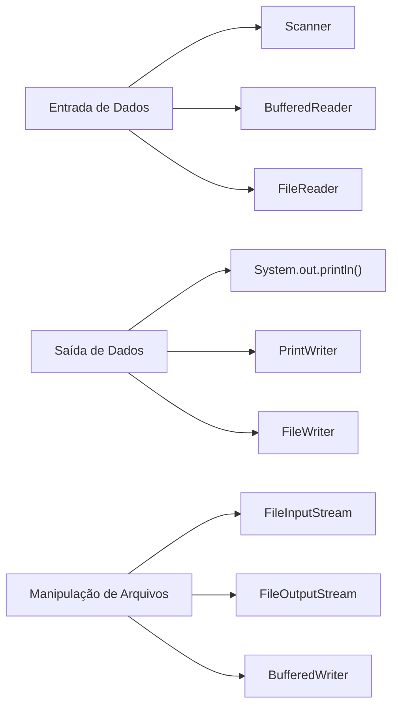
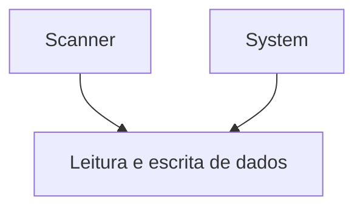

# Entrada e Saída de Dados
Importante para interagir com o usuário e exibir informações.
## Fundamentos de entrada e saída de dados em Java
Os fundamentos de entrada e saída de dados em Java envolvem a leitura de dados do usuário e a escrita desses dados como saída. A entrada pode variar conforme a necessidade da aplicação, seja por teclado ou arquivos, enquanto a saída pode ser visualizada na tela ou exportada.

Entrada de Dados:
> Para ler dados do usuário ou de outras fontes, você pode usar:
- Scanner: A classe Scanner é amplamente utilizada para ler dados do console. Ela pode ler diferentes tipos de dados, como inteiros, strings e floats.
- BufferedReader: Outra maneira de ler dados do console, geralmente usada para leitura de linhas completas de texto.
- FileReader: Usada para ler dados de arquivos.

Saída de Dados:
> Para enviar dados para tela ou ouros destinos, você pode usar:
- System.out.println(): O método mais comum para imprimir dados no console.
- PrintWriter: Usada para escrever dados em arquivos ou outros destinos.
- FileWriter: Usada para escrever dados em arquivos.

Manipulação de Arquivos:
> Para ler e escrever arquivos no sistema operacional, você pode usar:
- FileInputStream e FileOutputStream: Usadas para ler e escrever dados binários em arquivos.
- BufferedReader e BufferedWriter: Usadas para ler e escrever dados de texto em arquivos



## Sintaxe para Entrada de Dados
Formato da sintaxe para diferentes tipos de entrada.
- Ler dados do console -> Scanner:
```java
import java.util.Scanner;

public class ExemploScanner {
    public static void main(String[] args) {
        Scanner scanner = new Scanner(System.in);
        System.out.print("Digite seu nome: ");
        String nome = scanner.nextLine();
        System.out.println("Olá, " + nome + "!");
        scanner.close();
    }
}
```

- Método eficiente para ler dados do texto do console ou de arquivo -> BufferedReader:
```java
import java.io.BufferedReader;
import java.io.IOException;
import java.io.InputStreamReader;
public class ExemploBufferedReader {
    public static void main(String[] args) throws IOException {
        BufferedReader reader = new BufferedReader(new InputStreamReader(System.in));
        System.out.print("Digite seu nome: ");
        String nome = reader.readLine();
        System.out.println("Olá, " + nome + "!");
    }
}
``` 

- Fluxo de saida padrão de dado no console -> System.out.println():
```java
public class ExemploPrintln {
    public static void main(String[] args) {
        System.out.println("Olá, Mundo!");
    }
}
```
## Leitura e Escrita de Dados
Entrada e saida de dados em Java cobrem uma ampla gama de operações, desde a leitura de dados do usuário até a escrita de dados em arquivos. Aqui estão alguns exemplos comuns:



## Manipulação de Arquivos
Para ler e escrever arquivos, você pode usar as classes do pacote java.io FileReader, FileWriter, BufferedReader e BufferedWriter.

Reader = Leitura

Writer = Escrita

### Para que serve BufferedWriter?
BufferedWriter é usado para escrever texto em um fluxo de saída de forma eficiente, armazenando os dados em um buffer antes de escrevê-los no destino final, como um arquivo. Isso reduz o número de operações de escrita, melhorando o desempenho.
### Para que serve o FileWriter?
FileWriter é usado para escrever caracteres em um arquivo. Ele cria um fluxo de saída que permite escrever dados de texto diretamente em um arquivo no sistema de arquivos.
### Para que server o BufferedReader?
BufferedReader é usado para ler texto de um fluxo de entrada de forma eficiente, armazenando os dados em um buffer antes de processá-los. Isso reduz o número de operações de leitura, melhorando o desempenho.
### Para que serve o FileReader?
FileReader é usado para ler caracteres de um arquivo. Ele cria um fluxo de entrada que permite ler dados de texto diretamente de um arquivo no sistema de arquivos.