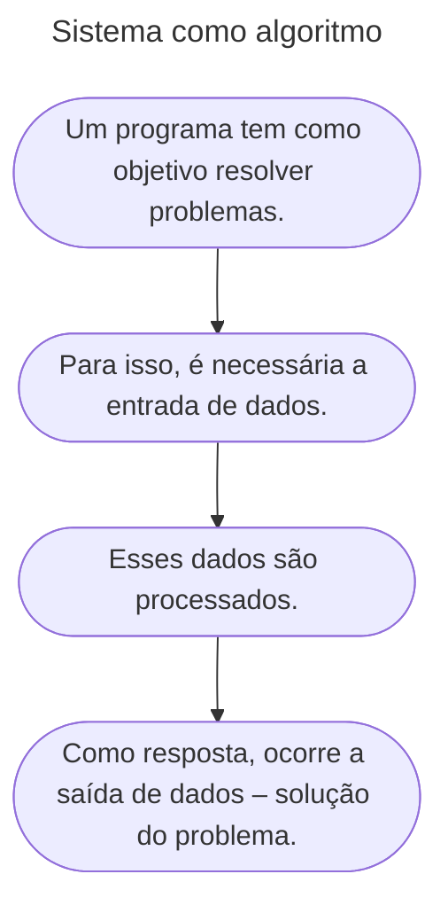

# Entrada, Processamento e Saída

## O que é um Sistema?
- Sistema é um conjunto de partes coordenadas, que concorrem para alcançar determinados objetivos.  
- É formado por elementos interdependentes que interagem e formam um todo unitário e complexo.  
- Em essência, um sistema recebe **entradas**, realiza **processamento** e gera **saídas**.

```mermaid
---
title: As atividades de um sistema
---
graph LR
B([Entrada]) --> C([Processamento]) --> D([Saída])
````

---

## Exemplo de Sistema na Vida Real

```mermaid
---
title: Exemplo de sistema na vida real
---
graph LR
A([**<u>Sistema</u>**<br><br>Faculdade])
B([**<u>Objetivo</u>**<br><br>Aquisição e desenvolvimento de conhecimento])
C([**<u>Entrada</u>**<br><br>Estudantes, professores, administradores, livros, equipamentos])
D([**<u>Processamento</u>**<br><br>Ensino e serviços])
E([**<u>Saída</u>**<br><br>Profissionais formados e serviços à comunidade])

A-->B-->C-->D-->E
```

---

## Entrada, Processamento e Saída em Programação

Um programa tem como objetivo **resolver problemas**.
Para isso, geralmente segue este ciclo:



---

## Passos para Resolução de Problemas

1. **Entendimento do problema**
2. **Criação de uma sequência de operações** (algoritmo)
3. **Execução dessa sequência**
4. **Verificação da adequação da solução**

> O computador desempenha uma parte desse processo (principalmente o passo 3 – execução).

---

## Definições

### Entrada de Dados

Atividades de registro, gravação ou edição de informações.
Exemplos: teclado, mouse, câmera, leitor ótico.
No **pseudocódigo**, usamos o comando:

```pseudocode
leia(variavel)
```

---

### Processamento

Ação de **converter dados brutos em informação útil**.
No contexto da programação, é a execução dos passos descritos no algoritmo.

Exemplo: cálculo de uma equação de segundo grau, soma de números, média aritmética etc.

---

### Saída de Dados

É a forma como os resultados do processamento são apresentados.
Exemplos: monitor, impressora, caixa de som.
No **pseudocódigo**, usamos:

```pseudocode
escreva("Resultado: ", variavel)
```

---

## Exemplo Prático (Visualg)

Cálculo da **média de três números**:

```pseudocode
algoritmo "MediaTresNumeros"
var
   n1, n2, n3, media: real
inicio
   escreva("Digite o primeiro número: ")
   leia(n1)
   escreva("Digite o segundo número: ")
   leia(n2)
   escreva("Digite o terceiro número: ")
   leia(n3)

   media <- (n1 + n2 + n3) / 3

   escreval("A média é: ", media)
fimalgoritmo
```

---

## Conteúdo Bônus

### Scratch 🎨

O **Scratch** é uma linguagem de programação em blocos criada pelo MIT, que utiliza elementos visuais, sons e imagens para ensinar lógica de programação de forma lúdica.

* Ideal para iniciantes (8 a 16 anos, mas usado por todas as idades).
* Permite criar **jogos, histórias interativas e animações**.
* Gratuito e disponível em mais de **40 idiomas**.
* Funciona em Windows, Linux e Mac.

📌 Sugestão: explore o Scratch e veja como conceitos de entrada, processamento e saída também estão presentes em suas criações.

---

## Referências Bibliográficas

* GUEDES, S. *Lógica de programação algorítmica*. Pearson, 2014.
* MANZANO, J. A. N. G.; OLIVEIRA, J. F. *Estudo Dirigido de Algoritmos*. 15. ed. São Paulo: Érica, 2012.
* PUGA, S.; RISSETTI, G. *Lógica de programação e estruturas de dados, com aplicações em Java*. Pearson, 2016.
* RIBEIRO, J. A. *Introdução à programação e aos algoritmos*. 1. ed. Rio de Janeiro: LTC, 2019.
