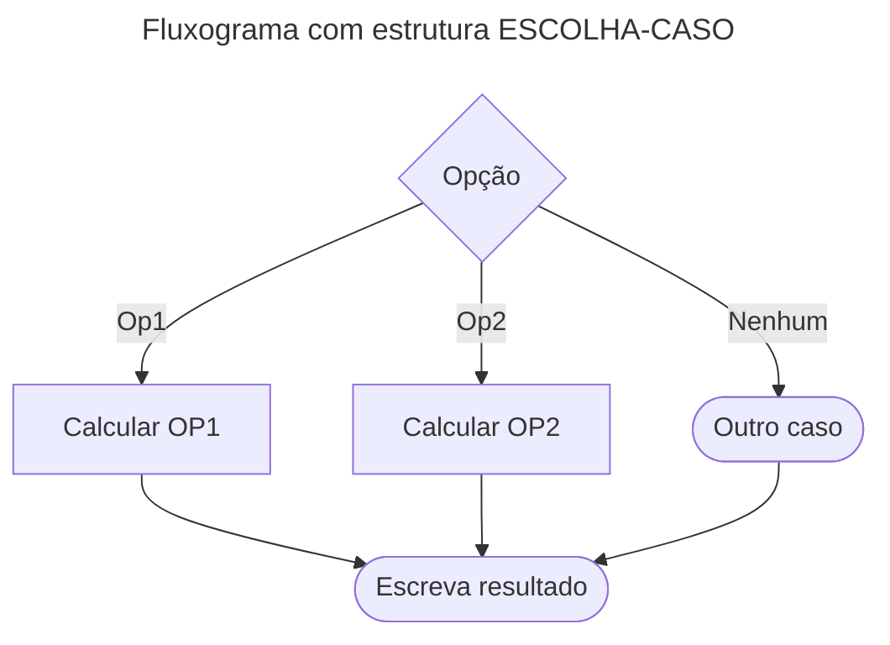

# Estruturas de Decisão

As **estruturas de decisão** (ou de controle) permitem que um algoritmo tome decisões com base em condições específicas.  
Com elas, o programa deixa de executar sempre a mesma sequência fixa e passa a **ramificar** o fluxo dependendo do resultado de testes lógicos.

Exemplo de uso: verificar a idade de uma pessoa para determinar se é criança, adulto ou idoso.

---

## Estrutura SE (simples)

Executa um bloco de comandos **apenas se** a condição for verdadeira.  
Se a condição for falsa, o bloco é ignorado.

```mermaid
---
title: Fluxograma com estrutura SE
---
graph TD
A{idade > 17<br> E<br> idade < 60}
B[Escreva entrada válida]
C[Escreva entrada inválida]

A--SIM-->B
A--NÃO-->C
````

📌 Exemplo em pseudocódigo:

```pseudocode
algoritmo "Exemplo_SE"
var idade: inteiro
inicio
   escreva("Digite sua idade: ")
   leia(idade)

   se (idade > 17) e (idade < 60) entao
      escreval("Entrada válida")
   fimse
fimalgoritmo
```

---

## Estrutura SE-SENÃO

Executa um bloco de comandos se a condição for verdadeira, e outro bloco alternativo se a condição for falsa.
Garante que **sempre um dos blocos será executado**.

```mermaid
---
title: Fluxograma com estrutura SE-SENÃO
---
graph TD
A{nota >= 6}
B[Escreva "Aprovado"]
C[Escreva "Reprovado"]

A--SIM-->B
A--NÃO-->C
```

📌 Exemplo em pseudocódigo:

```pseudocode
se (nota >= 6) entao
   escreval("Aprovado")
senao
   escreval("Reprovado")
fimse
```

---

## Estrutura SE-SENÃO Aninhado

Usado quando há **múltiplas condições** a serem testadas em sequência.
Permite criar uma cascata de verificações.

```mermaid
---
title: Fluxograma com estrutura SE aninhado
---
graph TD
A{idade > 17<br> E<br> idade < 60}
B[Escreva "Adulto"]
C{idade < 17}
E[Escreva "Criança"]
F[Escreva "60+"]

A--SIM-->B
A--NÃO-->C
C--SIM-->E
C--NÃO-->F
```

📌 Exemplo em pseudocódigo:

```pseudocode
se (idade > 17) e (idade < 60) entao
   escreval("Adulto")
senao
   se (idade < 17) entao
      escreval("Criança")
   senao
      escreval("60+")
   fimse
fimse
```

---

## Estrutura de Seleção Múltipla (ESCOLHA-CASO)

Alternativa ao uso de vários **SE-SENÃO** aninhados.
Direciona o fluxo de execução para um caso específico com base no valor de uma variável.



📌 Exemplo em pseudocódigo:

```pseudocode
escolha opcao
   caso 1
      escreval("Você escolheu Opção 1")
   caso 2
      escreval("Você escolheu Opção 2")
   outrocaso
      escreval("Opção inválida")
fimescolha
```

---

## Exemplo Prático (VisualG)

📌 Exemplo **Maior Número**

```pseudocode
algoritmo "MaiorNumero"
var n1, n2: inteiro
inicio
   escreva("Digite o primeiro número: ")
   leia(n1)
   escreva("Digite o segundo número: ")
   leia(n2)

   se (n1 < n2) entao
      escreval("O maior número é: ", n2)
   senao
      escreval("Os números digitados foram: ", n1, " e ", n2)
   fimse
fimalgoritmo
```

---

## Conteúdo Bônus

🎬 Filme: **Privacidade Hackeada**
Documentário que expõe o escândalo Cambridge Analytica/Facebook, mostrando como os dados pessoais podem ser explorados de forma abusiva.

---

## Referências Bibliográficas

* GUEDES, S. *Lógica de programação algorítmica*. Pearson: 2014.
* MANZANO, J. A. N. G.; OLIVEIRA, J. F. *Estudo Dirigido de Algoritmos*. 15. ed. São Paulo: Érica, 2012.
* PUGA, S.; RISSETTI, G. *Lógica de programação e estruturas de dados, com aplicações em Java*. Pearson: 2016.
* RIBEIRO, J. A. *Introdução à programação e aos algoritmos*. 1. ed. Rio de Janeiro: LTC, 2019.
