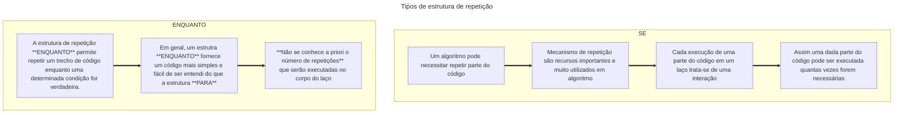
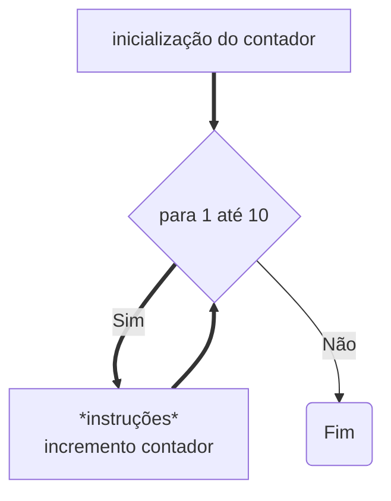
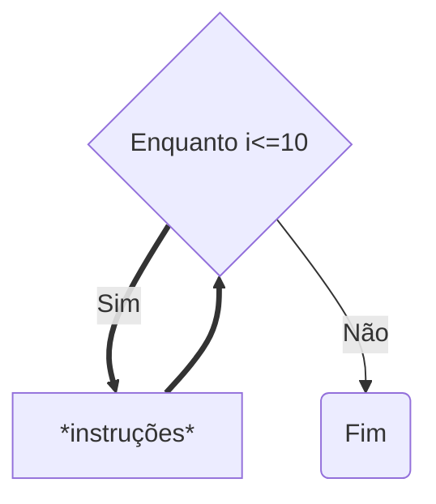
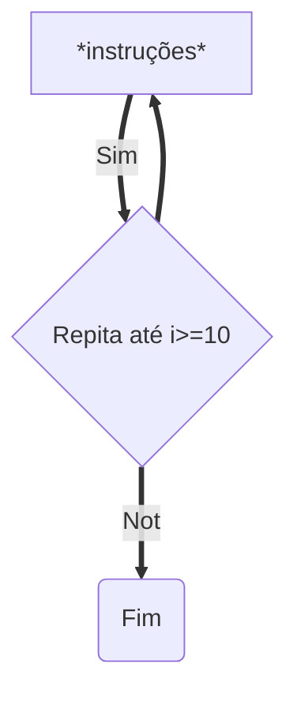

# Laços

## Para 
> Estrutura Para consiste em empregar uma variavel, geralmente um contador para controlar as repetições a serem executadas.

## ENQUANTO

## REPITA...ATÉ
> A estrutura "repita até" é similar ao "enquanto", mas executa o bloco de código pelo menos uma vez antes de verificar a condição. A avalição da condição ocorre no final da estrutura.

1*1=1*2=2*3=6*4=24