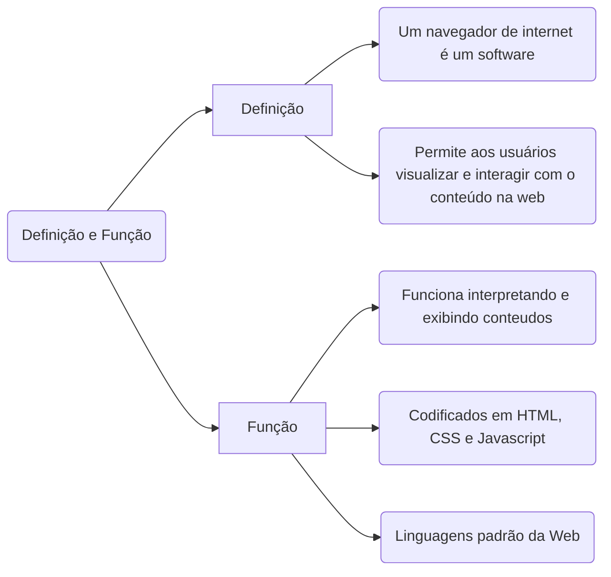
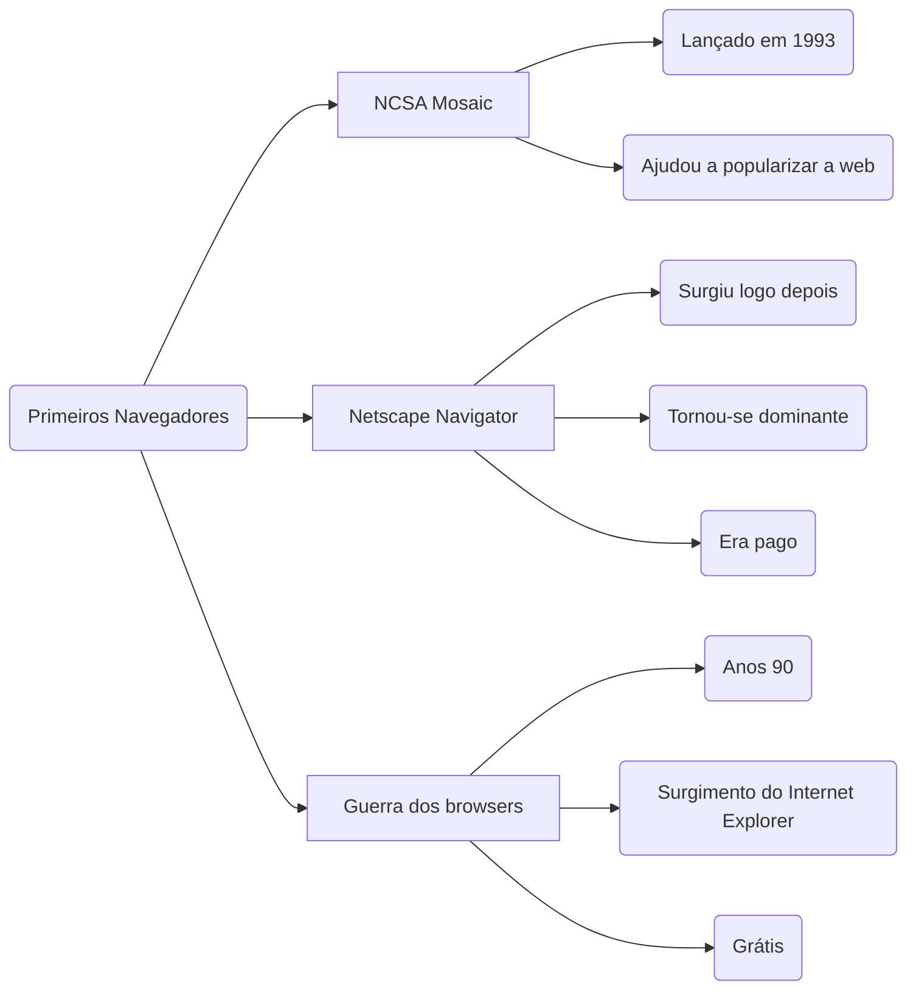
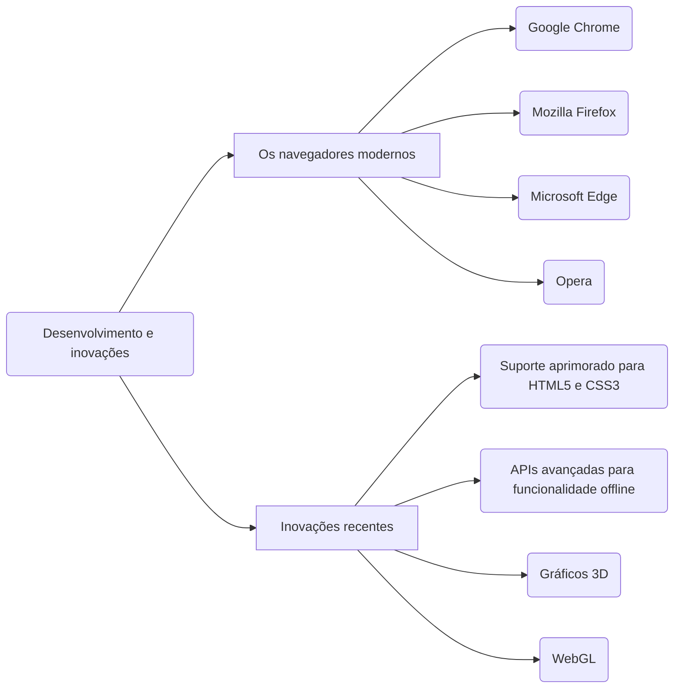
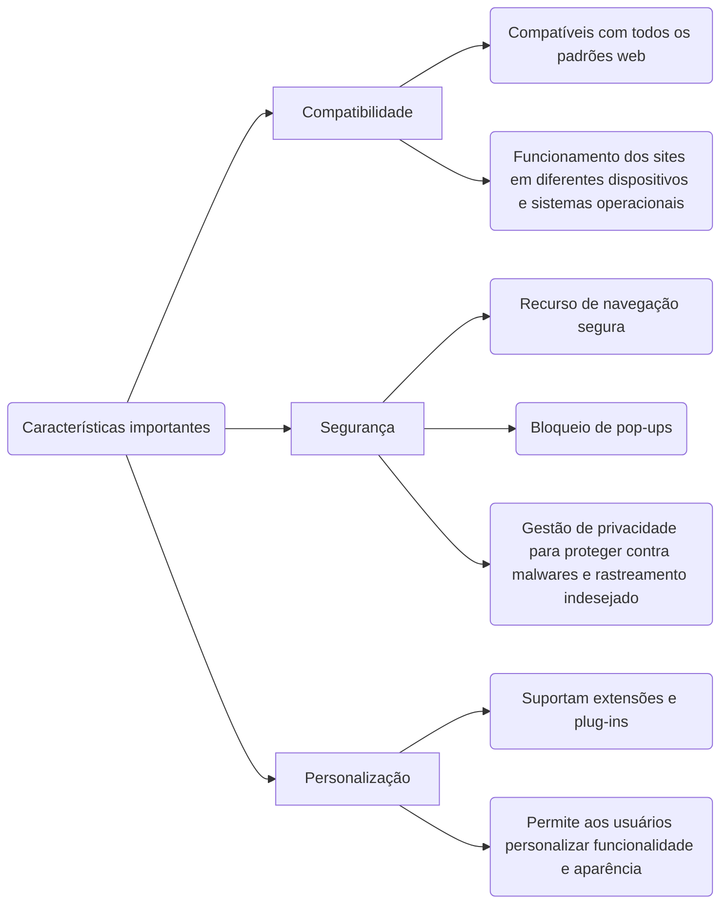
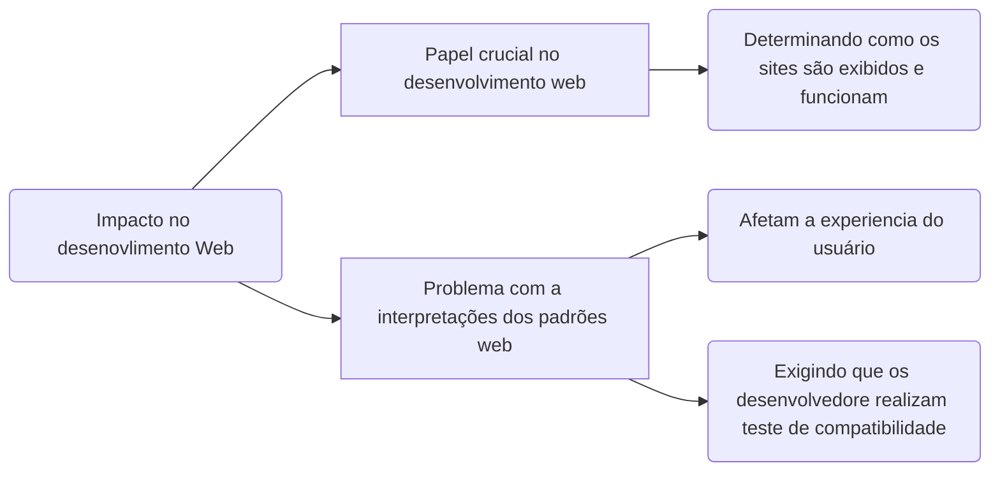

# Browser

O Navegador, renderiza o HTML e CSS
## Definição e Função

-------
## Primeiros Navegadores

## Desenvolvimento e inovações

## Características importantes

## Impacto no desenovlimento Web   

