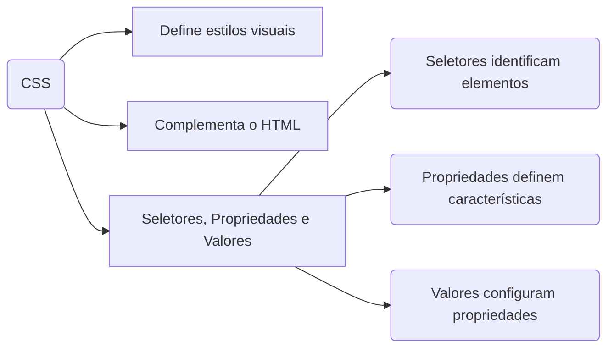
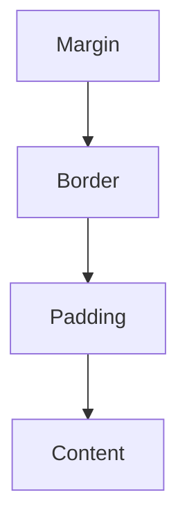
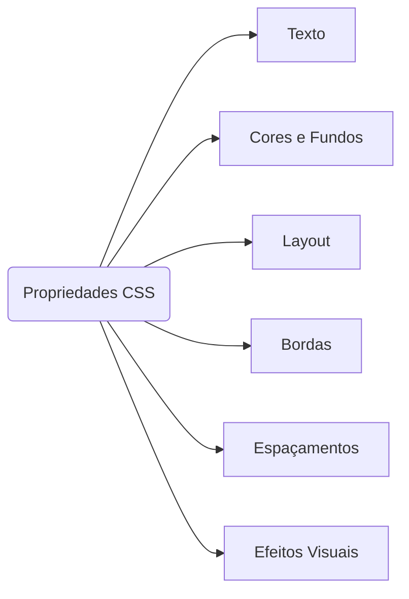

# CSS

O **CSS (Cascading Style Sheets)** é a linguagem responsável por estilizar páginas HTML, tornando-as mais visuais, organizadas e atrativas. 
Enquanto o HTML define a **estrutura**, o CSS define a **aparência**.

---

## Definições e Conceitos



- **Seletores** → identificam quais elementos HTML serão estilizados.  
- **Propriedades** → características visuais que queremos modificar (ex: cor, fonte, margens).  
- **Valores** → atribuições aplicadas às propriedades (ex: azul, 16px, negrito).  

Exemplo:
```css
p {
  color: blue;
  font-size: 16px;
}
```

---

## Estrutura do CSS

Podemos escrever CSS de três formas:  
1. **Inline**: diretamente no elemento HTML (`<p style="color: red">`).  
2. **Interno**: dentro da tag `<style>` no `<head>`.  
3. **Externo**: em um arquivo separado `.css`, vinculado com `<link>`.

> A forma mais recomendada é usar **arquivos externos**, garantindo melhor organização.

---

## Modelo de Formatação (Box Model)

O **Box Model** é o conceito que define como elementos HTML são exibidos na página.  
Cada elemento é uma **caixa** composta por:



- **Content** → conteúdo (texto, imagem).  
- **Padding** → espaço entre o conteúdo e a borda.  
- **Border** → linha ao redor do conteúdo/padding.  
- **Margin** → espaço externo entre a borda e outros elementos.  

Exemplo prático em CSS:
```css
.box {
  width: 300px;
  padding: 20px;
  border: 5px solid black;
  margin: 20px;
  background-color: lightblue;
}
```

---

## Categorias de Propriedades

As principais categorias de propriedades no CSS incluem:



Exemplos:
- **Texto** → `color`, `font-size`, `font-family`, `line-height`.  
- **Cores** → `color: red;`, `color: #0000FF;`, `color: rgb(0,0,255);`.  
- **Layout** → `display`, `position`, `flexbox`, `grid`.  
- **Bordas** → `border`, `border-radius`.  
- **Espaçamento** → `margin`, `padding`.  

---

## Cascata e Herança

O nome **Cascading** no CSS vem da forma como os estilos são aplicados.  
- Regras mais específicas substituem regras mais gerais.  
- A ordem importa: regras posteriores podem sobrescrever anteriores.  
- Alguns estilos são herdados (ex: cor do texto definida em `<body>` é herdada pelos parágrafos).  

Exemplo:
```css
body {
  color: black;
}
p {
  color: red; /* sobrescreve a cor herdada */
}
```

---

## Exemplo Completo

```html
<!DOCTYPE html>
<html lang="pt-BR">
<head>
  <meta charset="UTF-8">
  <meta name="viewport" content="width=device-width, initial-scale=1.0">
  <title>Página Estilizada</title>
  <style>
    body {
      text-align: center;
      color: blue;
      font-size: 24px;
    }
    .box {
      width: 300px;
      margin: 20px auto;
      padding: 20px;
      border: 2px solid gray;
      background-color: #f0f0f0;
    }
  </style>
</head>
<body>
  <h1>Bem-vindo ao mundo da programação!</h1>
  <div class="box">Esta é uma caixa estilizada com CSS.</div>
</body>
</html>
```

---

## Atividade Prática

Crie uma página HTML chamada **pagina_estilizada.html** com a frase:

**"Bem-vindo ao mundo da programação!"**  

Aplique CSS da seguinte forma:
- Centralize o texto na página.  
- A cor do texto deve ser **azul**.  
- O tamanho da fonte deve ser **24px**.  

---

## Referências Bibliográficas

- BONATTI, D. Desenvolvimento de Sites Dinâmicos com Dreamweaver CC. Brasport: 2013.  
- BONATTI, D. Desenvolvimento de Jogos em HTML5. Brasport: 2014.  
- FLATSCHART, F. HTML 5 - Embarque Imediato. Brasport: 2011.  
- JOÃO, B. do N. (Org.). Informática aplicada. 2.ed. Pearson: 2019.  
- MARINHO, A. L.; CRUZ, J. L. da. Desenvolvimento de aplicações para Internet. 2.ed. Pearson: 2020.  
- NEVES, M. C. B. de A. Sites de Alta Performance. Contentus: 2020.  
- SOUSA, R. F. M. CANVAS HTML 5 - Composição gráfica e interatividade na web. Brasport: 2018.  
- TANENBAUM, A. S.; FEAMSTER, N.; WETHERALL, D. J. Redes de computadores. 6.ed. Pearson: 2021.  
