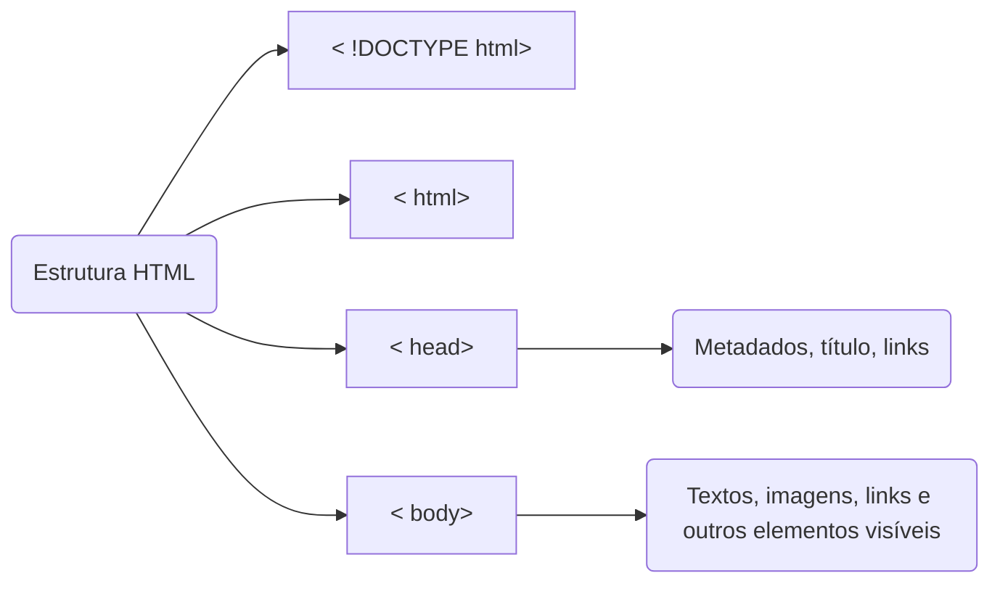
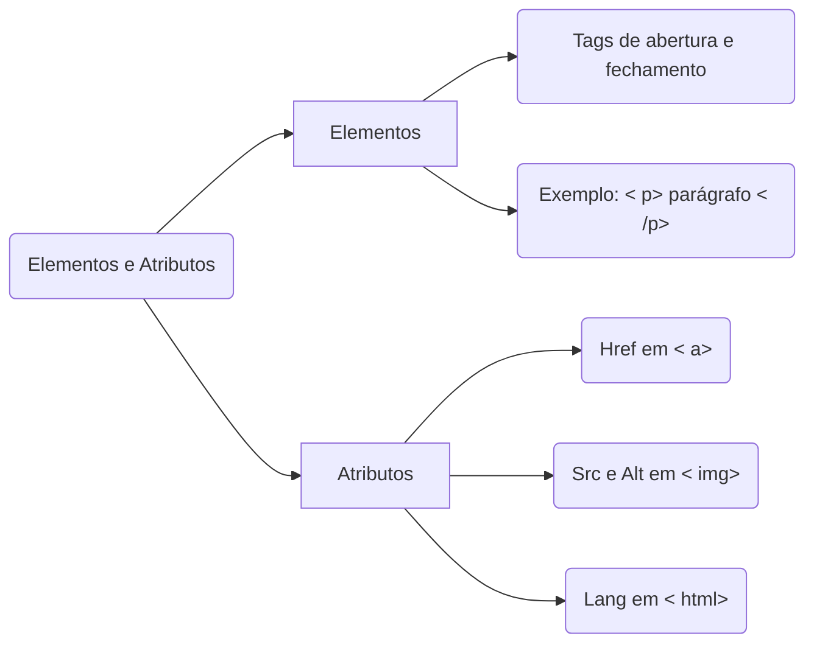
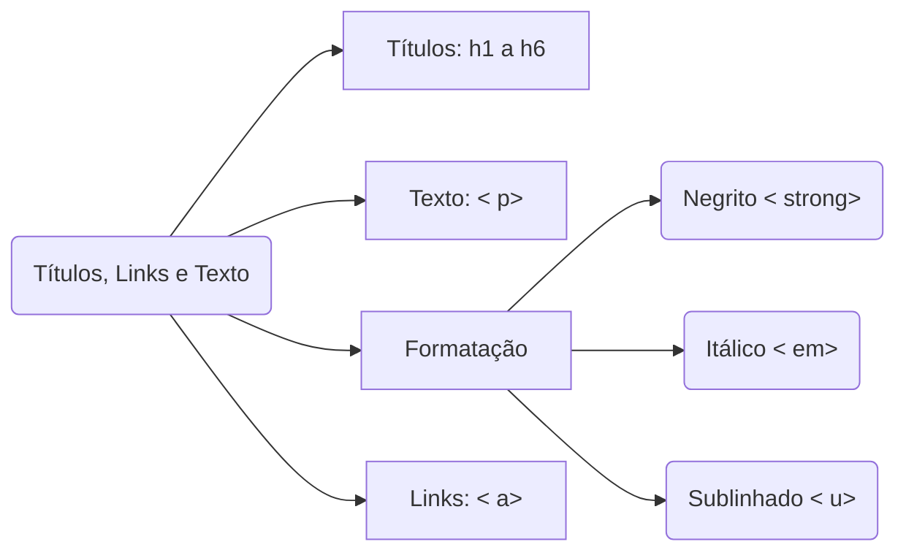
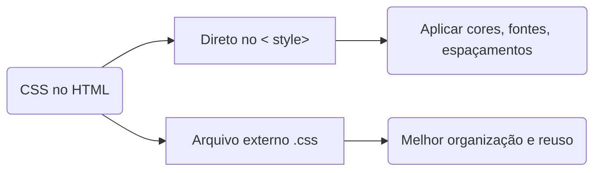

# HTML

A linguagem **HTML (HyperText Markup Language)** é a base para a construção de páginas web. 
Ela estrutura o conteúdo e define como será exibido no navegador.

---

## Estrutura básica



> Um documento HTML básico precisa sempre dessa estrutura: declaração do tipo de documento, tag `<html>`, tag `<head>` e tag `<body>`.

---

## Elementos e Atributos

Elementos HTML são definidos por **tags** que possuem abertura e fechamento, como `<p> ... </p>`.  
Atributos fornecem informações adicionais sobre os elementos.



Exemplos comuns:
- `<a href="url" target="_blank">` cria links para outras páginas.
- `` insere imagens acessíveis.

---

## Títulos, Links e Texto

As tags de título vão de `<h1>` (mais importante) até `<h6>` (menos importante).  
A tag `<p>` cria parágrafos, e dentro dela podemos aplicar formatações:

- `<strong>` → Negrito  
- `<em>` → Itálico  
- `<u>` → Sublinhado  



Exemplo de link:
```html
<a href="https://www.example.com" target="_blank">Visite o site</a>
```

---

## Cores e Estilos

CSS (Cascading Style Sheets) permite adicionar cores e estilos.  
Podemos incluir CSS diretamente no HTML usando a tag `<style>` ou em arquivos externos.



Exemplo:

```html
<style>
  body {
    background-color: lightgray;
    font-family: Arial, sans-serif;
  }
  h1 {
    color: green;
    text-align: center;
  }
</style>
```

---

## Responsividade

A responsividade garante que a página se adapte a diferentes telas (PC, tablet, celular).  
Utilizamos a metatag viewport dentro do `<head>`:

```html
<meta name="viewport" content="width=device-width, initial-scale=1.0">
```

---

## Exemplo Completo

```html
<!DOCTYPE html>
<html lang="pt-BR">
<head>
    <meta charset="UTF-8">
    <meta name="viewport" content="width=device-width, initial-scale=1.0">
    <title>Frase em HTML</title>
    <style>
        body { background-color: #f0f0f0; font-family: Arial; }
        h1 { color: green; text-align: center; }
        p { font-size: 18px; }
    </style>
</head>
<body>
    <h1>Sejam bem-vindos!</h1>
    <p>A <strong><u>tecnologia</u></strong> conecta o mundo!</p>
    <a href="https://www.example.com" target="_blank">Clique aqui</a>
</body>
</html>
```

---

## Atividade Prática

1. Crie um arquivo chamado **frase_formatada.html**.  
2. Adicione a estrutura básica de um documento HTML.  
3. No corpo, insira a frase: **"A tecnologia conecta o mundo!"**.  
   - A palavra "tecnologia" deve estar em **negrito** e **sublinhado**.  
4. Abra o arquivo no navegador para visualizar o resultado.

---

## Referências Bibliográficas

- BONATTI, D. Desenvolvimento de Sites Dinâmicos com Dreamweaver CC. Brasport: 2013.  
- BONATTI, D. Desenvolvimento de Jogos em HTML5. Brasport: 2014.  
- FLATSCHART, F. HTML 5 - Embarque Imediato. Brasport: 2011.  
- JOÃO, B. do N. (Org.). Informática aplicada. 2.ed. Pearson: 2019.  
- MARINHO, A. L.; CRUZ, J. L. da. Desenvolvimento de aplicações para Internet. 2.ed. Pearson: 2020.  
- NEVES, M. C. B. de A. Sites de Alta Performance. Contentus: 2020.  
- SOUSA, R. F. M. CANVAS HTML 5 - Composição gráfica e interatividade na web. Brasport: 2018.  
- TANENBAUM, A. S.; FEAMSTER, N.; WETHERALL, D. J. Redes de computadores. 6.ed. Pearson: 2021.
