# Browser

O navegador é a porta de entrada para a internet. Ele traduz a linguagem dos computadores (HTML, CSS e JavaScript) em páginas que nós conseguimos visualizar e interagir. Sem ele, a web seria apenas um conjunto de códigos sem sentido para o usuário comum.

## Definição e Função

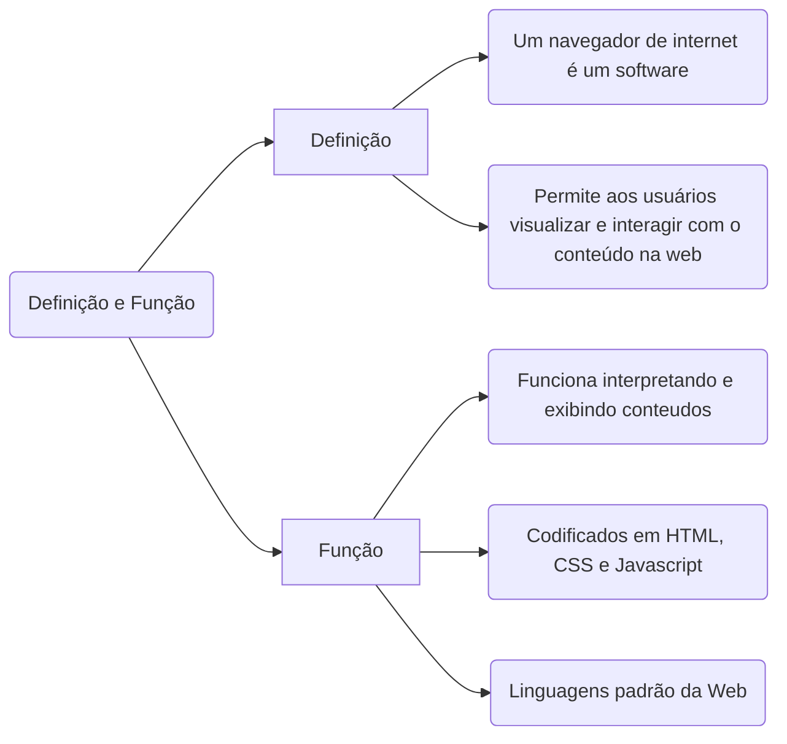
```mermaid
graph LR
    A(Definição e Função) --> B[Definição]
    A --> C[Função]
    B --> D(Um navegador de internet é um software)
    B --> E(Permite aos usuários visualizar e interagir com o conteúdo na web)
    C --> G(Funciona interpretando e exibindo conteudos)
    C --> H(Codificados em HTML, CSS e Javascript)
    C --> I(Linguagens padrão da Web)
```

> A World Wide Web é composta por hiperlinks, e o browser traduz e renderiza o código HTML, oferecendo uma visualização amigável das páginas e permitindo a navegação através dos links.

---

## Primeiros Navegadores

Os primeiros navegadores foram marcos fundamentais para popularizar a internet. Eles permitiram que a web deixasse de ser uma ferramenta apenas para cientistas e universidades e chegasse às pessoas comuns.

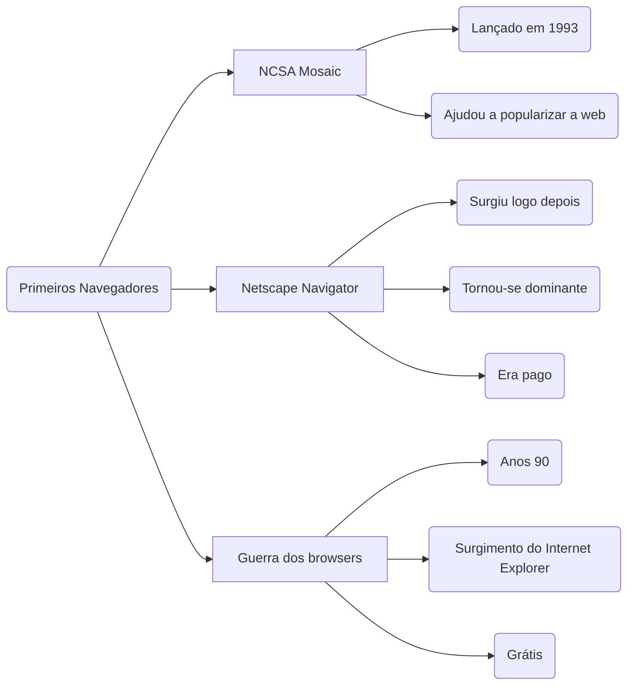
```mermaid
graph LR
    A(Primeiros Navegadores) --> B[NCSA Mosaic]
    A --> C[Netscape Navigator]
    A --> D[Guerra dos browsers]
    B --> E(Lançado em 1993)
    B --> F(Ajudou a popularizar a web)
    C --> G(Surgiu logo depois)
    C --> H(Tornou-se dominante)
    C --> I(Era pago)
    D --> J(Anos 90)
    D --> K(Surgimento do Internet Explorer)
    D --> L(Grátis)
```

## Desenvolvimento e inovações

À medida que a web cresceu, os navegadores evoluíram. Hoje, eles não apenas exibem páginas, mas funcionam como verdadeiras plataformas, capazes de rodar aplicações complexas e até jogos.

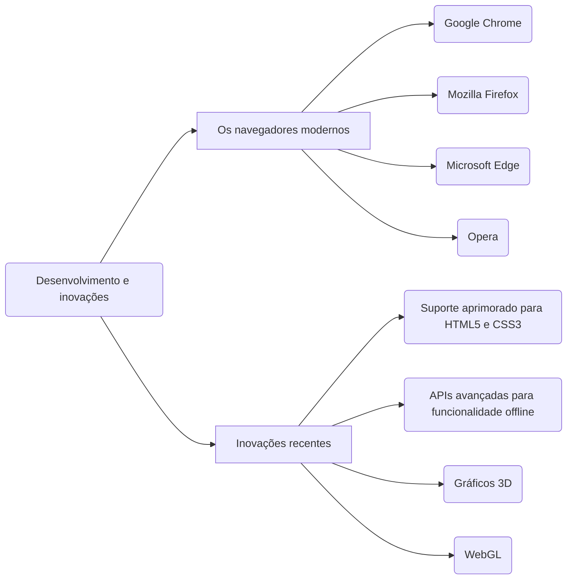
```mermaid
graph LR
    A(Desenvolvimento e inovações) --> B[Os navegadores modernos]
    A --> C[Inovações recentes]
    B --> D(Google Chrome)
    B --> E(Mozilla Firefox)
    B --> F(Microsoft Edge)
    B --> L(Opera)
    C --> G(Suporte aprimorado para HTML5 e CSS3)
    C --> H(APIs avançadas para funcionalidade offline)
    C --> I(Gráficos 3D)
    C --> M(WebGL)
```

## Características importantes

As características modernas garantem não só desempenho, mas também segurança e acessibilidade para os usuários.

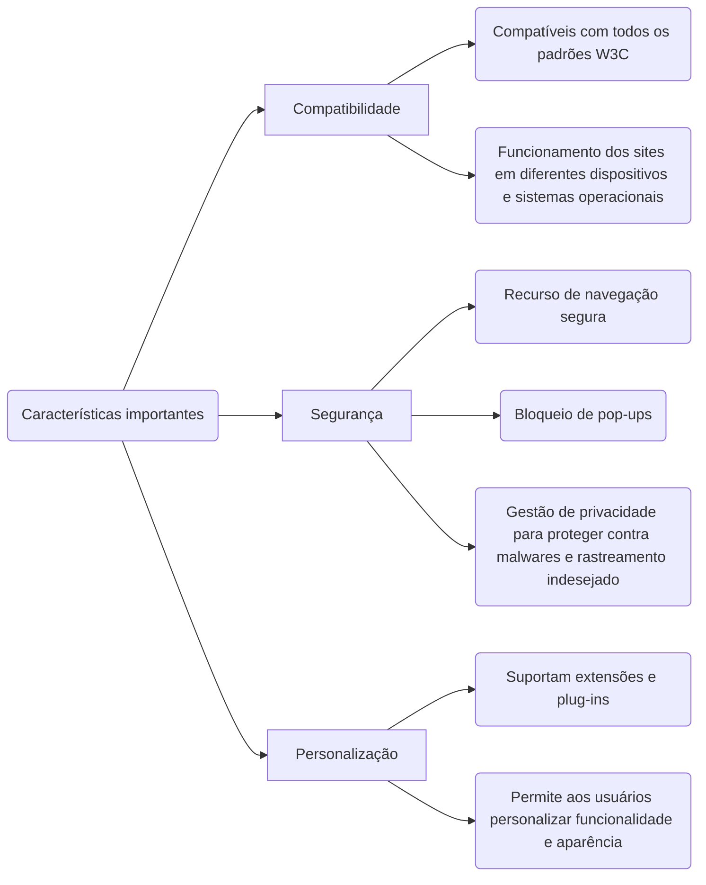
```mermaid
graph LR
    A(Características importantes) --> B[Compatibilidade]
    A --> C[Segurança]
    A --> D[Personalização]
    B --> E(Compatíveis com todos os padrões W3C)
    B --> F(Funcionamento dos sites em diferentes dispositivos e sistemas operacionais)
    C --> G(Recurso de navegação segura)
    C --> H(Bloqueio de pop-ups)
    C --> I(Gestão de privacidade para proteger contra malwares e rastreamento indesejado)
    D --> J(Suportam extensões e plug-ins)
    D --> K(Permite aos usuários personalizar funcionalidade e aparência)
```

## Impacto no desenvolvimento Web

Os navegadores foram decisivos para moldar a experiência online. Ao mesmo tempo em que abriram portas para inovações, também criaram desafios de compatibilidade que ainda exigem esforço dos desenvolvedores.

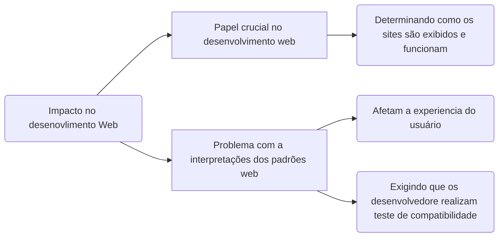
```mermaid
graph LR
    A(Impacto no desenovlimento Web) --> B[Papel crucial no desenvolvimento web]
    A --> C[Problema com a interpretações dos padrões web]
    B --> D(Determinando como os sites são exibidos e funcionam)
    C --> J(Afetam a experiencia do usuário)
    C --> G(Exigindo que os desenvolvedore realizam teste de compatibilidade)
```

# Motores

Os motores de busca são indispensáveis na navegação. Eles organizam o caos da informação, permitindo que encontremos rapidamente o que precisamos na imensidão da web.

## Definição e Função

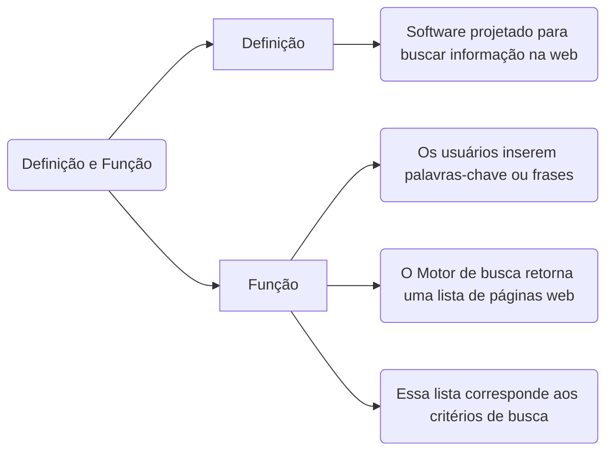
```mermaid
graph LR
    A(Definição e Função) --> B[Definição]
    A --> C[Função]
    B --> D(Software projetado para buscar informação na web)
    C --> G(Os usuários inserem palavras-chave ou frases)
    C --> H(O Motor de busca retorna uma lista de páginas web)
    C --> I(Essa lista corresponde aos critérios de busca)
```

---

## Primeiros motores de busca

Os primeiros buscadores eram simples indexadores de arquivos. Ainda assim, foram cruciais para dar os primeiros passos na organização da informação online.

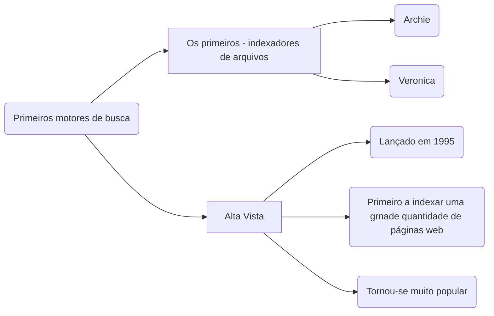
```mermaid
graph LR
    A(Primeiros motores de busca) --> B[Os primeiros - indexadores de arquivos]
    A --> C[Alta Vista]
    B --> E(Archie)
    B --> F(Veronica)
    C --> G(Lançado em 1995)
    C --> H(Primeiro a indexar uma grnade quantidade de páginas web)
    C --> I(Tornou-se muito popular)
```

## Google e revolução na busca

O Google transformou a forma como buscamos informações. Ao considerar não só palavras-chave, mas também a relevância das páginas, trouxe resultados muito mais precisos e úteis.

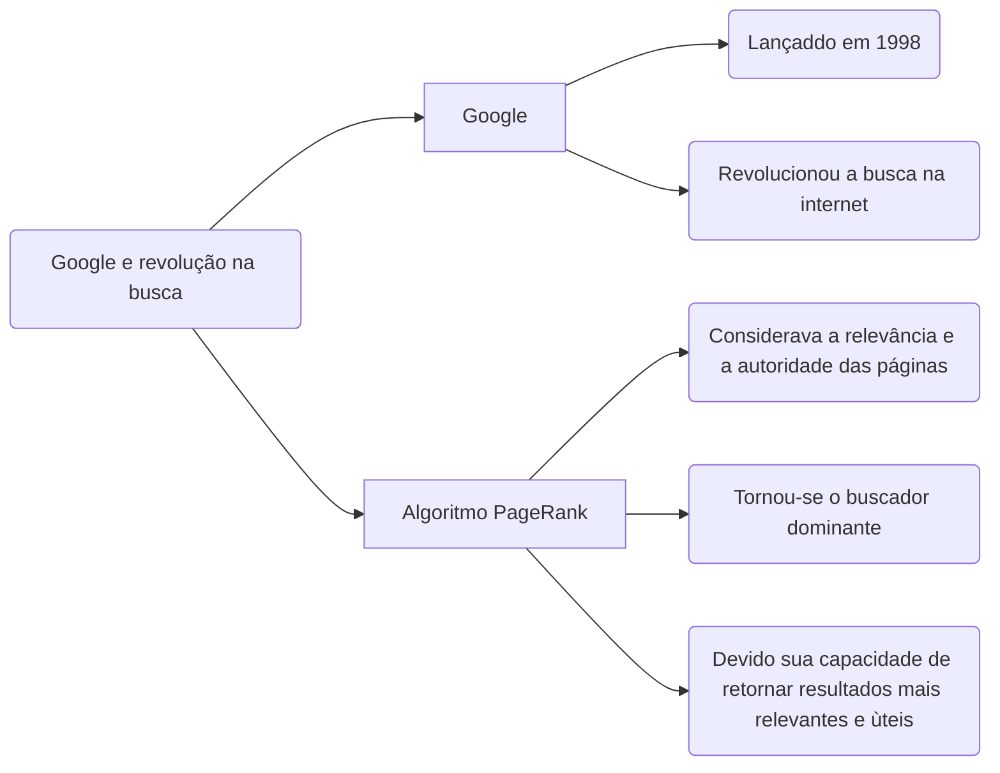
```mermaid
graph LR
    A(Google e revolução na busca) --> B[Google]
    A --> C[Algoritmo PageRank]
    B --> D(Lançaddo em 1998)
    B --> E(Revolucionou a busca na internet)
    C --> G(Considerava a relevância e a autoridade das páginas)
    C --> H(Tornou-se o buscador dominante)
    C --> I(Devido sua capacidade de retornar resultados mais relevantes e ùteis)
```

## Características dos motores de busca

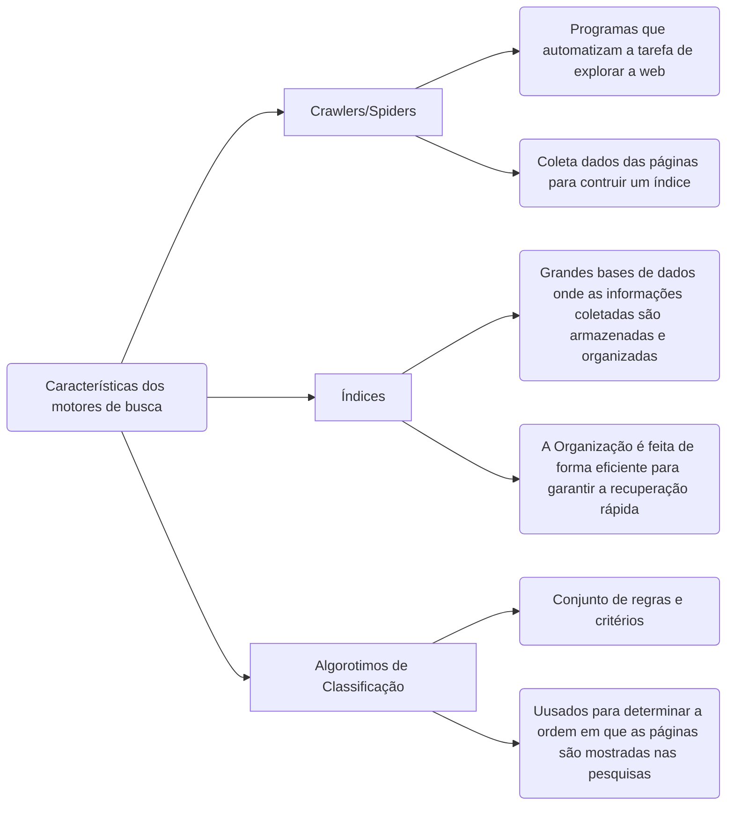
```mermaid
graph LR
    A(Características dos motores de busca) --> B[Crawlers/Spiders]
    A --> C[Índices]
    A --> D[Algorotimos de Classificação]
    B --> E(Programas que automatizam a tarefa de explorar a web)
    B --> F(Coleta dados das páginas para contruir um índice)
    C --> G(Grandes bases de dados onde as informações coletadas são armazenadas e organizadas)
    C --> H(A Organização é feita de forma eficiente para garantir a recuperação rápida)
    D --> J(Conjunto de regras e critérios)
    D --> K(Uusados para determinar a ordem em que as páginas são mostradas nas pesquisas)
```

## SEO - Search Engine Optimization

O SEO se tornou essencial no mundo digital. Ele garante que as páginas não apenas existam na web, mas também sejam encontradas e acessadas pelo público certo.

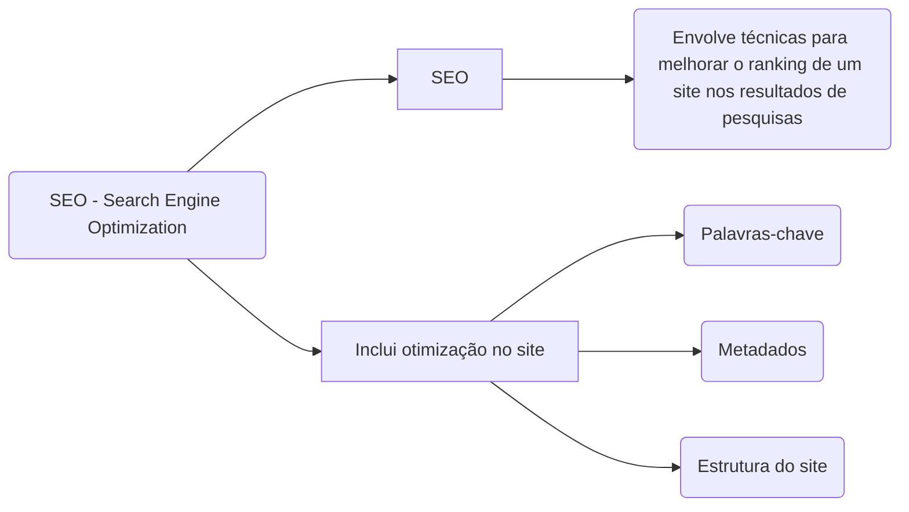
```mermaid
graph LR
    A(SEO - Search Engine Optimization) --> B[SEO]
    A --> C[Inclui otimização no site]
    B --> D(Envolve técnicas para melhorar o ranking de um site nos resultados de pesquisas)
    C --> J(Palavras-chave)
    C --> G(Metadados)
    C --> H(Estrutura do site)
```

---

# W3C

> Instituição que controla e atualiza padrões

O W3C garante que a web seja um espaço único e universal. Sem essa padronização, cada empresa poderia criar sua própria versão da internet, o que tornaria a rede fragmentada e caótica.

## Fundação e propósito

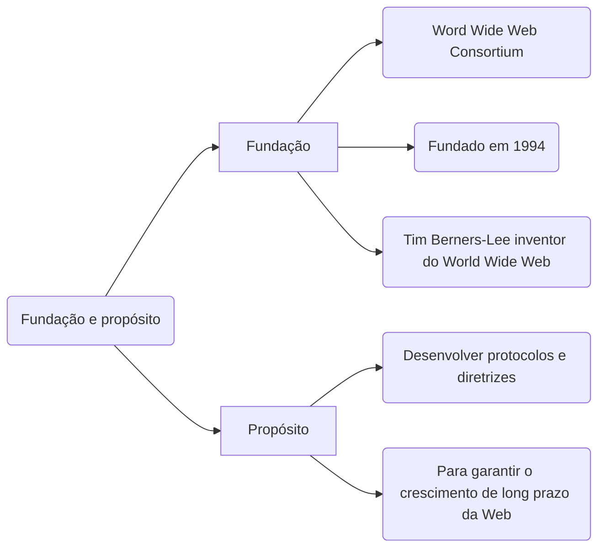
```mermaid
graph LR
    A(Fundação e propósito) --> B[Fundação]
    A --> C[Propósito]
    B --> D(Word Wide Web Consortium)
    B --> E(Fundado em 1994)
    B --> F(Tim Berners-Lee inventor do World Wide Web)
    C --> G(Desenvolver protocolos e diretrizes)
    C --> H(Para garantir o crescimento de long prazo da Web)
```

## Missão e Objetivos

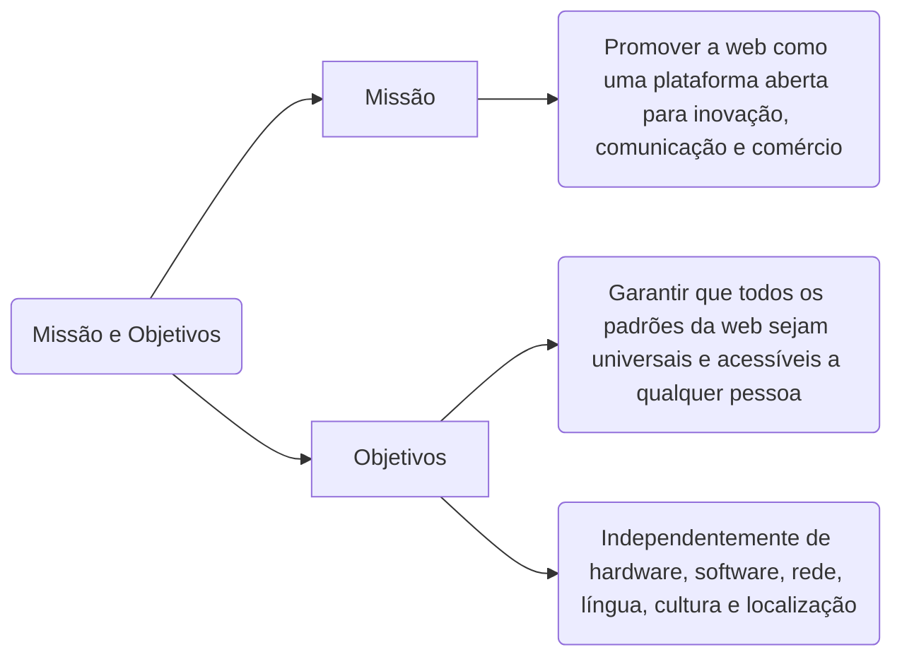
```mermaid
graph LR
    A(Missão e Objetivos) --> B[Missão]
    A --> C[Objetivos]
    B --> D(Promover a web como uma plataforma aberta para inovação, comunicação e comércio)
    C --> G(Garantir que todos os padrões da web sejam universais e acessíveis a qualquer pessoa)
    C --> H(Independentemente de hardware, software, rede, língua, cultura e localização)
```

## Desenvolvimento de padrão

Além de criar as linguagens centrais da web, o W3C promove um processo aberto, onde especialistas e comunidades colaboram para manter a internet evoluindo de forma segura e acessível.

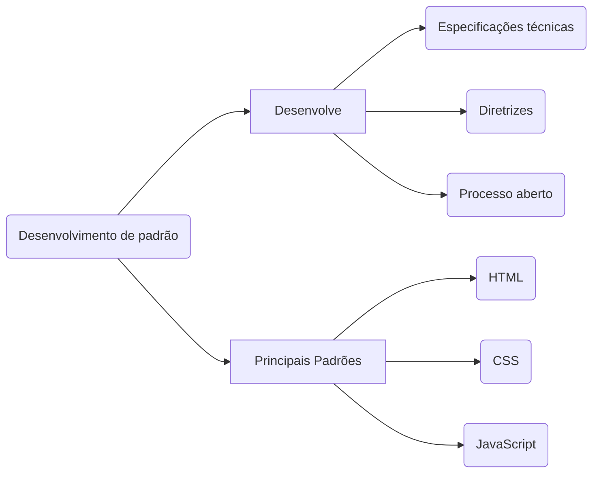
```mermaid
graph LR
    A(Desenvolvimento de padrão) --> B[Desenvolve]
    A --> C[Principais Padrões]
    B --> D(Especificações técnicas)
    B --> E(Diretrizes)
    B --> F(Processo aberto)
    C --> G(HTML)
    C --> H(CSS)
    C --> I(JavaScript)
```

> O HTML é responsável por montar a estrutura de uma página web, o CSS estiliza e embeleza a página, e o JavaScript dá vida e movimento a ela.

## Impacto global

O impacto do W3C vai além da tecnologia: garante acessibilidade, inclusão e a possibilidade de qualquer pessoa, em qualquer lugar, usar a web como uma ferramenta de crescimento e inovação.

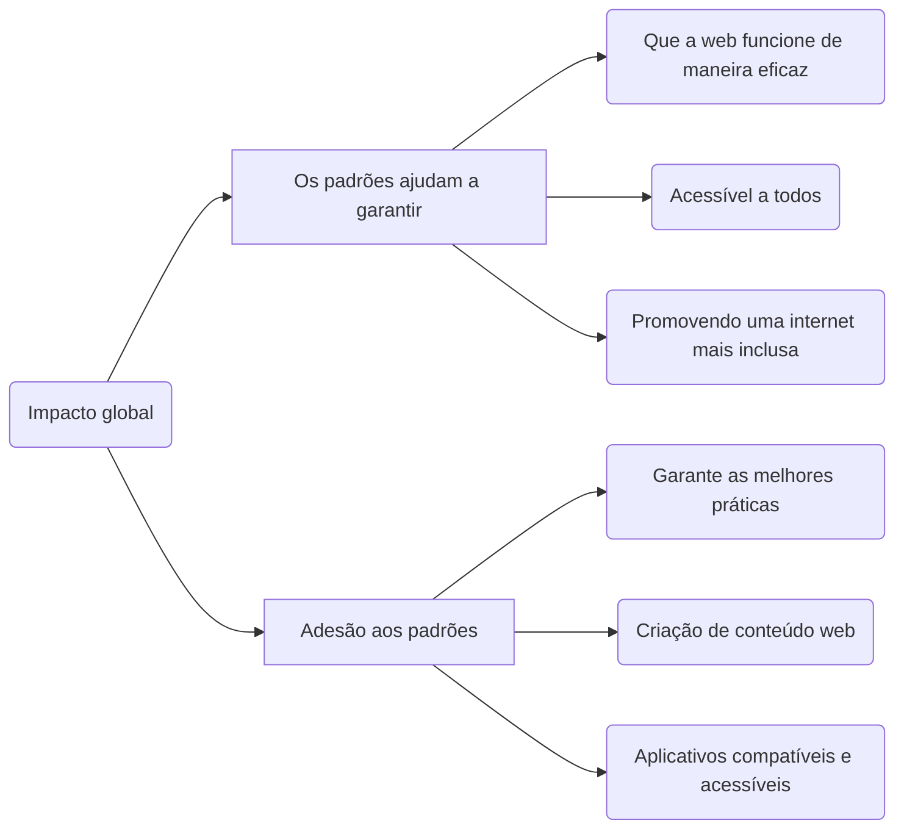
```mermaid
graph LR
    A(Impacto global) --> B[Os padrões ajudam a garantir]
    A --> C[Adesão aos padrões]
    B --> D(Que a web funcione de maneira eficaz)
    B --> E(Acessível a todos)
    B --> F(Promovendo uma internet mais inclusa)
    C --> G(Garante as melhores práticas)
    C --> H(Criação de conteúdo web)
    C --> I(Aplicativos compatíveis e acessíveis)
```

## Inciativas atuais e futuras

As iniciativas atuais mostram a preocupação com acessibilidade, sustentabilidade e ética no uso de dados — temas que moldam o futuro da web.

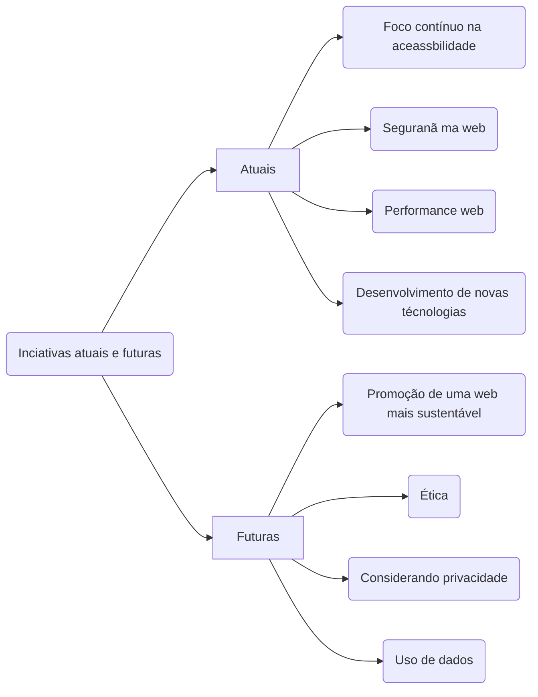
```mermaid
graph LR
    A(Inciativas atuais e futuras) --> B[Atuais]
    A --> C[Futuras]
    B --> D(Foco contínuo na aceassbilidade)
    B --> E(Seguranã ma web)
    B --> F(Performance web)
    B --> K(Desenvolvimento de novas técnologias)
    C --> J(Promoção de uma web mais sustentável)
    C --> G(Ética)
    C --> H(Considerando privacidade)
    C --> I(Uso de dados)
```

### Referência Bibliográfica

* BONATTI, D. Desenvolvimento de Sites Dinâmicos com Dreamweaver CC. Brasport: 2013.
* BONATTI, D. Desenvolvimento de Jogos em HTML5. Brasport: 2014.
* FLATSCHART, F. HTML 5 - Embarque Imediato. Brasport: 2011.
* JOÃO, B. do N. (Org.). Informática aplicada. 2.ed. Pearson: 2019.
* MARINHO, A. L.; CRUZ, J. L. da. Desenvolvimento de aplicações para Internet. 2.ed. Pearson: 2020
* NEVES, M. C. B. de A. Sites de Alta Performance. Contentus: 2020
* SOUSA, R. F. M. CANVAS HTML 5 - Composição gráfica e interatividade na web. Brasport: 2018.
* TANENBAUM, A. S.; FEAMSTER, N.; WETHERALL, D. J. Redes de computadores. 6.ed. Pearson: 2021.
