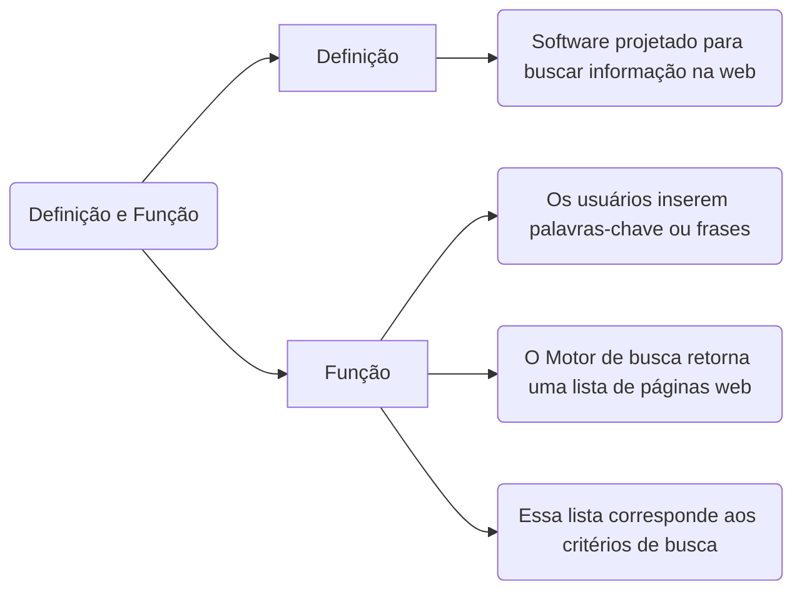
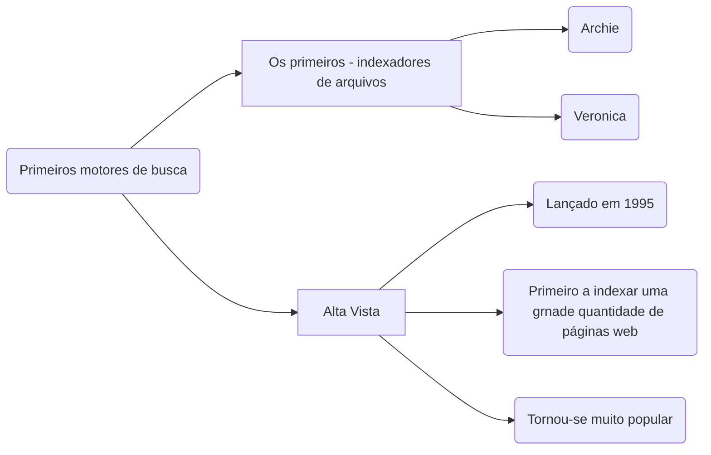
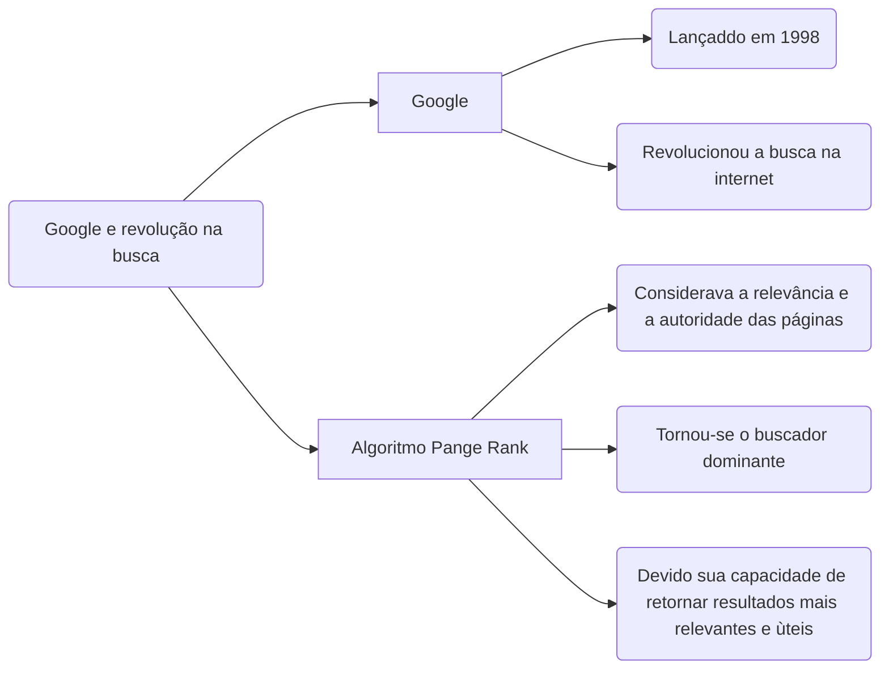
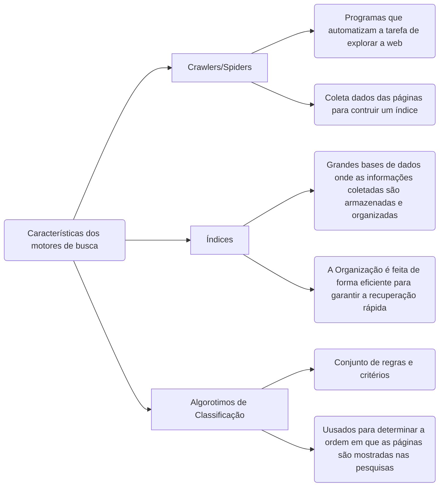
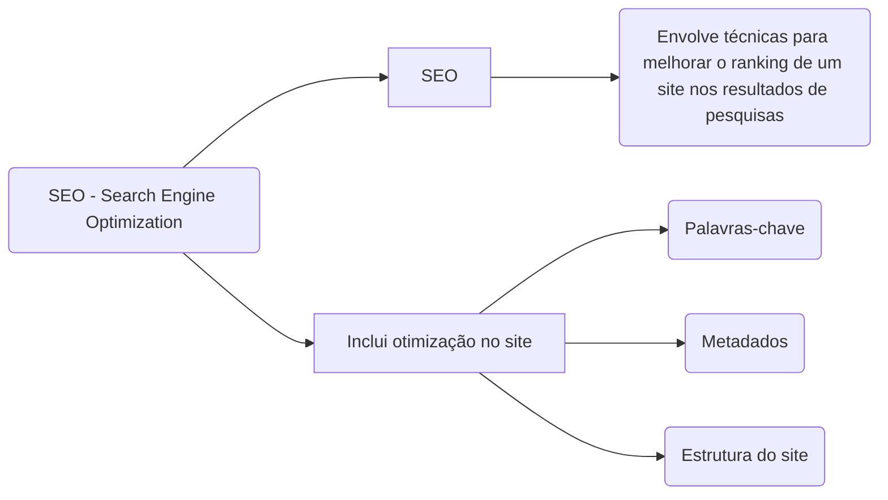

# Motores

O Navegador, renderiza o HTML e CSS
## Definição e Função

-------
## Primeiros motores de busca

## Google e revolução na busca

## Características dos motores de busca

## SEO - Search Engine Optimization   

