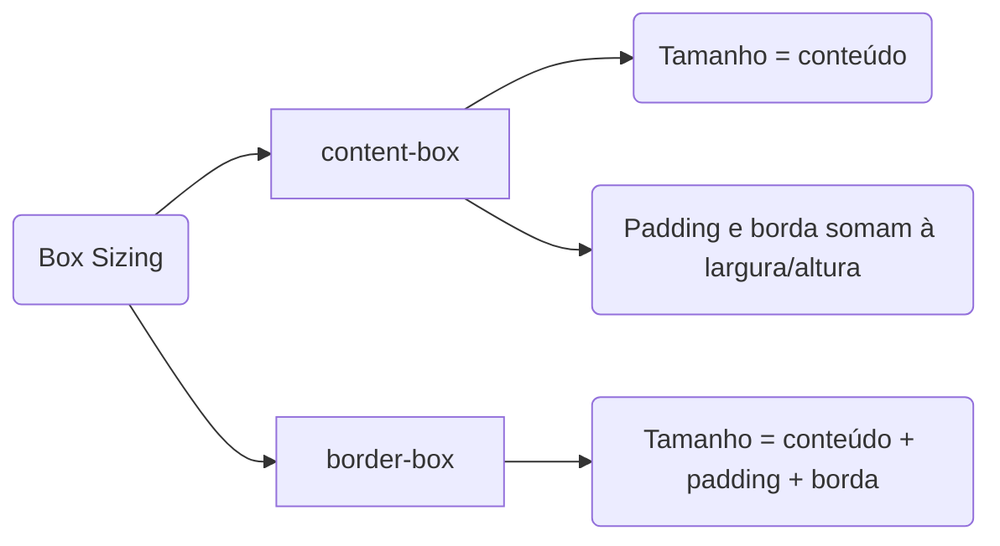

# Recursos especiais

## Box Sizing
A principal diferença entre box-sizing: content-box e box-sizing: border-box é como a largura e a altura de um elemento são calculadas em relação ao conteúdo, ao padding e à borda.
### Introdução ao Box Sizing

O box sizing é um conceito fundamental em CSS que define como a largura e altura de um elemento são calculadas. Existem duas abordagens principais: content-box e border-box, cada uma com suas particularidades e aplicações.
### Diferença entre Content Box e Border Box

A principal diferença entre content-box e border-box reside na forma como as dimensões são calculadas. No content-box, a largura e altura não incluem bordas e preenchimentos, enquanto no border-box, essas dimensões incluem bordas e preenchimentos, simplificando o layout.

Content-box (padrão):
--
Como é calculado:
- A largura e a altura que você define são aplicadas APENAS ao conteúdo do elemento.
- O padding e a borda são adicionados à largura e altura especificadas, aumentando o tamanho total do elemento.

___Exemplo:___

>   Se você define uma largura de 200 pixels, adiciona 20 pixels de padding e 5 pixels de borda, o tamanho total da caixa será:
<br/> 200 pixels (conteúdo) + 20 pixels (padding esquerdo) + 20 pixels (padding direito) + 5 pixels (borda esquerda) + 5 pixels (borda direita) = 250 pixels


**Estilizando a caixa com content-box (padrão)**
``` css
.content-box {
    box-sizing: content-box; /* Define box-sizing como content-box */
}
```

Border-box:
---
Como é calculado:
- A largura e a altura que você define INCLUEM o conteúdo, o padding e a borda.
- Isso significa que o tamanho total do elemento não muda, independentemente do padding e da borda que você adicionar.
____
___Exemplo___:<br/>

> Se você define uma largura de 200 pixels e adiciona 20 pixels de padding e 5 pixels de borda, o tamanho total da caixa permanecerá:<br/>
200 pixels (largura total) = conteúdo + padding + borda
____
**Estilizando a caixa com border-box**
```css
.border-box {
    box-sizing: border-box; /* Define box-sizing como border-box */
}
```

## Degradês
Degradês, ou gradientes, são transições suaves entre duas ou mais cores.<br/> 
No CSS, os degradês são usados para criar fundos, bordas ou outros efeitos visuais em elementos HTML. 

Existem dois tipos principais de degradês em CSS: lineares e radiais.<br/>
1.Degradê Linear (Linear Gradient)<br/>
2.Degradê Radial (Radial Gradient)
### Fundamentos de Degradê no CSS

Os degradês no CSS são transições suaves entre duas ou mais cores, podendo ser lineares ou radiais. O linear apresenta uma transição de uma cor escura para uma mais clara, enquanto o radial tem a cor escura no centro, clareando nas bordas.

### Aplicação de Degradê com CSS

Para aplicar degradês no CSS, utiliza-se a propriedade 'background' com 'linear-gradient' ou 'radial-gradient'. Isso permite estilizar elementos HTML, como títulos e divs, criando efeitos visuais atraentes em botões e caixas.

**Gradiente linear**

Um degradê linear cria uma transição suave entre várias cores ao longo de uma linha reta. 
   A linha pode ser horizontal, vertical ou em qualquer ângulo.

Parâmetros:

```direction```: Direção do degradê. Pode ser um ângulo (em graus) ou palavras-chave (to left, to right, to top, to bottom).

```color-stop```: Ponto de parada das cores, onde cada cor começa ou termina.

```css
.linear {
    background: linear-gradient(to right, #ff7e5f, #feb47b);
}
```
**Gradiente radial**

Um degradê radial cria uma transição suave entre várias cores que emana de um ponto central, formando círculos concêntricos.

Parâmetros:

```shape```: Forma do degradê (por padrão é ellipse, pode ser circle).

```size```: Tamanho do degradê (palavras-chave como closest-side, farthest-side, closest-corner, farthest-corner).

```position```: Posição do ponto central do degradê (por padrão é center).

```color-stop```: Ponto de parada das cores, onde cada cor começa ou termina.

```css
.radial {
    background: radial-gradient(circle, #ff7e5f, #feb47b);
}
```
## Animações
As animações em CSS permitem que você crie transições dinâmicas e interativas para os elementos em uma página web. <br/>
Com elas, você pode alterar propriedades de estilo gradualmente ao longo do tempo, proporcionando uma experiência mais envolvente para os usuários.
### Introdução às Animações em CSS

As animações em CSS utilizam keyframes para criar transições dinâmicas e interativas. Elas permitem alterar propriedades de estilo gradualmente ao longo do tempo, proporcionando efeitos visuais atraentes nas aplicações.

### Keyframes e Propriedades de Animação

Os keyframes definem os estados intermediários e finais de uma animação. É essencial configurar propriedades como duração, temporização e direção para garantir que a animação funcione corretamente em diferentes navegadores e dispositivos.


___Componentes de Animações em CSS___
- Keyframes (Quadros-chave)
- Propriedades de Animação 

**Definindo os keyframes**

Keyframes definem os estados intermediários e finais de uma animação. 
Eles especificam como o estilo de um elemento deve mudar em determinados pontos durante a animação.
```css
@keyframes mover-e-mudar-cor {
    from {
        background-color: red;
        transform: translateX(0);
    }
    to {
        background-color: yellow;
        transform: translateX(100px);
    }
}
```
**Aplicando a animação ao elemento**

As propriedades de animação aplicam a animação definida nos keyframes aos elementos selecionados e controlam aspectos como duração, repetição e tempo de início.

#### Principais Propriedades de Animação:

| Propriedade                 | Descrição                                                                      |
| --------------------------- | ------------------------------------------------------------------------------ |
| `@keyframes`                | Define os estágios da animação (0% → 100%).                                    |
| `animation-name`            | Nome da animação definida com @keyframes.                                      |
| `animation-duration`        | Duração de um ciclo (ex: `2s`).                                                |
| `animation-delay`           | Tempo antes de iniciar.                                                        |
| `animation-iteration-count` | Número de repetições (`1`, `infinite`).                                        |
| `animation-direction`       | Direção (`normal`, `reverse`, `alternate`).                                    |
| `animation-timing-function` | Curva de velocidade (`linear`, `ease`, `ease-in`, `ease-out`, `cubic-bezier`). |
| `animation-fill-mode`       | Estado final (`none`, `forwards`, `backwards`, `both`).                        |

### Exemplo prático

```css
.animacao {
    width: 100px;
    height: 100px;
    background-color: red;
    animation-name: mover-e-mudar-cor; /* Nome da animação definida nos keyframes.*/
    animation-duration: 2s; /* Duração da animação. */
    animation-timing-function: ease-in-out; /* Função de temporização da animação (por exemplo, linear, ease, ease-in, ease-out). */
    animation-iteration-count: infinite; /* Número de vezes que a animação deve se repetir. */
    animation-direction: alternate; /* Direção da animação (normal, reverse, alternate, alternate-reverse). */
}
```

📌 **Dica**: Use `alternate` para a animação ir e voltar sem precisar duplicar keyframes.


## Transições
Transições em CSS permitem que você altere gradualmente os valores das propriedades CSS ao longo de um período de tempo. <br/>
Isso proporciona uma mudança suave entre os estados de estilo, em vez de uma alteração brusca. <br/>
As transições são muito úteis para criar efeitos visuais interativos e aprimorar a experiência do usuário em uma página web.
### Introdução às Transições em CSS

As transições em CSS permitem a alteração gradual de propriedades quando uma ação é realizada, diferenciando-se das animações, que são contínuas. O foco é na interação do usuário que provoca a mudança.

### Implementação de Transições no Código

Transições em CSS possibilitam mudanças suaves entre estados de estilo, como a alteração de cor ao passar o mouse. O código HTML e CSS é simples, estruturando uma div que demonstra a transição ao interagir com o mouse.
#### Atributos principais

| Propriedade                  | Descrição                                                         |
| ---------------------------- | ----------------------------------------------------------------- |
| `transition-property`        | Define a propriedade a ser animada (`all`, `color`, `transform`). |
| `transition-duration`        | Tempo da transição (ex: `0.5s`).                                  |
| `transition-timing-function` | Curva de velocidade (`linear`, `ease`, `ease-in-out`).            |
| `transition-delay`           | Tempo antes da transição começar.     
**Estilo inicial para a caixa**

```css
.caixa {
    width: 200px;
    height: 100px;
    background-color: blue;
    color: white;
    text-align: center;
    line-height: 100px;
    transition-property: background-color, transform; /* Especifica que a background-color e a transform serão animadas. */
    transition-duration: 2s; /* Define que a transição levará 2 segundos para completar. */
    transition-timing-function: ease-in-out; /* Define que a transição usará uma função de temporização ease-in-out, que começa e termina devagar. */
}
```
**Estilo ao passar o mouse**
*Efeito ao Passar o Mouse (:hover)*
> Quando o usuário passa o mouse sobre o elemento .caixa, a cor de fundo muda para vermelho e o elemento gira 360 graus.
```css
.caixa:hover {
    background-color: red; /* Cor de fundo muda para vermelho */
    transform: rotate(360deg); /* Caixa gira 360 graus */
}
 ```

 ## Atividade Prática

**Título**: Animação com CSS  

**Tarefa**: Crie uma página HTML com uma caixa (100x100px) que se mova da esquerda para a direita continuamente em 3 segundos.  

Exemplo de gabarito:
```html
<!DOCTYPE html>
<html lang="pt-BR">
<head>
  <meta charset="UTF-8">
  <meta name="viewport" content="width=device-width, initial-scale=1.0">
  <title>Animação CSS</title>
  <style>
    body {
      display: flex;
      justify-content: center;
      align-items: center;
      height: 100vh;
      margin: 0;
    }
    .caixa {
      width: 100px;
      height: 100px;
      background-color: blue;
      position: relative;
      animation: moverCaixa 3s infinite;
    }
    @keyframes moverCaixa {
      0% { left: 0; }
      50% { left: 300px; }
      100% { left: 0; }
    }
  </style>
</head>
<body>
  <div class="caixa"></div>
</body>
</html>
```

---

## Resumo

- **Box-sizing** controla o cálculo das dimensões dos elementos.  
- **Degradês** criam transições suaves entre cores.  
- **Animações** adicionam movimento e interatividade contínua.  
- **Transições** tornam mudanças mais suaves em resposta ao usuário.  

---

## Referências Bibliográficas

- BONATTI, D. Desenvolvimento de Sites Dinâmicos com Dreamweaver CC. Brasport: 2013.  
- BONATTI, D. Desenvolvimento de Jogos em HTML5. Brasport: 2014.  
- FLATSCHART, F. HTML 5 - Embarque Imediato. Brasport: 2011.  
- JOÃO, B. do N. (Org.). Informática aplicada. 2.ed. Pearson: 2019.  
- MARINHO, A. L.; CRUZ, J. L. da. Desenvolvimento de aplicações para Internet. 2.ed. Pearson: 2020.  
- NEVES, M. C. B. de A. Sites de Alta Performance. Contentus: 2020.  
- SOUSA, R. F. M. CANVAS HTML 5 - Composição gráfica e interatividade na web. Brasport: 2018.  
- TANENBAUM, A. S.; FEAMSTER, N.; WETHERALL, D. J. Redes de computadores. 6.ed. Pearson: 2021.  
