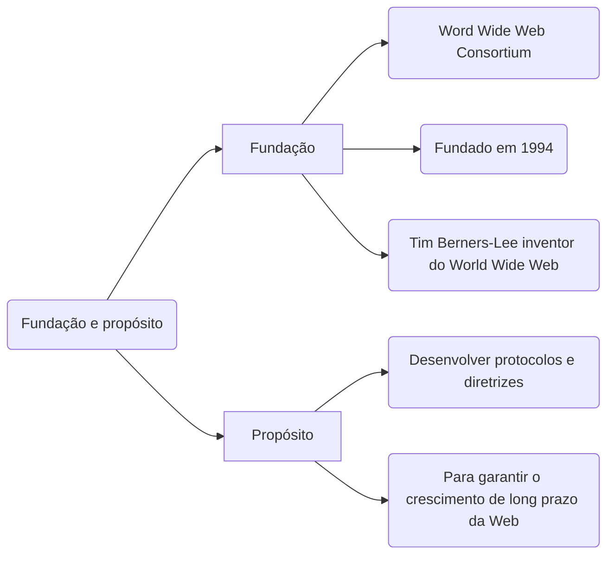
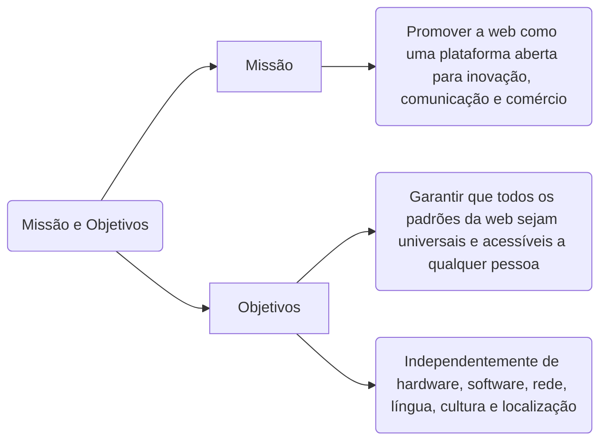
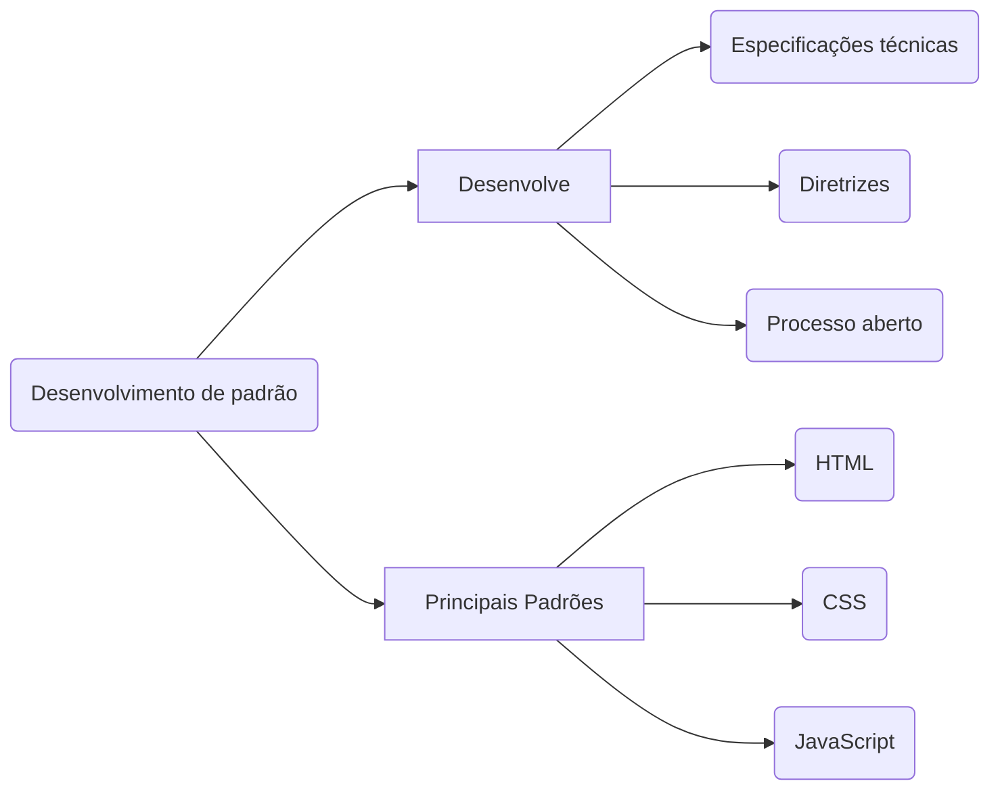
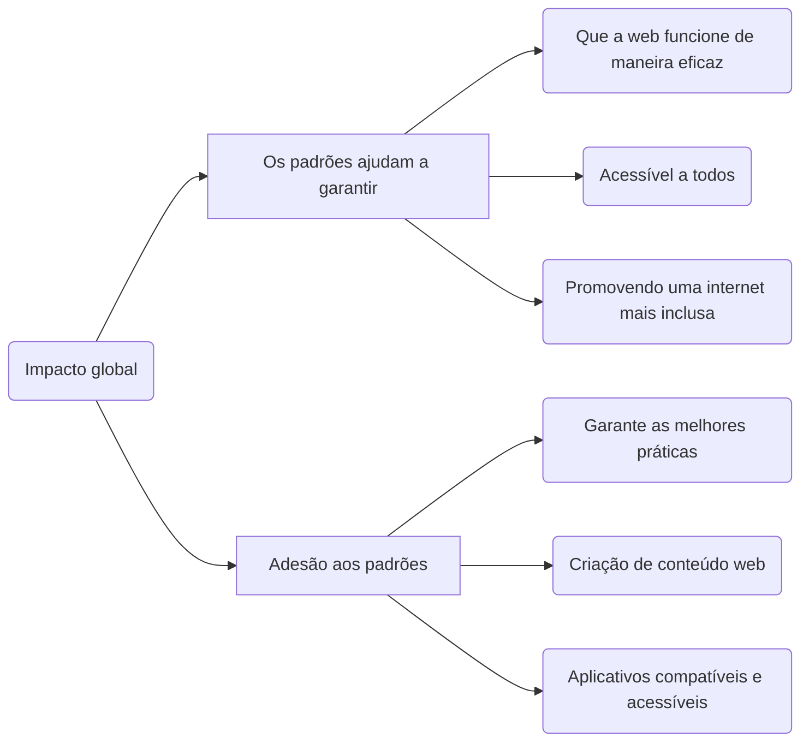
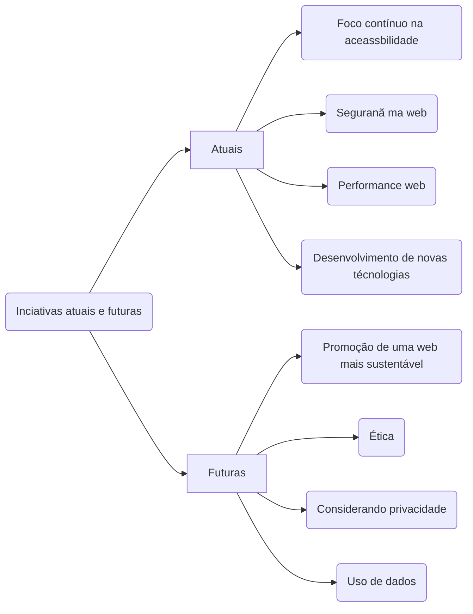

# W3C

Instituição que controla e atualiza padrões
## Fundação e propósito

```mermaid
graph LR
    A(Fundação e propósito) --> B[Fundação]
    A --> C[Propósito]
    B --> D(Word Wide Web Consortium)
    B --> E(Fundado em 1994)
    B --> F(Tim Berners-Lee inventor do World Wide Web)
    C --> G(Desenvolver protocolos e diretrizes)
    C --> H(Para garantir o crescimento de long prazo da Web)
```
-------
## Missão e Objetivos

```mermaid
graph LR
    A(Missão e Objetivos) --> B[Missão]
    A --> C[Objetivos]
    B --> D(Promover a web como uma plataforma aberta para inovação, comunicação e comércio)
    C --> G(Garantir que todos os padrões da web sejam universais e acessíveis a qualquer pessoa)
    C --> H(Independentemente de hardware, software, rede, língua, cultura e localização)
```

## Desenvolvimento de padrão

```mermaid
graph LR
    A(Desenvolvimento de padrão) --> B[Desenvolve]
    A --> C[Principais Padrões]
    B --> D(Especificações técnicas)
    B --> E(Diretrizes)
    B --> F(Processo aberto)
    C --> G(HTML)
    C --> H(CSS)
    C --> I(JavaScript)
```

## Impacto global

```mermaid
graph LR
    A(Impacto global) --> B[Os padrões ajudam a garantir]
    A --> C[Adesão aos padrões]
    B --> D(Que a web funcione de maneira eficaz)
    B --> E(Acessível a todos)
    B --> F(Promovendo uma internet mais inclusa)
    C --> G(Garante as melhores práticas)
    C --> H(Criação de conteúdo web)
    C --> I(Aplicativos compatíveis e acessíveis)
```

## Inciativas atuais e futuras

```mermaid
graph LR
    A(Inciativas atuais e futuras) --> B[Atuais]
    A --> C[Futuras]
    B --> D(Foco contínuo na aceassbilidade)
    B --> E(Seguranã ma web)
    B --> F(Performance web)
    B --> K(Desenvolvimento de novas técnologias)
    C --> J(Promoção de uma web mais sustentável)
    C --> G(Ética)
    C --> H(Considerando privacidade)
    C --> I(Uso de dados)
```