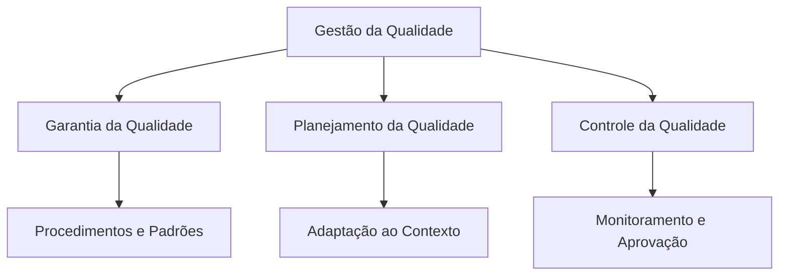
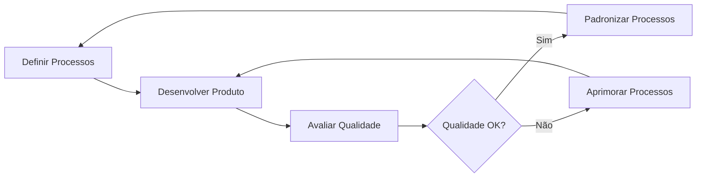
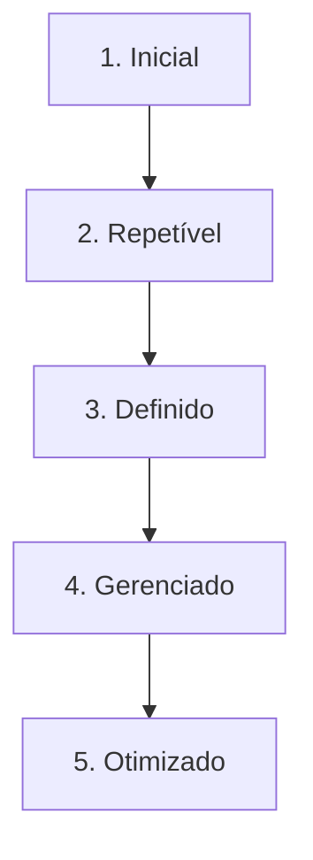

# Garantia e Qualidade de Software
## Introdução à Qualidade de Software

A qualidade de software, disciplina da Engenharia de Software desde 1970, tornou-se uma **necessidade fundamental** na disponibilização de sistemas modernos. O desenvolvedor deve ter compromisso com procedimentos que resultem em produtos que atendam às necessidades dos stakeholders e ao processo de construção adotado.

### Abordagem Dupla da Qualidade

A qualidade de software centra-se em **dois pilares fundamentais**:

- **Produto**: Garantir que a entrega atenda às expectativas dos stakeholders, tenha facilidade de uso e não apresente erros na execução
- **Processo**: Assegurar que os recursos utilizados na construção incluam padronização, modularização adequada, estruturas compreensíveis e documentação que garanta a continuidade dos sistemas

## O que é Qualidade de Software?

### Definições Fundamentais

**Segundo a NBR ISO 9000:2005:**
> "Qualidade é o grau no qual um conjunto de características inerentes satisfaz aos requisitos"

**Princípio Básico:** Se um produto ou serviço atende aos requisitos especificados, possui a qualidade desejada.

### Atributos Essenciais da Qualidade

| Atributo | Descrição |
|----------|-----------|
| **Aceitabilidade** | Grau em que o software é aceito pelos usuários (facilidade de uso) |
| **Dependabilidade e Segurança** | Capacidade de operar de forma confiável e segura |
| **Eficiência** | Realizar objetivos com otimização de recursos |
| **Manutenibilidade** | Facilidade de manutenção e atualização |
| **Confiabilidade** | Execução consistente sem falhas |
| **Usabilidade** | Facilidade de aprendizado e uso |
| **Portabilidade** | Adaptação a diferentes ambientes |

## Gerenciamento da Qualidade de Software

### Estrutura do Gerenciamento

### Componentes do Gerenciamento

**1. Garantia da Qualidade:**
- Procedimentos e padrões que conduzem a software de alta qualidade
- Estabelecimento de frameworks de melhores práticas

**2. Planejamento da Qualidade:**
- Adaptação dos procedimentos e padrões às características específicas do software
- Customização conforme contexto do projeto

**3. Controle da Qualidade:**
- Definição e aprovação de processos
- Garantia de adoção pela equipe de desenvolvimento

### Qualidade de Processo vs. Produto

A **qualidade do processo** afeta diretamente a **qualidade do produto**. Procedimentos bem definidos e seguidos resultam em produtos de qualidade superior.

**Elementos-chave do processo:**
- Processo de desenvolvimento documentado, compreendido e seguido
- Definição de padrões de processo ('como' e 'quando' realizar atividades)
- Monitoramento contínuo do desenvolvimento
- Relatórios transparentes para gerência e clientes

## Ciclo de Melhoria Contínua da Qualidade

## O que Considerar como Qualidade?

### Padrões de Qualidade

**Padrões de Produto:**
- Estrutura de documentos de requisitos
- Padrões de documentação técnica
- Padrões de codificação para diferentes linguagens
- Formatação e organização de artefatos

**Padrões de Processo:**
- Definição dos processos de especificação
- Metodologias de projeto e desenvolvimento
- Processos de validação e teste
- Procedimentos de manutenção

### Benefícios dos Padrões

1. **Evitam repetição de erros** cometidos em projetos anteriores
2. **Framework de melhores práticas** adaptado às necessidades da empresa
3. **Facilitam a continuidade** do sistema e manutenções futuras

### Papéis e Responsabilidades

**Profissionais envolvidos:**
- Gerentes de projeto
- Gerentes de qualidade
- Equipe de desenvolvimento

**Atribuições:**
- Apresentar padrões e procedimentos à equipe
- Revisar e modificar padrões conforme novos cenários
- Disponibilizar ferramentas de apoio aos padrões

## Técnicas e Tipos de Validação

### Processos de Certificação

**Organizações certificadoras:**
- US DoD (United States Department of Defense)
- ANSI (American National Standards Institute)
- BSI (British Standards Institutions)
- IEEE (Institute of Electrical and Electronic Engineers)

**Tipos de avaliação:**
- Avaliação ao longo do processo de desenvolvimento
- Avaliação de pacotes completos

### Atributos de Qualidade em Certificação

| Categoria | Atributos |
|-----------|-----------|
| **Funcionais** | Segurança, Proteção, Funcionalidade |
| **Operacionais** | Confiabilidade, Robustez, Facilidade de recuperação |
| **Estruturais** | Facilidade de compreensão, Adaptabilidade, Modularidade |
| **Evolutivos** | Facilidade de teste, Manutenibilidade, Portabilidade |

## Modelos de Certificação

### ISO 9001
- Padrão internacional para sistemas de gestão da qualidade
- Foco em processos organizacionais
- Flexível para diferentes tipos de organização

### ISO 9126
**Características principais:**
- Funcionalidade
- Confiabilidade
- Usabilidade
- Eficiência
- Manutenibilidade
- Portabilidade

### CMM (Capability Maturity Model)

**Níveis de maturidade:**
1. **Inicial**: Processos ad hoc e caóticos
2. **Repetível**: Processos básicos estabelecidos
3. **Definido**: Processos documentados e padronizados
4. **Gerenciado**: Processos medidos e controlados
5. **Otimizado**: Melhoria contínua dos processos

### TMM (Test Maturity Model)

**Paradigmas fundamentais:**
- Compatível com CMM
- Linha para melhoria contínua do processo de testes
- Baseado em avaliação objetiva da situação atual
- Incorpora melhores práticas de teste do mercado

**Níveis de maturidade:**
- Inicial → Fase de definição → Integração e otimização → Prevenção de defeitos → Controle de qualidade

## Controle da Qualidade de Software

### Definição e Abordagem

> "Conjunto planejado e sistemático de todas as ações necessárias para fornecer uma confiança adequada de que o item ou produto está de acordo com os requisitos técnicos estabelecidos." (ANSI/IEEE Std 730-1984)

### Procedimentos de Avaliação

**1. Definir o que medir:**
- Identificar componentes-chave do sistema
- Focar em pontos complexos e representativos

**2. Definir métricas:**
- Fan-in/Fan-out
- Extensão de código
- Complexidade ciclomática
- Extensão de identificadores
- Profundidade de aninhamento
- Índice de fog

**3. Definir indicadores de qualidade:**
- Estabelecer parâmetros (médio, bom, ótimo)
- Contextualizar conforme características do componente

**4. Aplicar métricas e analisar resultados:**
- Executar medições sistemáticas
- Analisar resultados conforme indicadores

## Técnicas de Validação na Prática

### Revisão de Requisitos

**Preparação:**
- Planejamento do escopo da revisão
- Convocação de representantes de todas as áreas
- Definição de local e tempo
- Distribuição prévia de documentos
- Escolha de moderador independente

### Prototipação

**Vantagens:**
- Concretização de ideias para stakeholders
- Minimização de inconsistências
- Demonstração executável do sistema

**Riscos:**
- Mal-entendido da finalidade da técnica
- Comprometimento percebido da qualidade
- Impacto no cronograma do projeto

### Geração de Casos de Teste

**Práticas recomendadas:**
- Desenvolver testes para verificar testabilidade dos requisitos
- Manter registro detalhado de características observadas
- Realizar análise automatizada da consistência
- Documentar problemas e recomendações

### Automação de Teste

**Benefícios:**
- Execução sem intervenção manual
- Testes embutidos nos componentes
- Maior eficiência na execução

**Desafios:**
- Mudança cultural na organização
- Instabilidade de requisitos
- Custo inicial elevado
- Necessidade de profissionais especializados

## Conclusão

A garantia e qualidade de software representam **disciplinas estratégicas** para o sucesso de projetos de desenvolvimento. A abordagem integrada entre produto e processo, aliada à adoção de padrões reconhecidos e técnicas de validação robustas, permite às organizações entregar sistemas que realmente atendam às expectativas dos stakeholders com confiabilidade e excelência.

A evolução contínua nos processos de qualidade, através de modelos como CMM e TMM, possibilita às empresas não apenas certificar sua capacidade atual, mas estabelecer uma trajetória de melhoria permanente que se reflete diretamente na qualidade final dos produtos desenvolvidos.

---

**Referência Bibliográfica**
- GRAHAM D., Fewster M.; Software Test Automation. ACM press books, 1999.
- SOMMERVILLE, Ian; Engenharia de software. 8ª edição, Pearson Addison-Wesley, 2007.

**Atividade Recomendada:** Leitura do artigo "Qualidade, Qualidade de Software e Garantia da Qualidade de Software são as mesmas coisas?" de Fábio Martinho Campos.