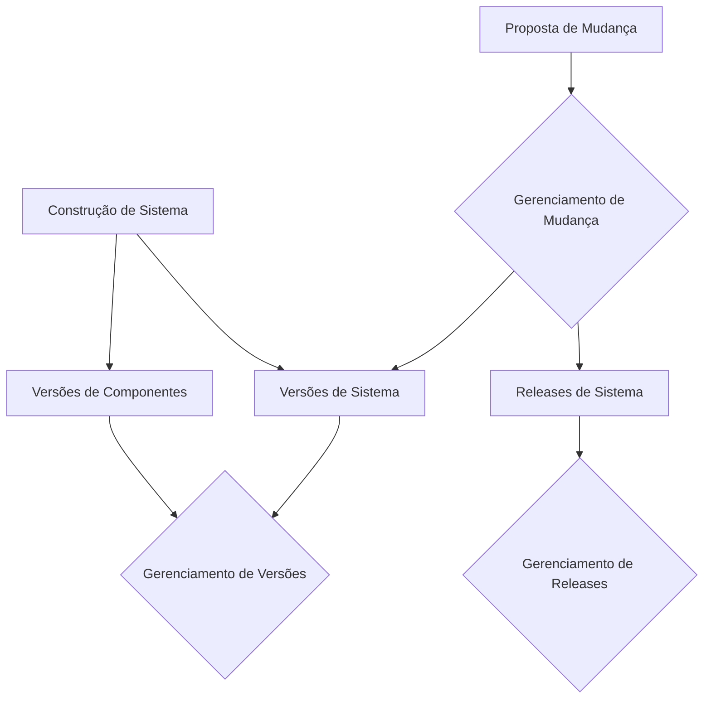
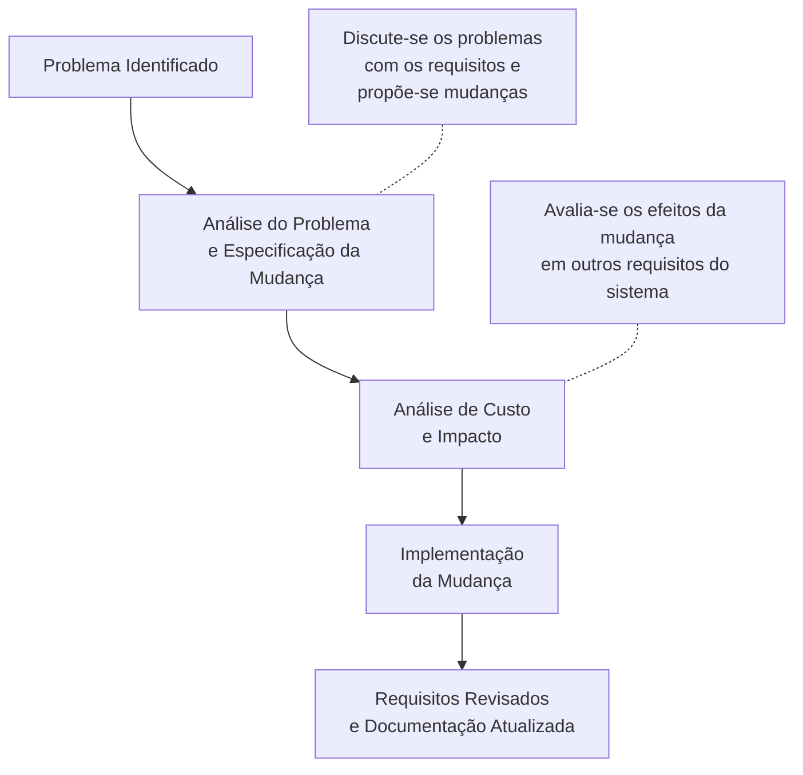

# Gerência de Manutenção de Software - Revisado e Ampliado

## Introdução à Manutenção de Software

No processo de desenvolvimento de sistemas, após as etapas de levantamento de requisitos, análise, projeto, implementação, testes e implantação, surge com o tempo a **necessidade de atualizações** que exigem manutenção nos sistemas.

A manutenção requer **atenção equivalente ao desenvolvimento** para manter a qualidade do produto e garantir sua continuidade, através de procedimentos organizados que minimizem o impacto no sistema em execução.

### Ambiente de Homologação

Toda manutenção deve ser desenvolvida no **ambiente de homologação** - um ambiente preparado para implementações e testes que replica o ambiente de produção. Isso permite que a equipe realize implementações e testes sem riscos de violar o ambiente utilizado pelos usuários finais.

## Definição de Manutenção de Sistema

A manutenção de sistema é uma **disciplina da engenharia de software** aplicada para modificar o sistema após a entrega.

### Metodologias e Técnicas

Para implementação dos ajustes são adotados:
- **Técnicas de elicitação de requisitos**
- **Modelos UML** (Unified Modeling Language)
- **Metodologias** de desenvolvimento estabelecidas

### Gerência de Configuração

Segundo Andrade (2014):
> "Gerência de configuração é um conjunto de atividades, responsabilidades e processos que devem ser bem definidos para garantir a gestão de mudanças, versões e releases de softwares durante todo o seu ciclo de vida, considerada como garantia de qualidade."

**Aplicabilidade:**
- Utilizável em projetos pequenos
- **Imprensindível** em grandes projetos
- **Essencial** quando a equipe tem múltiplos programadores

### Fluxo da Gerência de Configuração

**Componentes do Gerenciamento:**
- **Gerenciamento de mudanças** - Controle de alterações propostas
- **Gerenciamento de versões** - Controle de diferentes versões do sistema
- **Gerenciamento de releases** - Gestão das entregas ao cliente

## Por que a Manutenção Ocorre?

### Principais Motivações

| Motivo | Descrição | Exemplo |
|--------|-----------|---------|
| **Correção de erros** | Falhas não detectadas nos testes | Bugs, vulnerabilidades de segurança |
| **Erros no levantamento** | Requisitos descobertos pós-implantação | Funcionalidades essenciais omitidas |
| **Novas funcionalidades** | Evolução do sistema por novas necessidades | Módulos adicionais, integrações |
| **Adaptação ao ambiente** | Ajustes para novas configurações | Atualizações de hardware/software |

### Processo Formal de Solicitação

**Toda solicitação de alteração deve conter:**
- ✅ **Descrição detalhada** da mudança proposta
- ✅ **Análise de custo vs. benefício**
- ✅ **Data da solicitação**
- ✅ **Análise de riscos** envolvidos
- ✅ **Evidências** que justifiquem a mudança

**Fluxo de aprovação:**
1. Análise pela equipe responsável
2. Proposta de soluções alternativas
3. Aprovação pelo comitê de mudanças
4. Início do processo de alteração

## Atividades de Manutenção

### Estágios do Processo

### Atividades Específicas

Segundo Andrade, as atividades incluem:

1. **Análise de custos** - Avaliação financeira da mudança
2. **Exploração de benefícios** - Identificação de vantagens
3. **Definição de prioridades** - Ordenamento das implantações
4. **Documentação completa** - Registro de todas as alterações

### Estágios Detalhados

**1. Análise do problema e especificação da mudança**
- Discussão dos problemas com os requisitos
- Proposição de mudanças específicas
- Definição do escopo da alteração

**2. Análise de custo da mudança**
- Avaliação dos efeitos em outros requisitos
- Análise de impacto técnico
- Estimativa de recursos necessários

**3. Implementação das mudanças**
- Execução das modificações no código
- Atualização da documentação
- Validação das alterações

## Exemplo Prático de Manutenção

### Cenário: Empresa de Cosméticos

**Contexto:**
- Empresa de comercialização de produtos de beleza
- Vendedores distribuídos nacionalmente
- Sistema existente: controle de vendas, relacionamento com clientes, performance de vendedores
- Política original: promoções frequentes, prêmios anuais, **sem comissão**

**Mudança necessária:**
Após 2 anos de uso, decisão de implementar **pagamento de comissão** aos vendedores.

### Análise e Especificação da Mudança

**Ajustes identificados:**
1. **Criação do atributo comissão** na tabela vendedor
2. **Alteração no programa de cadastro** de vendedor
3. **Construção de programa para cálculo** de comissão baseado nas vendas
4. **Integração com sistema de RH** para folha de pagamento (outra equipe)

### Processo Executado

1. **Análise do problema** - Entrevistas com stakeholders
2. **Especificação técnica** - Detalhamento das modificações
3. **Análise custo-benefício** - Justificativa econômica
4. **Aprovação formal** - Autorização para prosseguir
5. **Gerenciamento do desenvolvimento** - Coordenação da implementação
6. **Atualização documental** - Modelos e especificações
7. **Implantação em produção** - Liberação para usuários

## Melhores Práticas em Manutenção

### Controle de Qualidade

- **Testes rigorosos** em ambiente de homologação
- **Backup do sistema** antes de qualquer implantação
- **Plano de rollback** para contingências
- **Comunicação transparente** com usuários afetados

### Documentação

- **Registro de todas as alterações**
- **Atualização de manuais** de usuário
- **Versionamento de documentação** técnica
- **Histórico de manutenções** realizadas

## Conclusão

A gerência de manutenção de software representa um **processo estratégico** para garantir a longevidade e evolução dos sistemas. Através de procedimentos estruturados de gerência de configuração, análise criteriosa de mudanças e implementação controlada em ambientes adequados, as organizações podem assegurar que seus sistemas continuem atendendo às necessidades do negócio ao longo do tempo.

A capacidade de adaptar sistemas existentes a novas realidades - como demonstrado no exemplo da empresa de cosméticos - é tão crucial quanto o desenvolvimento inicial, representando um **investimento contínuo** no valor do software como ativo organizacional.

---

**Referência Bibliográfica**
- ANDRADE, José. Gerência de configuração. São Paulo: Person Education do Brasil, 2014.
- SOMMERVILLE, I. Engenharia de software. 9.ed. São Paulo: Pearson Education do Brasil, 2011.

**Atividade Recomendada:** Leitura do documento "Gerenciamento de configuração" de Ian Buchanan para aprofundamento em ferramentas e técnicas aplicadas.