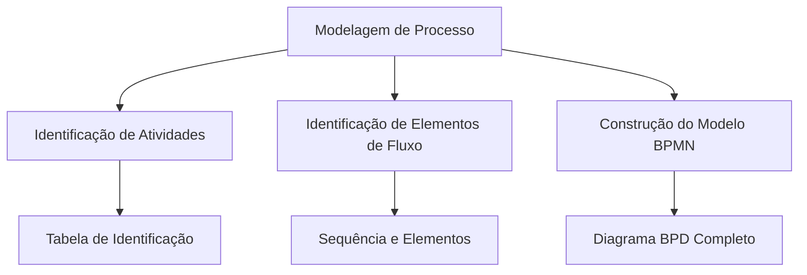

# Construção do Modelo de Processo - Revisado e Ampliado

## Introdução à Construção de Modelos de Processo

A modelagem de processos é uma prática essencial no mercado de trabalho que permite o **conhecimento detalhado** das atividades de negócio, seus responsáveis e as interconexões entre elas. Esta aula foca na modelagem BPD (Business Process Diagram) utilizando a notação BPMN (Business Process Model and Notation).

### Vantagens da Modelagem de Processos

- **Visibilidade completa** das atividades de negócio e seus relacionamentos
- **Identificação de redundâncias** nos procedimentos
- **Agilidade na análise** de conexões e implicações entre atividades
- **Transparência** nas operações de negócio
- **Facilidade de inserção** de novas necessidades quando requerido

## Etapas da Modelagem de Processo

### 1. Identificação de Atividades

**Objetivo:** Identificar todas as atividades/tarefas e seus respectivos responsáveis.

**Características:**
- Abrange **todos os procedimentos** executados no negócio em estudo
- Considera atividades **independentemente do uso de tecnologia**
- Resulta na construção de uma **tabela de identificação** estruturada

**Entregável:** Tabela com atividades, responsáveis e descrições detalhadas

### 2. Identificação de Elementos de Fluxo

**Objetivo:** Organizar a sequência das atividades e identificar elementos de fluxo necessários.

**Processo:**
- Análise da lista de atividades e responsáveis
- Definição da **sequência lógica** das atividades
- Identificação de **elementos de fluxo** necessários:
  - Eventos intermediários
  - Gateways (decisões)
  - Paralelismos

**Ponto de Partida:** Identificação da atividade inicial do negócio (normalmente atividades de preparação do ambiente)

### 3. Construção do Modelo BPMN

**Implementação do diagrama:**
1. **Representar as raias** para os responsáveis
2. **Incluir o evento de início** do processo
3. **Acrescentar atividades** na sequência definida
4. **Empregar elementos de fluxo** identificados como necessários

## Estudo de Caso: Colégio Aprendiz

### Contexto do Negócio

O Colégio Primário Aprendiz deseja implantar um sistema para controlar suas atividades principais, desde a contratação de professores até a emissão de carnês e contracheques.

**Procedimentos existentes:**
- Secretaria cadastra séries e turmas no início do ano
- Aluno realiza matrícula na secretaria informando série e turma desejada
- Direção contrata professores quando necessário
- Secretaria emite pautas mensais para chamada
- Emissão de carnês de alunos mensalmente
- Secretaria emite boletins no final do ano

### Identificação de Atividades e Responsáveis

**Tabela de Identificação:**

| Atividade | Responsável | Descrição |
|-----------|-------------|-----------|
| Cadastrar séries e turmas | Secretaria | Registrar as séries e turmas para o ano letivo |
| Realizar matrícula | Aluno/Secretaria | Efetivar matrícula do aluno |
| Contratar professor | Direção | Realizar processo seletivo e contratação |
| Registrar informações professor | Secretaria | Cadastrar dados do professor no sistema |
| Emitir pauta mensal | Secretaria | Gerar documento para controle de presença |
| Efetuar chamada | Professor | Registrar presença dos alunos |
| Emitir carnês | Secretaria | Gerar documentos de cobrança mensal |
| Emitir boletim anual | Secretaria | Produzir relatório de desempenho |

### Identificação de Elementos de Fluxo

**Elementos Básicos Identificados:**
- **Gateway Condicional**: Para atividades dependentes de condições específicas
- **Gateway Paralelo**: Para atividades que podem ocorrer simultaneamente
- **Evento Intermediário de Tempo**: Para atividades com periodicidade definida

**Sequência Principal:**
1. Cadastro de séries e turmas (atividade inicial)
2. Processos paralelos: matrículas e contratações
3. Atividades mensais: emissão de pautas, chamadas e carnês
4. Atividades anuais: emissão de boletins

### Construção do Modelo BPMN

**Ferramentas Recomendadas:**
- Bizagi Modeler
- Heflo
- Supravizio
- Visio
- ARIS
- BPMN.io
- Modelio
- Adonis
- **LucidChart** (utilizado neste estudo)

**Estrutura do Modelo:**
- **Pools**: Secretaria, Direção, Professor, Aluno
- **Lanes**: Subdivisões por função dentro dos pools
- **Sequência**: Fluxo lógico baseado na análise prévia
- **Elementos de fluxo**: Gateways e eventos conforme identificação

## Refinamento do Modelo BPMN

### Modernização do Processo

O Colégio Aprendiz deseja modernizar suas atividades utilizando a web para maior agilidade:

**Novas Requisições:**
- ✅ **Aluno** realiza próprio cadastro e matrícula online
- ✅ **Aluno** emite carnê de pagamento mensal
- ✅ **Professor** registra presença diária e visualiza boletins
- ✅ **Eliminação** de emissão de pautas pela secretaria
- ✅ **Direção** consulta movimentos de matrícula e pagamentos

### Impacto do Refinamento

**Benefícios Observados:**
- **Redução significativa** de atividades da secretaria
- **Maior autonomia** para alunos e professores
- **Processos mais ágeis** e menos burocráticos
- **Transparência** ampliada para a direção
- **Eliminação** de redundâncias

**Análise do Modelo Refinado:**
- Remanejamento de responsabilidades entre setores
- Inclusão de novas atividades para direção
- Eliminação de atividades obsoletas
- Otimização do fluxo geral do processo

## Melhores Práticas na Construção de Modelos

### Representação Adequada

- **Todas as atividades** devem ser representadas claramente
- **Ligações e dependências** devem ser explicitadas
- **Informações base** do negócio devem estar contempladas
- **Fluxo de execução** deve seguir sequência lógica
- **Simbiologia correta** para cada tipo de atividade

### Análise Contínua

- **Identificação de pontos** de mudança necessários
- **Redesenho do modelo** para implementar melhorias
- **Validação constante** com os stakeholders
- **Documentação** das alterações e seus impactos

## Conclusão

A construção de modelos de processo através do BPMN representa uma **ferramenta estratégica** para organizações que buscam:

- **Compreensão profunda** de seus fluxos de trabalho
- **Identificação de oportunidades** de otimização
- **Transparência operacional**
- **Facilidade na implementação** de melhorias
- **Alinhamento** entre diferentes áreas da organização

O estudo de caso do Colégio Aprendiz demonstra como a modelagem adequada permite não apenas documentar processos existentes, mas também **planejar transformações digitais** que resultam em ganhos significativos de eficiência e qualidade.

---

**Referência Bibliográfica**
- HAMMER, M.; CHAMPY, J. Reengenharia. Rio de Janeiro: Campus, 1994.
- REIS, Glauco dos Santos. Modelagem de processos de negócios com BPMN. 2008.

**Atividade Recomendada:** Leitura do documento "Modelagem de Processos com a Notação BPMN" do Prof. Higor Monteiro - UFPE, disponível como "Modelagem de Processos com a Notação BPMN - TCE-PE".