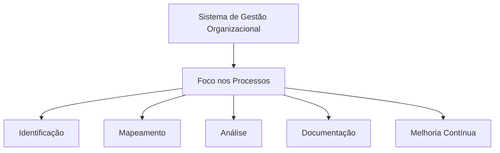
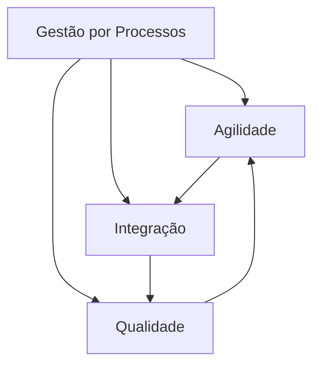

# Modelagem do Processo - Revisado e Ampliado

## Introdução

A gestão por processos é um **sistema de gestão organizacional** orientado para gerir a organização com foco nos processos. As empresas que adotam esse modelo definem sua melhor forma de fazer negócios, considerando processos críticos através de identificação, mapeamento, análise, documentação e melhoria contínua.

## O que é um Processo?

### Definições Fundamentais

- **Processo**: "Um grupo de atividades realizadas numa sequência lógica com objetivo de produzir um bem ou serviço que tem valor para um grupo específico de clientes." [Hammer e Champy, 1994]

- **Processo**: "A forma pela qual um conjunto de atividades cria, trabalha ou transforma insumos (entradas), agregando-lhes valor, com finalidade de produzir bens ou serviços, com qualidade para serem entregues a clientes (saída), sejam eles internos ou externos." [Cruz, 2002, pág. 106]

- **Processo**: Sequência de tarefas coesas e interligadas que recebem uma entrada, as processam e devolvem uma saída, podendo ser atividades físicas, materiais ou de informação.

### Elementos de um Processo

Um processo de negócio consiste em **5 elementos essenciais**:

1. **Clientes** - Destinatários finais do processo
2. **Atividades que criam valor** - Ações que agregam valor para os clientes
3. **Atores** - Seres humanos ou máquinas que operam as atividades
4. **Unidades organizacionais** - Áreas responsáveis por todo o processo
5. **Tecnologia** - Ferramentas e sistemas que suportam a execução

## Gestão por Processos

### Conceito e Objetivos

A gestão por processos é um **procedimento administrativo** com objetivo de melhorar e otimizar os processos para atender expectativas dos interessados com sistema integrado, bom desempenho e alto índice de acerto.

### Benefícios da Gestão por Processos

**Vantagens específicas:**

- **Abre caixas-pretas** - Torna público o conhecimento inerente ao fluxo do trabalho
- **Quebra rigidez hierárquica** - Rompe com a estrutura tradicional monolítica
- **Promove integração** - Propicia colaboração entre atividades do ciclo produtivo

### Implementação da Gestão por Processos

**Considerações essenciais:**

- Utilização de metodologia, definição de modelos, técnicas e ferramentas
- Implantação contínua e validação constante
- Foco no atendimento aos clientes e relações com concorrentes
- Análise constante da cadeia de valor
- Reavaliação periódica dos processos envolvidos

## Introdução ao BPM (Business Process Management)

### O que é Modelagem de Processos?

A **modelagem de processos de negócio** é desenvolvida para identificar e mapear processos através de:

- **Representação gráfica** das atividades e suas interconexões
- **Visão da empresa** através de diagramas funcionais
- **Avaliação sistemática** dos processos organizacionais

### Abordagens do BPM

A sigla BPM é utilizada sob **dois enfoques**:

1. **Ferramenta de modelagem** de gestão de processos
2. **Relacionada às áreas** de BI (Business Intelligence) e ERP

### Benefícios da Modelagem

**Avaliação de processos:**
- Identificação de falhas e gargalos
- Detecção de atividades que não agregam valor
- Identificação de oportunidades de melhoria

**Ações proativas:**
- Mapeamento dos processos de negócio
- Atendimento à norma ISO 9001:2000
- Análise conjuntural e isolada dos processos
- Reengenharia de processos
- Implementação de TQM (Total Quality Management)

### Controle por Softwares BPM

**Elementos controlados:**
- Atividades, tarefas e procedimentos
- Entradas e saídas
- Custo e duração
- Resultados e produtos
- Outros recursos

## BPMN (Business Process Model and Notation)

### Objetivos da BPMN

A BPMN fornece uma **notação padronizada** compreensível por todos os usuários:

- **Analistas** - Estudam os processos
- **Desenvolvedores** - Implementam os processos
- **Gestores** - Gerenciam e monitoram os processos

### Elementos da Notação BPMN

#### 1. Objetos de Fluxo

**Eventos:**
- ⚪ **Evento de Início** - Inicia o processo
- ⚫ **Evento Intermediário** - Ocorre entre início e fim
- 🔴 **Evento Final** - Encerra o processo

**Atividades:**
- ▭ **Tarefa** - Trabalho realizado no fluxo
- ▭ **Subprocesso** - Atividade que pode ser detalhada (+)

**Gateways:**
- ◇ **Gateway** - Decisões e paralelismos no processo

#### 2. Objetos de Conexão

- **Fluxo de Sequência** - Ordem das atividades
- **Fluxo de Mensagem** - Comunicação entre participantes
- **Associação** - Relaciona artefatos com elementos de fluxo

#### 3. Swimlanes (Raias)

- **Pool** - Participante principal do processo
- **Lane** - Subdivisão do pool (áreas/funções)

#### 4. Artefatos

- **Objeto de Dados** - Informações necessárias ou produzidas
- **Grupo** - Agrupamento visual de atividades
- **Anotação** - Comentários adicionais explicativos

## Passos para Construção do Modelo BPMN

### Metodologia Passo a Passo

1. **Identificar atividades e responsáveis**
   - Listar todas as atividades do processo
   - Definir atores/responsáveis por cada atividade

2. **Definir escopo do processo**
   - Estabelecer ponto de início claro
   - Definir critérios de término

3. **Análise da construção lógica**
   - Identificar pontos de decisão
   - Detectar pontos de interrupção
   - Mapear atividades paralelas

4. **Construir modelo BPMN**
   - Aplicar notação correta
   - Validar sequência lógica
   - Garantir compreensibilidade

## Exemplo Prático de Modelo BPMN

### Cenário: Secretaria de Saúde

**Contexto:** Avaliação de atendimentos de gripe suína nas unidades de saúde.

**Processo descrito:**
1. Postos atendem pacientes e realizam cadastro (se necessário)
2. Registram sintomas e encaminham para atendimento médico
3. Médicos registram diagnóstico
4. Caso confirmada a doença, emitem licença médica
5. Mensalmente: emissão de valores apurados e totais por diagnóstico

### Aplicação dos Passos:

**1. Identificação de atores e requisitos:**
- Atendentes (cadastro)
- Médicos (diagnóstico)
- Sistema (emissões)

**2. Ponto de início:** "Atender paciente"

**3. Elementos identificados:**
- **Decisão:** Cadastro condicional e licença médica condicional
- **Interrupção:** Emissões apenas no final do mês
- **Paralelismo:** Emissões independentes

**4. Modelo BPMN construído** com base na análise completa

## Conclusão

A modelagem de processos através do BPMN representa uma **ferramenta estratégica** para organizações que buscam:

- Melhor compreensão de seus fluxos de trabalho
- Identificação de oportunidades de melhoria
- Padronização da comunicação sobre processos
- Alinhamento entre áreas técnicas e de negócio

A adoção dessa abordagem permite às empresas transformar sua gestão tradicional em um **sistema integrado e orientado a resultados**, garantindo agilidade, qualidade e competitividade no mercado.

---

**Referência Bibliográfica**
- CRUZ, Tadeu. Sistemas, Organizações & Métodos. 3ª ed. São Paulo: Atlas, 2002.
- HAMMER, M.; CHAMPY, J. Reengenharia. Rio de Janeiro: Campus, 1994.

**Atividade Recomendada:** Leitura do documento "Notação BPMN: como aplicar para modelar processos? Entenda etapas" da empresa Sydle.